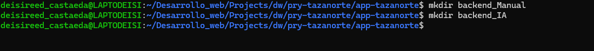
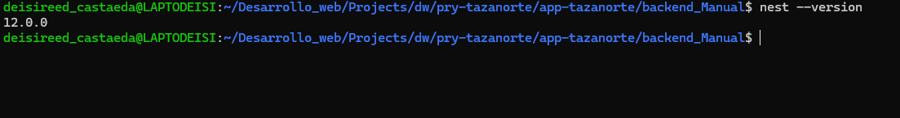
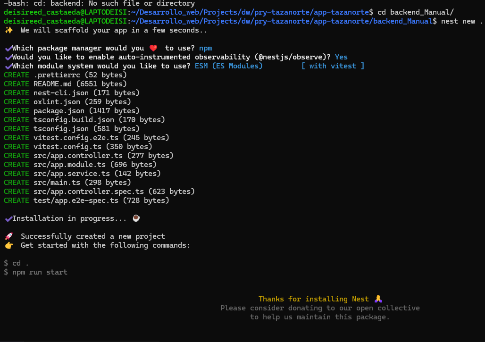
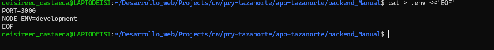
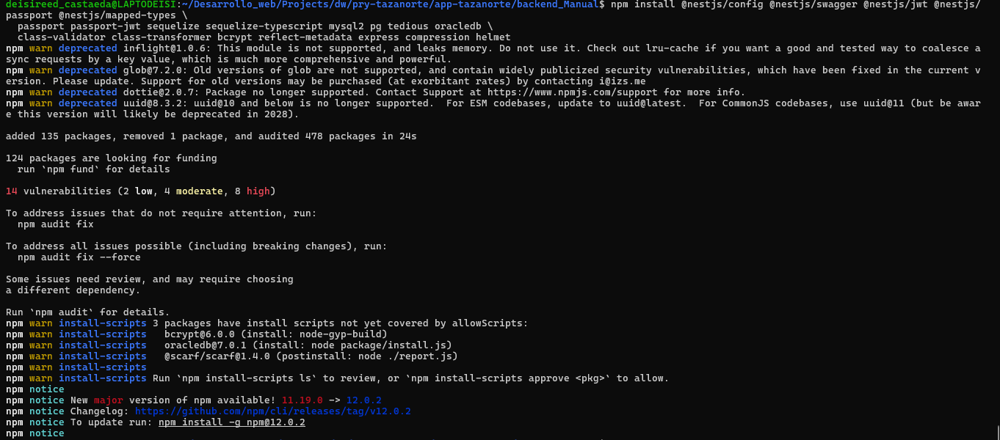

# Manual de creación del Backend — NestJS + Sequelize (Clean Architecture)

Deisireed Castañeda

## FASE 1 — `00_BASE_INIT_NESTJS`

### Inicialización del proyecto NestJS

> **Objetivo de la fase:** Dejar el esqueleto oficial Nest corriendo en un puerto libre, con Git inicial.

#### 1.1 — Crear carpetas padre y permisos

``` bash
mkdir -p /home/portatiljq/apps/dlloweb/nestjs/express_sequelize 
chmod -R 755 /home/portatiljq/apps/dlloweb/nestjs/express_sequelize
```



**Sugerencia de commit (issue):**

``` bash
git add . 
git commit -m "chore: prepare workspace folders for nest backend"
```

#### 1.2 — Instalar Nest CLI (si no existe)

``` bash
npm install -g @nestjs/cli 
nest --version
```



**Sugerencia de commit (issue):**

``` bash
git add . 
git commit -m "chore: ensure nest cli available locally"
```

#### 1.3 — Crear proyecto NestJS

``` bash
cd /home/portatiljq/apps/dlloweb/nestjs/express_sequelize 
nest new backend_ia
cd backend_ia
```



**Sugerencia de commit (issue):**

``` bash
git add . 
git commit -m "chore: scaffold nestjs project backend_ia"
```

#### 1.4 — Crear `.env` mínimo (puerto)

El puerto `3002` evita choques con el 3000. Más adelante el `.env` crecerá con BD y JWT.

``` bash
cat > .env <<'EOF' 
PORT=3000 
NODE_ENV=development
EOF
```



**Sugerencia de commit (issue):**

``` bash
git add .
git commit -m "chore: add initial .env with PORT=3002"
```

#### 1.5 — Commit inicial del esqueleto

Congela el punto de partida reproducible.

``` bash
git init git add .
git commit -m "chore: inicialización del proyecto NestJS"
```

------------------------------------------------------------------------

## **FASE 2 — `01_BASE_DEPS_Y_PUERTO`**

### Dependencias + manejo de puerto (EADDRINUSE)

> **Objetivo de la fase:** Instalar el stack profesional y evitar que un `start:dev` colgado bloquee el puerto.

#### 2.1 — Dependencias de producción

``` bash
npm install @nestjs/config @nestjs/swagger @nestjs/jwt @nestjs/passport @nestjs/mapped-types \   passport passport-jwt sequelize sequelize-typescript mysql2 pg tedious oracledb \   class-validator class-transformer bcrypt reflect-metadata express compression helmet
```



**Sugerencia de commit (issue):**

``` bash
git add .
git commit -m "chore: install production dependencies for ca backend"
```

#### 2.2 — Dependencias de desarrollo

``` bash
npm install -D @types/bcrypt @types/passport-jwt sequelize-cli
```

**Sugerencia de commit (issue):**

``` bash
git add . 
git commit -m "chore: install auth and sequelize-cli devDependencies"
```

#### 2.3 — Script para liberar puerto (evita EADDRINUSE)

``` bash
mkdir -p scripts cat > scripts/free-port.js <<'EOF_BACKEND_IA' 
/** 
* Libera el puerto configurado en .env (PORT) antes de arrancar Nest. 
* Evita EADDRINUSE cuando queda una instancia previa de start:dev. 
*/ 
const { execSync } = require('child_process'); 
const fs = require('fs');
const path = require('path'); 

function readPortFromEnv() {   const envPath = path.join(__dirname, '..', '.env');   let port = 3002;  
if (fs.existsSync(envPath)) {   
const content = fs.readFileSync(envPath, 'utf8');    
const match = content.match(/^\s*PORT\s*=\s*(\d+)\s*$/m);   


if (match) {       port = parseInt(match[1], 10);    
  }  
}    
if (process.env.PORT) {     port = parseInt(process.env.PORT, 10) || port; 
}  

return port; 
  
} 

function freePort(port) {  
try {     // Linux/WSL: mata el proceso que escucha en el puerto     execSync(`fuser -k ${port}/tcp`, { stdio: 'ignore' }); 

console.log(`✅ Puerto ${port} liberado`);   
  
} 

catch {     // No había proceso escuchando: ok   

console.log(`ℹ️  Puerto ${port} disponible`);   
  
  } 
  
} 
const port = readPortFromEnv(); 

freePort(port); 
EOF_BACKEND_IA
```

**Sugerencia de commit (issue):**

``` bash
git add .
git commit -m "chore: add scripts/free-port.js to avoid EADDRINUSE"
```

#### 2.4 — Actualizar scripts npm en package.json

Integra `free:port` en `start:dev` / `start:debug`. Aplica el cambio con Node para no editar JSON a mano.

``` bash
node <<'EOF_BACKEND_IA' 
const fs = require('fs'); 
const pkg = JSON.parse(fs.readFileSync('package.json', 'utf8')); 

pkg.scripts = {   ...pkg.scripts,   'free:port': 'node scripts/free-port.js',   'start:dev': 'npm run free:port && nest start --watch',   'start:debug': 'npm run free:port && nest start --debug --watch',
};

fs.writeFileSync('package.json', JSON.stringify(pkg, null, 2) + '\n'); 
console.log('✅ package.json scripts actualizados'); 
EOF_BACKEND_IA
```

**Sugerencia de commit (issue):**

``` bash
git add . 
git commit -m "chore: wire free:port into nest start scripts"
```

#### 2.5 — Verificar arranque base

Debe levantar el Hello World de Nest en el puerto del `.env`.

``` bash
npm run start:dev # Ctrl+C cuando veas el log de arranque curl -s http://localhost:3002 || true
```

**Sugerencia de commit (issue):**

``` bash
git add . 
git commit -m "test: verify nest boots after dependency install"
```

------------------------------------------------------------------------

## 
