# Manual de creación del Backend — NestJS + Sequelize (Clean Architecture)

Deisireed Castañeda

## FASE 1 — `00_BASE_INIT_NESTJS`

### Inicialización del proyecto NestJS

> **Objetivo de la fase:** Dejar el esqueleto oficial Nest corriendo en un puerto libre, con Git inicial.

#### 1.1 — Crear carpetas padre y permisos

``` bash
mkdir -p /home/portatiljq/apps/dlloweb/nestjs/express_sequelize 
chmod -R 755 /home/portatiljq/apps/dlloweb/nestjs/express_sequelize
```


**Sugerencia de commit (issue):**

``` bash
git add . 
git commit -m "chore: prepare workspace folders for nest backend"
```

#### 1.2 — Instalar Nest CLI (si no existe)

``` bash
npm install -g @nestjs/cli 
nest --version
```


**Sugerencia de commit (issue):**

``` bash
git add . 
git commit -m "chore: ensure nest cli available locally"
```

#### 1.3 — Crear proyecto NestJS

``` bash
cd /home/portatiljq/apps/dlloweb/nestjs/express_sequelize 
nest new backend_ia
cd backend_ia
```


**Sugerencia de commit (issue):**

``` bash
git add . 
git commit -m "chore: scaffold nestjs project backend_ia"
```

#### 1.4 — Crear `.env` mínimo (puerto)

El puerto `3002` evita choques con el 3000. Más adelante el `.env` crecerá con BD y JWT.

``` bash
cat > .env <<'EOF' 
PORT=3000 
NODE_ENV=development
EOF
```


**Sugerencia de commit (issue):**

``` bash
git add .
git commit -m "chore: add initial .env with PORT=3002"
```

#### 1.5 — Commit inicial del esqueleto

Congela el punto de partida reproducible.

``` bash
git init git add .
git commit -m "chore: inicialización del proyecto NestJS"
```

------------------------------------------------------------------------

## **FASE 2 — `01_BASE_DEPS_Y_PUERTO`**

### Dependencias + manejo de puerto (EADDRINUSE)

> **Objetivo de la fase:** Instalar el stack profesional y evitar que un `start:dev` colgado bloquee el puerto.

#### 2.1 — Dependencias de producción

``` bash
npm install @nestjs/config @nestjs/swagger @nestjs/jwt @nestjs/passport @nestjs/mapped-types \   passport passport-jwt sequelize sequelize-typescript mysql2 pg tedious oracledb \   class-validator class-transformer bcrypt reflect-metadata express compression helmet
```


**Sugerencia de commit (issue):**

``` bash
git add .
git commit -m "chore: install production dependencies for ca backend"
```

#### 2.2 — Dependencias de desarrollo

``` bash
npm install -D @types/bcrypt @types/passport-jwt sequelize-cli
```

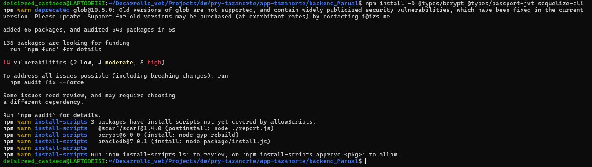

**Sugerencia de commit (issue):**

``` bash
git add . 
git commit -m "chore: install auth and sequelize-cli devDependencies"
```

#### 2.3 — Script para liberar puerto (evita EADDRINUSE)

``` bash
mkdir -p scripts cat > scripts/free-port.js <<'EOF' 
/** 
* Libera el puerto configurado en .env (PORT) antes de arrancar Nest. 
* Evita EADDRINUSE cuando queda una instancia previa de start:dev. 
*/ 
const { execSync } = require('child_process'); 
const fs = require('fs');
const path = require('path'); 

function readPortFromEnv() {   const envPath = path.join(__dirname, '..', '.env');   let port = 3002;  
if (fs.existsSync(envPath)) {   
const content = fs.readFileSync(envPath, 'utf8');    
const match = content.match(/^\s*PORT\s*=\s*(\d+)\s*$/m);   


if (match) {       port = parseInt(match[1], 10);    
  }  
}    
if (process.env.PORT) {     port = parseInt(process.env.PORT, 10) || port; 
}  

return port; 
  
} 

function freePort(port) {  
try {     // Linux/WSL: mata el proceso que escucha en el puerto     execSync(`fuser -k ${port}/tcp`, { stdio: 'ignore' }); 

console.log(`✅ Puerto ${port} liberado`);   
  
} 

catch {     // No había proceso escuchando: ok   

console.log(`ℹ️  Puerto ${port} disponible`);   
  
  } 
  
} 
const port = readPortFromEnv(); 

freePort(port); 
EOF
```

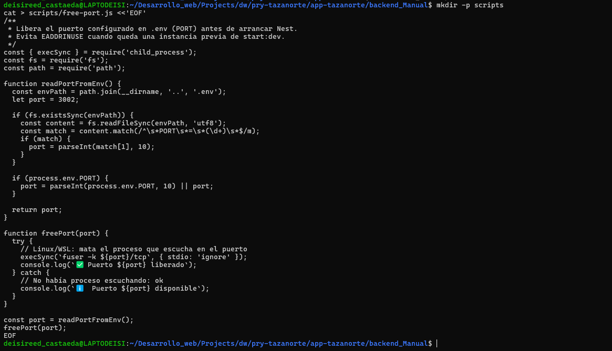

**Sugerencia de commit (issue):**

``` bash
git add .
git commit -m "chore: add scripts/free-port.js to avoid EADDRINUSE"
```

#### 2.4 — Actualizar scripts npm en package.json

Integra `free:port` en `start:dev` / `start:debug`. Aplica el cambio con Node para no editar JSON a mano.

``` bash
node <<'EOF' 
const fs = require('fs'); 
const pkg = JSON.parse(fs.readFileSync('package.json', 'utf8')); 

pkg.scripts = {   ...pkg.scripts,   'free:port': 'node scripts/free-port.js',   'start:dev': 'npm run free:port && nest start --watch',   'start:debug': 'npm run free:port && nest start --debug --watch',
};

fs.writeFileSync('package.json', JSON.stringify(pkg, null, 2) + '\n'); 
console.log('✅ package.json scripts actualizados'); 
EOF
```

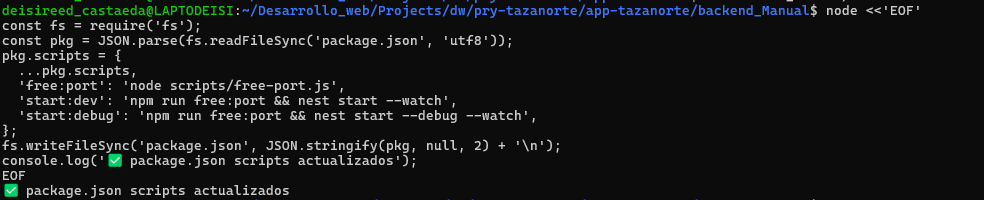

**Sugerencia de commit (issue):**

``` bash
git add . 
git commit -m "chore: wire free:port into nest start scripts"
```

#### 2.5 — Verificar arranque base

Debe levantar el Hello World de Nest en el puerto del `.env`.

``` bash
npm run start:dev # Ctrl+C cuando veas el log de arranque
curl -s http://localhost:3002 || true
```

**Sugerencia de commit (issue):**

``` bash
git add . 
git commit -m "test: verify nest boots after dependency install"
```

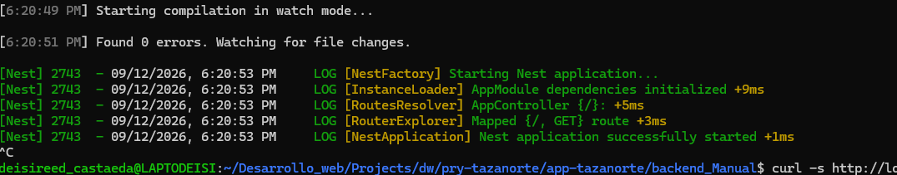

## FASE 3 — `02_BASE_ESTRUCTURA_CA`

### Estructura de carpetas Clean Architecture

> **Objetivo de la fase:** Crear el mapa mental: config / common / infrastructure / features (business + auth).

#### 3.1 — Crear árbol base de carpetas

Aún no hay código de dominio. Solo directorios y módulos vacíos de features para anclar imports futuros.

``` bash
mkdir -p src/config/{app,database,environment,jwt,logger,swagger} mkdir -p src/common/{constants,decorators,enums,exceptions,filters,guards,interceptors,interfaces,pipes,types,utils,validators} mkdir -p src/infrastructure/database/{sequelize,migrations,seeders} mkdir -p src/infrastructure/{logging,security/hashing,security/tokens} mkdir -p src/features/business/{clients,product-types,products,sales}/{application/{dto,mappers,use-cases},domain/{entities,enums,exceptions,interfaces,services,validators},infrastructure/persistence/{models,repositories,migrations,seeders},presentation/http/{controllers,decorators,serializers,swagger},tests} mkdir -p src/features/auth/{users,roles,role-users,resources,resource-roles,refresh-tokens}/{application/{dto,mappers,use-cases},domain/{entities,enums,exceptions,interfaces,services,validators},infrastructure/persistence/{models,repositories,migrations,seeders},presentation/http/{controllers,decorators,serializers,swagger},tests} mkdir -p src/features/auth/authentication/{application/{dto,mappers,use-cases},domain/{entities,enums,exceptions,interfaces,services,validators},infrastructure/{jwt,password},presentation/http/{controllers,decorators,serializers,swagger},tests} mkdir -p src/features/auth/infrastructure/database cat > src/features/business/business.module.ts <<'EOF'

import { Module } from '@nestjs/common';  
@Module({ 
imports: [], 
exports: [], 
 
}) 
export class BusinessModule {} 

EOF 
cat > src/features/auth/auth.module.ts <<'EOF' 
import { Module } from '@nestjs/common';

@Module({   
imports: [], 
exports: [], 
  
}) 
export class AuthModule {}

EOF
```

**Sugerencia de commit (issue):**

``` bash
git add . 
git commit -m "chore: create clean architecture folder tree and empty feature modules"
```

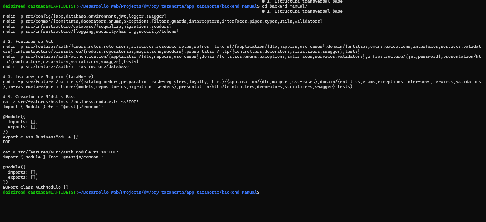

#### 3.2 — Recordatorio de responsabilidades

| Carpeta           | Responsabilidad                              |
|-------------------|----------------------------------------------|
| `config/`         | Cómo se configura la app (env, jwt, swagger) |
| `common/`         | Piezas transversales reutilizables           |
| `infrastructure/` | Detalles técnicos (Sequelize, bcrypt, JWT)   |
| `features/*`      | Dominios (business/auth) con CA interna      |

**Error típico:** poner `@Table` de Sequelize dentro de `domain/entities`.

**Sugerencia de commit (issue):**

``` bash
git add . git 
commit -m "docs: note clean architecture folder responsibilities"
```

## FASE 4 — `03_BASE_ENTORNO_ENV`

### Configuración del entorno tipado (multi-base)

> **Objetivo de la fase:** Centralizar variables en `.env`: selector `DB_DIALECT` y un bloque de credenciales por motor (MySQL, PostgreSQL, SQL Server, Oracle). Validar antes del boot.

#### 4.1 — Crear `.env.example` y actualizar `.env` completo

El `.env` real NO se sube a Git. Usa BD dedicada `tecnogua_ia`.

**Contrato multi-base (igual que `docs/Prompt.md`):** - `DB_DIALECT` = `mysql` \| `postgres` \| `mssql` \| `oracle` (elige qué motor corre). - MySQL: `DB_MYSQL_HOST`, `DB_MYSQL_PORT`, `DB_MYSQL_USERNAME`, `DB_MYSQL_PASSWORD`, `DB_MYSQL_NAME`. - PostgreSQL: `DB_POSTGRES_*` (puerto lab 5432). - SQL Server: `DB_MSSQL_*` (puerto lab 1433, usuario `sa`). - Oracle: `DB_ORACLE_*` + `DB_ORACLE_CONNECT_STRING` (puerto lab 1521). - Para cambiar de motor, cambia **solo** `DB_DIALECT`. No uses `DB_HOST` / `DB_USERNAME` genéricos.

``` bash
cat > .env.example <<'EOF' 
# ==========================================
# APP
# ==========================================

PORT=3000
NODE_ENV=development  
# ========================================== 
# DATABASE
# ==========================================
# Selector del motor en ejecución (un solo valor): 
# mysql | postgres | mssql | oracle
DB_DIALECT=mysql


# --- MYSQL --- 
DB_MYSQL_HOST=localhost
DB_MYSQL_PORT=3306
DB_MYSQL_USERNAME=root 
DB_MYSQL_PASSWORD=root
DB_MYSQL_NAME=tecnogua_ia 

# --- POSTGRES --- 
DB_POSTGRES_HOST=localhost 
DB_POSTGRES_PORT=5432
DB_POSTGRES_USERNAME=postgres 
DB_POSTGRES_PASSWORD=postgres
DB_POSTGRES_NAME=tecnogua_ia 
# --- MSSQL (SQL Server) --- 
DB_MSSQL_HOST=localhost
DB_MSSQL_PORT=1433 DB_MSSQL_USERNAME=sa 
DB_MSSQL_PASSWORD=YourStrong@Passw0rd 
DB_MSSQL_NAME=tecnogua_ia 

# --- ORACLE --- 
DB_ORACLE_HOST=localhost
DB_ORACLE_PORT=1521
DB_ORACLE_USERNAME=system 
DB_ORACLE_PASSWORD=oracle 
DB_ORACLE_NAME=tecnogua_ia
DB_ORACLE_CONNECT_STRING=localhost:1521/XEPDB1 


# ========================================== 
# JWT (pista completa; el guion simple no implementa login) 
# ========================================== 
JWT_SECRET=lab-jwt-secret-tecnogua-ia 
JWT_EXPIRES_IN=1d 
JWT_REFRESH_SECRET=lab-jwt-refresh-tecnogua-ia 
JWT_REFRESH_EXPIRES_IN=7d
EOF
```

``` bash
cp .env.example .env
# Laboratorio: DB_DIALECT + un bloque por motor (MYSQL/POSTGRES/MSSQL/ORACLE).
# Cambia solo el bloque del motor que uses. Mantén DB_*_NAME=tecnogua_ia
```

**Sugerencia de commit (issue):**

``` bash
git add .
git commit -m "chore: add typed env template and local .env for tecnogua_ia"
```

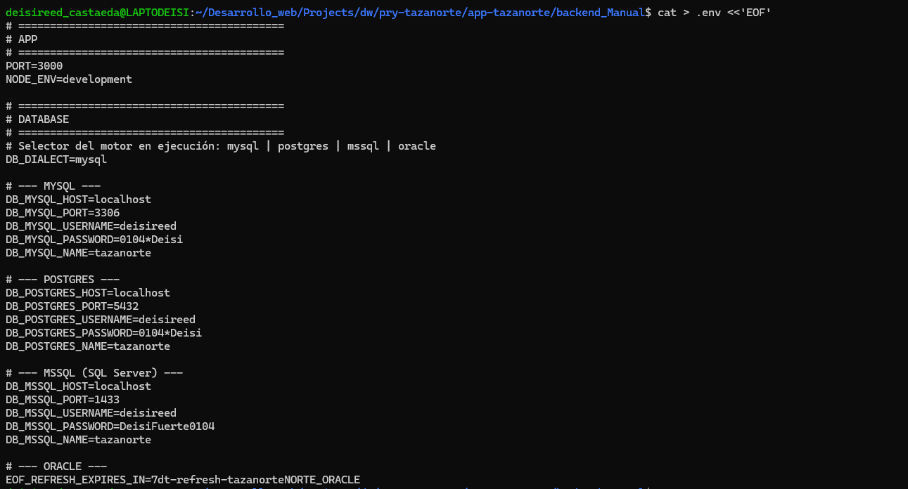

#### 4.2 — Interface de entorno

Tipos TypeScript de las variables de entorno (APP, DB, JWT) y enum de dialectos.

**Archivo:** `src/config/environment/env.interface.ts`

``` bash
mkdir -p src/config/environment
cat > src/config/environment/env.interface.ts <<'EOF' 
export enum Environment {  
Development = 'development', 
Production = 'production',  
Test = 'test', 
  
  
}

export enum DatabaseDialect {  
MySQL = 'mysql', 
Postgres = 'postgres',  
MSSQL = 'mssql',  
Oracle = 'oracle', 
  
  
} 

export interface AppConfig { 
port: number;  
nodeEnv: Environment;

  
} 

export interface DatabaseConfig {   
dialect: DatabaseDialect;
host: string;  
port: number;  
username: string;   
password: string;   
database: string;   
connectString?: string;

  
} 

export interface JwtConfig { 
secret: string;
expiresIn: string;  
refreshSecret: string;  
refreshExpiresIn: string;

  
}  

export interface EnvironmentConfig {  
app: AppConfig;  
database: DatabaseConfig;  
jwt: JwtConfig;
} 

EOF
```

**Sugerencia de commit (issue):**

``` bash
git add .
git commit -m "feat: add environment interfaces and DatabaseDialect enum"
```

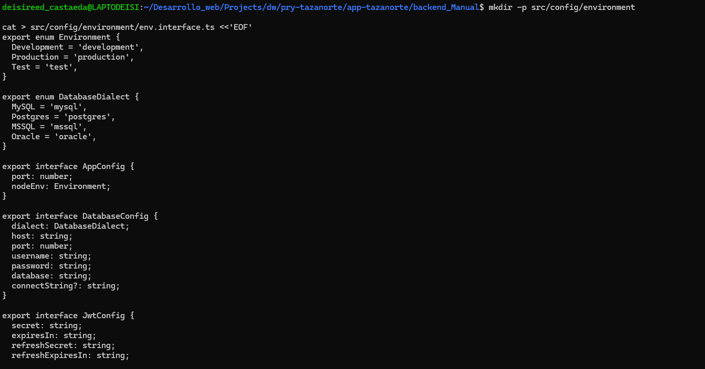

#### 4.3 — Validación de entorno con class-validator

Si falta JWT_SECRET o DB_DIALECT es inválido, o el bloque del motor activo está vacío, el boot falla con mensaje claro.

**Archivo:** `src/config/environment/env.validation.ts`

``` bash
mkdir -p src/config/environment 
cat > src/config/environment/env.validation.ts <<'EOF'
import { plainToInstance } from 'class-transformer';
import { 
IsEnum,  
IsNumber, 
IsOptional, 
IsString,  
Max,  
Min, 
validateSync,

} from 'class-validator'; 
import {  
assertActiveDialectCredentials,   
resolveDialectCredentials,

} from './db-env';

import { DatabaseDialect,
Environment } from './env.interface'; 


export class EnvironmentVariables {  

@IsEnum(Environment) 
@IsOptional()  
NODE_ENV:Environment = Environment.Development; 


@IsNumber()  
@Min(0)   
@Max(65535)
@IsOptional()  
PORT: number = 3002;   

@IsEnum(DatabaseDialect)  
DB_DIALECT: DatabaseDialect; 


@IsString()  
@IsOptional() 
DB_MYSQL_HOST?: string;

@IsNumber()
@IsOptional() 
DB_MYSQL_PORT?:number;   


@IsString()  
@IsOptional() 
DB_MYSQL_USERNAME?: string; 


@IsString() 
@IsOptional()  
DB_MYSQL_PASSWORD?: string; 

@IsString() 
@IsOptional() 
DB_MYSQL_NAME?: string;

@IsString()  
@IsOptional() 
DB_POSTGRES_HOST?: string;  

@IsNumber()  
@IsOptional()
DB_POSTGRES_PORT?: number;   

@IsString()   
@IsOptional()  
DB_POSTGRES_USERNAME?: string;  

@IsString()  
@IsOptional()  
DB_POSTGRES_PASSWORD?: string;   

@IsString() 
@IsOptional()   
DB_POSTGRES_NAME?: string;  

@IsString()  
@IsOptional()  
DB_MSSQL_HOST?: string;    

@IsNumber()  
@IsOptional() 
DB_MSSQL_PORT?: number;   

@IsString()  
@IsOptional()  
DB_MSSQL_USERNAME?: string;   

@IsString()
@IsOptional()  
DB_MSSQL_PASSWORD?: string;   

@IsString() 
@IsOptional() 
DB_MSSQL_NAME?: string;   

@IsString() 
@IsOptional()  
DB_ORACLE_HOST?: string;  

@IsNumber() 
@IsOptional()   
DB_ORACLE_PORT?: number; 

@IsString() 
@IsOptional() 
DB_ORACLE_USERNAME?: string;

@IsString() 
@IsOptional() 
DB_ORACLE_PASSWORD?: string;   

@IsString() 
@IsOptional()  
DB_ORACLE_NAME?: string;  

@IsString()
@IsOptional() 
DB_ORACLE_CONNECT_STRING?: string;  

@IsString()   
JWT_SECRET: string;  

@IsString()
@IsOptional()  
JWT_EXPIRES_IN: string = '1d';  

@IsString()  
JWT_REFRESH_SECRET: string;   

@IsString()  
@IsOptional() 
JWT_REFRESH_EXPIRES_IN: string = '7d'; 
  
} 

function formatValidationErrors( 
errors: ReturnType<typeof validateSync>,
): string { 
return errors   
.map((error) => {  
const constraints = error.constraints     
? Object.values(error.constraints).join(', ')      
: 'valor inválido';     
return `${error.property}: ${constraints}`;   
})   
.join('; '); 
  
} 

export function validate(config: Record<string, unknown>): EnvironmentVariables {   const validatedConfig = plainToInstance(EnvironmentVariables, config, {     enableImplicitConversion: true,   
exposeDefaultValues: true,  
}); 

const errors = validateSync(validatedConfig, {  
skipMissingProperties: false,   }); 

if (errors.length > 0) {  
throw new Error(       `Error de configuración: variable(s) crítica(s) inválida(s) o ausente(s).
${formatValidationErrors(errors)}. Copia .env.example a .env y completa el bloque del motor elegido (DB_DIALECT).`, 
);  
}   

assertActiveDialectCredentials(resolveDialectCredentials(validatedConfig));   
return validatedConfig; } 

EOF
```

**Sugerencia de commit (issue):**

``` bash
git add .
git commit -m "feat: validate environment variables with class-validator"
```

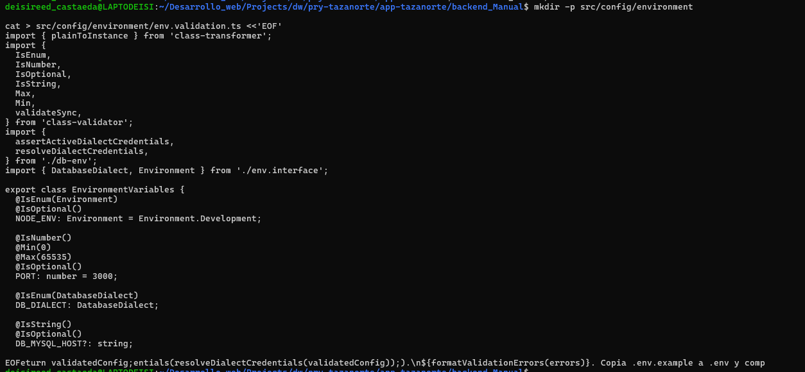

#### 4.4 — Resolver de credenciales por motor

Lee el bloque DB_MYSQL\_\* / DB_POSTGRES\_\* / DB_MSSQL\_\* / DB_ORACLE\_\* según DB_DIALECT.

**Archivo:** `src/config/environment/db-env.ts`

``` bash
mkdir -p src/config/environment 
cat > src/config/environment/db-env.ts <<'EOF_BACKEND_IA'
import { DatabaseConfig, DatabaseDialect }
from './env.interface';

export const DEFAULT_DB_PORTS: Record<DatabaseDialect, number> = {   [DatabaseDialect.MySQL]: 3306,  
[DatabaseDialect.Postgres]: 5432, 
[DatabaseDialect.MSSQL]: 1433,  
[DatabaseDialect.Oracle]: 1521, 
  
};  

export type DialectEnvSource = {   
DB_DIALECT: DatabaseDialect;  
DB_MYSQL_HOST?: string; 
DB_MYSQL_PORT?: string | number; 
DB_MYSQL_USERNAME?: string;  
DB_MYSQL_PASSWORD?: string;  
DB_MYSQL_NAME?: string;  
DB_POSTGRES_HOST?: string; 
DB_POSTGRES_PORT?: string | number; 
DB_POSTGRES_USERNAME?: string;  
DB_POSTGRES_PASSWORD?: string; 
DB_POSTGRES_NAME?: string;
DB_MSSQL_HOST?: string;  
DB_MSSQL_PORT?: string | number; 
DB_MSSQL_USERNAME?: string;
DB_MSSQL_PASSWORD?: string; 
DB_MSSQL_NAME?: string; 
DB_ORACLE_HOST?: string;   
DB_ORACLE_PORT?: string | number;  
DB_ORACLE_USERNAME?: string; 
DB_ORACLE_PASSWORD?: string;  
DB_ORACLE_NAME?: string;
DB_ORACLE_CONNECT_STRING?: string; };  

function toPort(value: string | number | undefined, fallback: number): number {   if (typeof value === 'number' && Number.isFinite(value)) {   
return value;  
} 
if (typeof value === 'string' && value.trim() !== '') {  
const parsed = parseInt(value, 10); 

if (Number.isFinite(parsed)) {    
return parsed;  
}  
}  
return fallback; }  

function text(value: string | undefined): string { 
return value?.trim() ?? ''; }  export function resolveDialectCredentials(   env: DialectEnvSource, ): DatabaseConfig {   const dialect = env.DB_DIALECT;   const port = DEFAULT_DB_PORTS[dialect];    switch (dialect) {     case DatabaseDialect.MySQL:       return {         dialect,         host: text(env.DB_MYSQL_HOST),         port: toPort(env.DB_MYSQL_PORT, port),         username: text(env.DB_MYSQL_USERNAME),         password: text(env.DB_MYSQL_PASSWORD),         database: text(env.DB_MYSQL_NAME),       };     case DatabaseDialect.Postgres:       return {         dialect,         host: text(env.DB_POSTGRES_HOST),         port: toPort(env.DB_POSTGRES_PORT, port),         username: text(env.DB_POSTGRES_USERNAME),         password: text(env.DB_POSTGRES_PASSWORD),         database: text(env.DB_POSTGRES_NAME),       };     case DatabaseDialect.MSSQL:       return {         dialect,         host: text(env.DB_MSSQL_HOST),         port: toPort(env.DB_MSSQL_PORT, port),         username: text(env.DB_MSSQL_USERNAME),         password: text(env.DB_MSSQL_PASSWORD),         database: text(env.DB_MSSQL_NAME),       };     case DatabaseDialect.Oracle:       return {         dialect,         host: text(env.DB_ORACLE_HOST),         port: toPort(env.DB_ORACLE_PORT, port),         username: text(env.DB_ORACLE_USERNAME),         password: text(env.DB_ORACLE_PASSWORD),         database: text(env.DB_ORACLE_NAME),         connectString: text(env.DB_ORACLE_CONNECT_STRING) || undefined,       };     default:       throw new Error(         `Error de configuración: DB_DIALECT inválido. Use mysql, postgres, mssql u oracle.`,       );   } }  export function assertActiveDialectCredentials(config: DatabaseConfig): void {   const prefix: Record<DatabaseDialect, string> = {     [DatabaseDialect.MySQL]: 'DB_MYSQL',     [DatabaseDialect.Postgres]: 'DB_POSTGRES',     [DatabaseDialect.MSSQL]: 'DB_MSSQL',     [DatabaseDialect.Oracle]: 'DB_ORACLE',   };   const tag = prefix[config.dialect];   const missing: string[] = [];    if (!config.host) missing.push(`${tag}_HOST`);   if (!config.username) missing.push(`${tag}_USERNAME`);   if (!config.database) missing.push(`${tag}_NAME`);   if (config.dialect === DatabaseDialect.Oracle && !config.connectString) {     missing.push('DB_ORACLE_CONNECT_STRING');   }    if (missing.length > 0) {     throw new Error(       `Error de configuración: variable(s) crítica(s) inválida(s) o ausente(s) para ${config.dialect}: ${missing.join(', ')}. Completa el bloque de ese motor en .env (no commitees secretos).`,     );   } } EOF_BACKEND_IA
```

**Sugerencia de commit (issue):**

``` bash
git add . 
git commit -m "feat: resolve database credentials per dialect"
```

#### 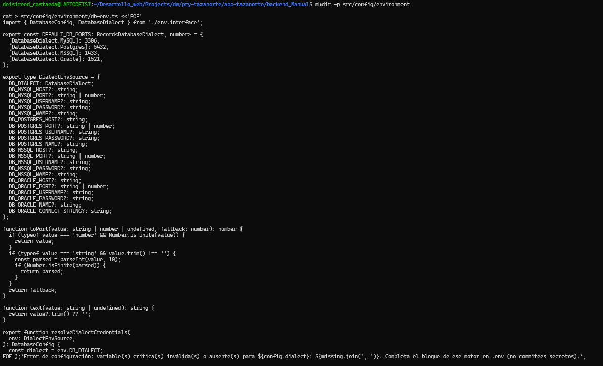

#### 4.5 — Factory registerAs de entorno

Expone `environment.*` vía ConfigService (`registerAs`).

**Archivo:** `src/config/environment/env.config.ts`

``` bash
mkdir -p src/config/environment cat > src/config/environment/env.config.ts <<'EOF_BACKEND_IA' import { registerAs } from '@nestjs/config'; import { resolveDialectCredentials } from './db-env'; import { Environment } from './env.interface'; import { validate } from './env.validation';  export const ENV_CONFIG_NAME = 'environment';  export const envConfig = registerAs(ENV_CONFIG_NAME, () => {   const validated = validate(process.env);    return {     app: {       port: validated.PORT,       nodeEnv: validated.NODE_ENV ?? Environment.Development,     },     database: resolveDialectCredentials(validated),     jwt: {       secret: validated.JWT_SECRET,       expiresIn: validated.JWT_EXPIRES_IN,       refreshSecret: validated.JWT_REFRESH_SECRET,       refreshExpiresIn: validated.JWT_REFRESH_EXPIRES_IN,     },   }; }); EOF_BACKEND_IA
```

**Sugerencia de commit (issue):**

``` bash
git add . 
git commit -m "feat: register environment config factory"
```

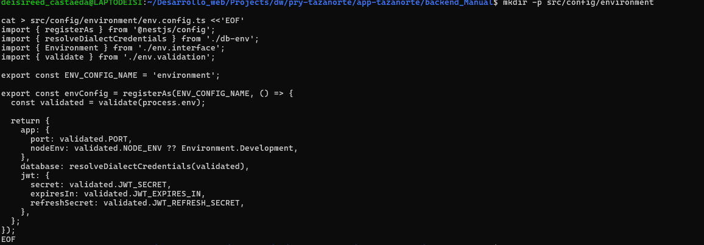

## FASE 5 — `04_BASE_DATABASE_SEQUELIZE`

### Base de datos multi-dialecto (Sequelize)

> **Objetivo de la fase:** Conectar Sequelize al motor de `DB_DIALECT` usando el bloque `DB_MYSQL_*` / `DB_POSTGRES_*` / `DB_MSSQL_*` / `DB_ORACLE_*`. Aún sin features (ALL_MODELS vacío).

#### 5.1 — Constante SEQUELIZE_TOKEN

Token DI para inyectar la instancia Sequelize en repositorios.

**Archivo:** `src/common/constants/database.constants.ts`

``` bash
mkdir -p src/common/constants cat > src/common/constants/database.constants.ts <<'EOF' export const SEQUELIZE_TOKEN = 'SEQUELIZE'; 
EOF
```

**Sugerencia de commit (issue):**

``` bash
git add . 
git commit -m "feat: add SEQUELIZE_TOKEN constant"
```

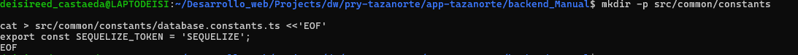

#### 5.2 — Tipos auxiliares de database config

Tipos auxiliares del bloque config/database (legado/compat).

**Archivo:** `src/config/database/database.types.ts`

``` bash
mkdir -p src/config/database cat > src/config/database/database.types.ts <<'EOF_BACKEND_IA' import { Options as SequelizeOptions } from 'sequelize';  export type DialectOptions =   | { dialect: 'mysql'; options?: SequelizeOptions }   | { dialect: 'postgres'; options?: SequelizeOptions }   | { dialect: 'mssql'; options?: SequelizeOptions }   | { dialect: 'oracle'; options?: SequelizeOptions }; EOF_BACKEND_IA
```

**Sugerencia de commit (issue):**

``` bash
git add . 
git commit -m "chore: add database.types helpers"
```

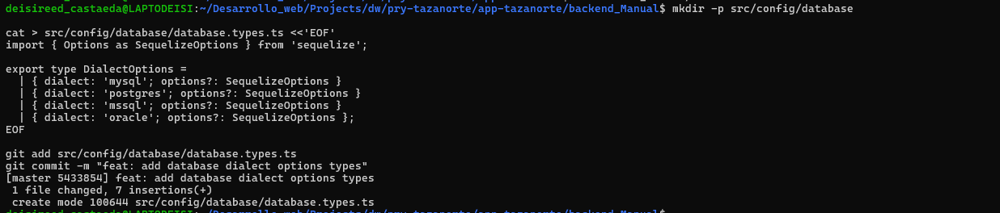

#### 5.3 — database.config.ts

Factory registerAs opcional para namespace `database` (complementa environment).

**Archivo:** `src/config/database/database.config.ts`

``` bash
mkdir -p src/config/database cat > src/config/database/database.config.ts <<'EOF_BACKEND_IA' import { registerAs } from '@nestjs/config'; import { resolveDialectCredentials } from '../environment/db-env'; import { DatabaseDialect } from '../environment/env.interface';  export const DATABASE_CONFIG_NAME = 'database';  const dialectModuleMap: Record<DatabaseDialect, string> = {   [DatabaseDialect.MySQL]: 'mysql2',   [DatabaseDialect.Postgres]: 'pg',   [DatabaseDialect.MSSQL]: 'tedious',   [DatabaseDialect.Oracle]: 'oracledb', };  export const databaseConfig = registerAs(DATABASE_CONFIG_NAME, () => {   const dialect =     (process.env.DB_DIALECT as DatabaseDialect) || DatabaseDialect.MySQL;   const credentials = resolveDialectCredentials({     DB_DIALECT: dialect,     ...process.env,   });    return {     ...credentials,     dialectModulePath: dialectModuleMap[dialect],     autoLoadModels: true,     synchronize: process.env.NODE_ENV !== 'production',     logging: process.env.NODE_ENV === 'development' ? console.log : false,   }; }); EOF_BACKEND_IA
```

**Sugerencia de commit (issue):**

``` bash
git add . 
git commit -m "feat: add database.config registerAs"
```

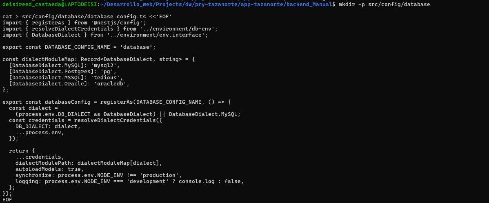

#### 5.4 — database.module.ts / providers

Módulo de configuración de BD (forFeature). Los providers quedan vacíos a propósito.

**Archivo:** `src/config/database/database.module.ts`

``` bash
mkdir -p src/config/database cat > src/config/database/database.module.ts <<'EOF_BACKEND_IA' import { Module } from '@nestjs/common'; import { ConfigModule } from '@nestjs/config'; import { databaseConfig } from './database.config';  @Module({   imports: [ConfigModule.forFeature(databaseConfig)],   exports: [ConfigModule], }) export class DatabaseConfigModule {} EOF_BACKEND_IA
```

**Sugerencia de commit (issue):**

``` bash
git add . 
git commit -m "feat: add DatabaseConfigModule"
```

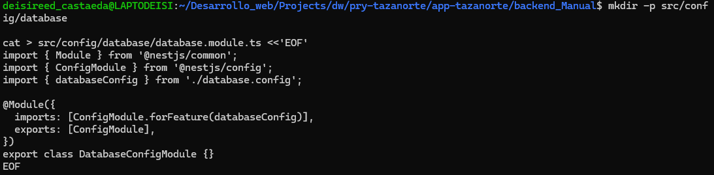

#### 5.5 — database.providers.ts

Placeholder de providers de config/database.

**Archivo:** `src/config/database/database.providers.ts`

``` bash
mkdir -p src/config/database cat > src/config/database/database.providers.ts <<'EOF_BACKEND_IA' export const DATABASE_PROVIDERS = []; EOF_BACKEND_IA
```

**Sugerencia de commit (issue):**

``` bash
git add . git commit -m "chore: add empty DATABASE_PROVIDERS"
```

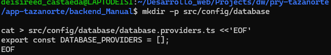

#### 5.6 — Opciones Sequelize por dialecto

Arma host/port/user/password/logging con el bloque del motor seleccionado por DB_DIALECT.

**Archivo:** `src/infrastructure/database/sequelize/sequelize.options.ts`

``` bash
mkdir -p src/infrastructure/database/sequelize cat > src/infrastructure/database/sequelize/sequelize.options.ts <<'EOF_BACKEND_IA' import { SequelizeOptions } from 'sequelize-typescript'; import { resolveDialectCredentials } from '../../../config/environment/db-env'; import { DatabaseDialect } from '../../../config/environment/env.interface';  export function getSequelizeOptions(   dialect: DatabaseDialect, ): Partial<SequelizeOptions> {   const credentials = resolveDialectCredentials({     DB_DIALECT: dialect,     ...process.env,   });    const base: SequelizeOptions = {     dialect: dialect as SequelizeOptions['dialect'],     host: credentials.host,     port: credentials.port,     username: credentials.username,     password: credentials.password,     database: credentials.database,     logging: process.env.NODE_ENV === 'development' ? console.log : false,     define: {       underscored: false,       freezeTableName: true,     },   };    switch (dialect) {     case DatabaseDialect.MSSQL:       return {         ...base,         dialectOptions: {           options: {             encrypt: true,             trustServerCertificate: true,           },         },       };     case DatabaseDialect.Oracle:       return {         ...base,         dialectOptions: {           connectString: credentials.connectString,         },       };     default:       return base;   } } EOF_BACKEND_IA
```

**Sugerencia de commit (issue):**

``` bash
git add . git commit -m "feat: add getSequelizeOptions multi-dialect"
```

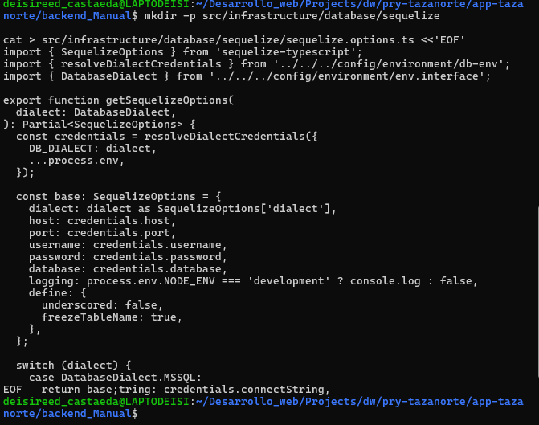

#### 5.7 — Factory Sequelize (sin modelos aún)

Crea la instancia Sequelize. `ALL_MODELS` empieza vacío: se llena al crear cada entidad.cd

**Archivo:** `src/infrastructure/database/sequelize/sequelize.factory.ts`

``` bash
mkdir -p src/infrastructure/database/sequelize cat > src/infrastructure/database/sequelize/sequelize.factory.ts <<'EOF_BACKEND_IA' import { Sequelize } from 'sequelize-typescript'; import { DatabaseDialect } from '../../../config/environment/env.interface'; import { getSequelizeOptions } from './sequelize.options';   export const ALL_MODELS = [   // (aún sin modelos — se agregan por feature) ];  export async function createSequelizeInstance(   dialect: DatabaseDialect, ): Promise<Sequelize> {   const options = getSequelizeOptions(dialect);    let dialectModule: any;    switch (dialect) {     case DatabaseDialect.MySQL:       dialectModule = require('mysql2');       break;     case DatabaseDialect.Postgres:       dialectModule = require('pg');       break;     case DatabaseDialect.MSSQL:       dialectModule = require('tedious');       break;     case DatabaseDialect.Oracle:       dialectModule = require('oracledb');       break;     default:       throw new Error(`Dialecto no soportado: ${dialect}`);   }    const sequelize = new Sequelize({     ...options,     dialectModule,     models: ALL_MODELS,   } as any);    try {     await sequelize.authenticate();     console.log(`✅ Conexión exitosa a ${dialect.toUpperCase()}`);   } catch (error: any) {     console.error(       `❌ Error conectando a ${dialect.toUpperCase()}:`,       error.message,     );     throw error;   }    if (process.env.NODE_ENV !== 'production') {     await sequelize.sync({ alter: false });     console.log('✅ Tablas sincronizadas');   }    return sequelize; } EOF_BACKEND_IA
```

**Sugerencia de commit (issue):**

``` bash
git add . git commit -m "feat: add createSequelizeInstance with empty ALL_MODELS"
```

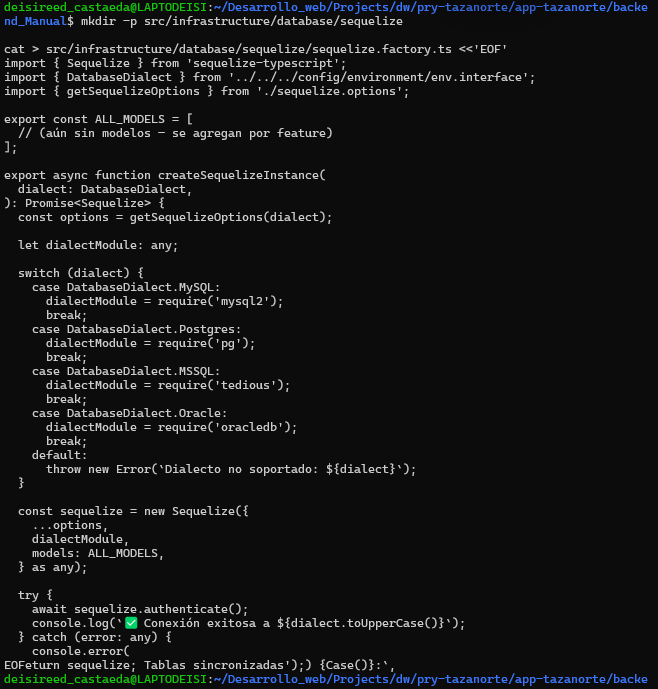

#### 5.8 — DatabaseSeederService (sin seeders aún)

Hook OnModuleInit para seeders. Todavía no llama a ningún seeder de feature.

**Archivo:** `src/infrastructure/database/seeders/database-seeder.service.ts`

``` bash
mkdir -p src/infrastructure/database/seeders cat > src/infrastructure/database/seeders/database-seeder.service.ts <<'EOF_BACKEND_IA' import { Injectable, Logger, OnModuleInit } from '@nestjs/common';   /**  * Ejecuta seeders en orden de dependencias.  * Solo en entornos no productivos.  */ @Injectable() export class DatabaseSeederService implements OnModuleInit {   private readonly logger = new Logger(DatabaseSeederService.name);    async onModuleInit(): Promise<void> {     if (process.env.NODE_ENV === 'production') {       return;     }      try {       // sin seeders aún       this.logger.log('✅ Seeders ejecutados');     } catch (error: any) {       this.logger.error(`❌ Error en seeders: ${error.message}`, error.stack);       throw error;     }   } } EOF_BACKEND_IA
```

**Sugerencia de commit (issue):**

``` bash
git add . git commit -m "feat: add DatabaseSeederService scaffold"
```

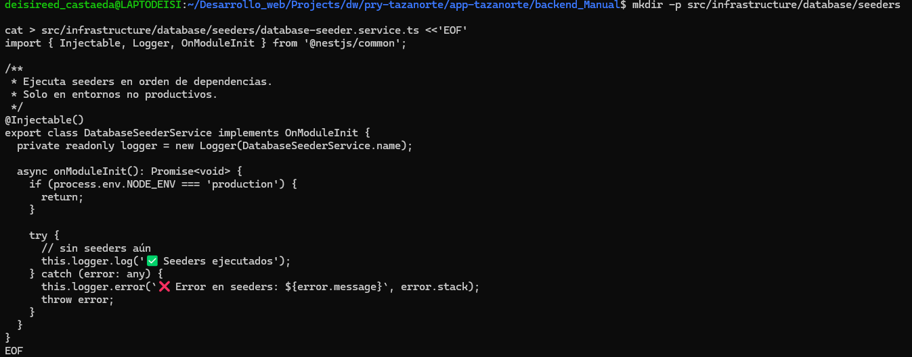

#### 5.9 — Módulo global Sequelize

Módulo `@Global()` que provee `SEQUELIZE_TOKEN` + ejecuta seeders.

**Archivo:** `src/infrastructure/database/sequelize/sequelize.module.ts`

``` bash
mkdir -p src/infrastructure/database/sequelize cat > src/infrastructure/database/sequelize/sequelize.module.ts <<'EOF_BACKEND_IA' import { Module, Global } from '@nestjs/common'; import { ConfigService } from '@nestjs/config'; import { Sequelize } from 'sequelize-typescript'; import { DatabaseDialect } from '../../../config/environment/env.interface'; import { SEQUELIZE_TOKEN } from '../../../common/constants/database.constants'; import { createSequelizeInstance } from './sequelize.factory'; import { DatabaseSeederService } from '../seeders/database-seeder.service';  @Global() @Module({   providers: [     {       provide: SEQUELIZE_TOKEN,       useFactory: async (configService: ConfigService): Promise<Sequelize> => {         const dialect = configService.get<DatabaseDialect>(           'environment.database.dialect',           DatabaseDialect.MySQL,         );         return createSequelizeInstance(dialect);       },       inject: [ConfigService],     },     DatabaseSeederService,   ],   exports: [SEQUELIZE_TOKEN], }) export class SequelizeDatabaseModule {} EOF_BACKEND_IA
```

**Sugerencia de commit (issue):**

``` bash
git add . git commit -m "feat: add global SequelizeDatabaseModule"
```

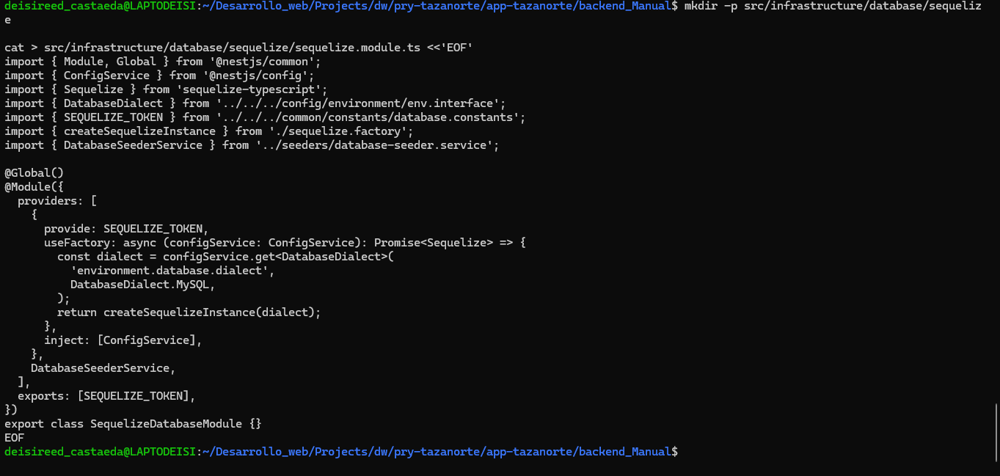

#### 5.10 — Verificar conexión a BD

Crea la BD vacía `tecnogua_ia` en el motor que indica `DB_DIALECT`. Aún no hay tablas de negocio. Si falla el authenticate, corrige el **bloque de ese motor** en `.env` (no el de otro).

``` bash
# mysql: # mysql -u root -p -e "CREATE DATABASE IF NOT EXISTS tecnogua_ia;" # postgres: # createdb tecnogua_ia # mssql (sqlcmd): # sqlcmd -S localhost -U sa -Q "CREATE DATABASE tecnogua_ia;" # oracle: crea el schema/PDB que apunte DB_ORACLE_CONNECT_STRING npm run start:dev # Busca: ✅ Conexión exitosa a MYSQL (o POSTGRES / MSSQL / ORACLE según DB_DIALECT) # Ctrl+C
```

**Sugerencia de commit (issue):**

``` bash
git add . git commit -m "test: verify sequelize authenticates against tecnogua_ia"
```

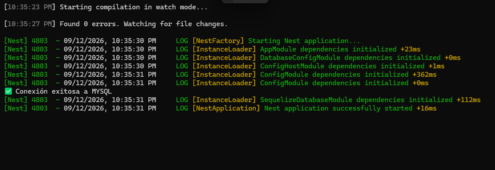

## FASE 6 — `05_BASE_APP_COMMON_SECURITY`

### App config + Logger + Common + Security + bootstrap

> **Objetivo de la fase:** Dejar la infraestructura transversal lista antes de la primera entidad de negocio. Aún sin Business/Auth en AppModule y sin guards globales.

#### 6.1 — config/app/app.constants.ts

Archivo del feature en Clean Architecture.

**Archivo:** `src/config/app/app.constants.ts`

``` bash
mkdir -p src/config/app cat > src/config/app/app.constants.ts <<'EOF_BACKEND_IA' export const APP_CONFIG_NAME = 'app';  export const APP_DEFAULTS = {   PORT: 3002,   NODE_ENV: 'development', }; EOF_BACKEND_IA
```

**Sugerencia de commit (issue):**

``` bash
git add . 
git commit -m "feat: add app.constants.ts"
```

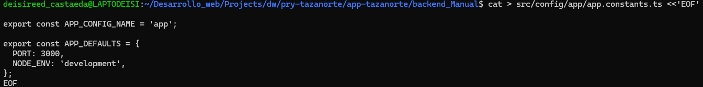

#### 6.2 — config/app/app.config.ts

Archivo del feature en Clean Architecture.

**Archivo:** `src/config/app/app.config.ts`

``` bash
mkdir -p src/config/app cat > src/config/app/app.config.ts <<'EOF_BACKEND_IA' import { registerAs } from '@nestjs/config'; import { APP_CONFIG_NAME, APP_DEFAULTS } from './app.constants'; import { Environment } from '../environment/env.interface';  export const appConfig = registerAs(APP_CONFIG_NAME, () => ({   port: parseInt(process.env.PORT || String(APP_DEFAULTS.PORT), 10),   nodeEnv: (process.env.NODE_ENV as Environment) || APP_DEFAULTS.NODE_ENV, })); EOF_BACKEND_IA
```

**Sugerencia de commit (issue):**

``` bash
git add . 
git commit -m "feat: add app.config.ts"
```

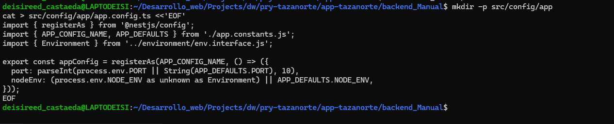

#### 6.3 — config/logger/logger.config.ts

Archivo del feature en Clean Architecture.

**Archivo:** `src/config/logger/logger.config.ts`

``` bash
mkdir -p src/config/logger cat > src/config/logger/logger.config.ts <<'EOF_BACKEND_IA' import { LogLevel } from '@nestjs/common';  export function getLoggerConfig(): { logLevels: LogLevel[] } {   const isDev = process.env.NODE_ENV === 'development';    return {     logLevels: isDev       ? ['log', 'error', 'warn', 'debug', 'verbose', 'fatal']       : ['log', 'error', 'warn'],   }; } EOF_BACKEND_IA
```

**Sugerencia de commit (issue):**

``` bash
git add .
git commit -m "feat: add logger.config.ts"
```

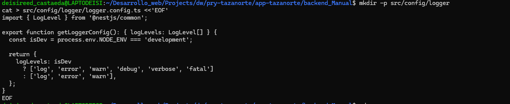

#### 6.4 — config/logger/logger.module.ts

Módulo Nest del feature: cablea providers, tokens DI y controller.

**Archivo:** `src/config/logger/logger.module.ts`

``` bash
mkdir -p src/config/logger cat > src/config/logger/logger.module.ts <<'EOF_BACKEND_IA' import { Module, Global, Logger } from '@nestjs/common';  @Global() @Module({   providers: [Logger],   exports: [Logger], }) export class LoggerModule {} EOF_BACKEND_IA
```

**Sugerencia de commit (issue):**

``` bash
git add .
git commit -m "feat: wire nest module logger.module.ts"
```

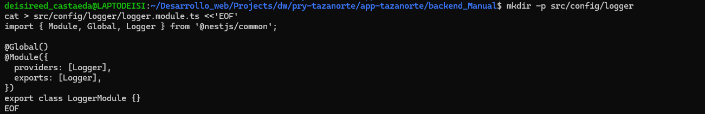

#### 6.5 — config/jwt/jwt.constants.ts

Archivo del feature en Clean Architecture.

**Archivo:** `src/config/jwt/jwt.constants.ts`

``` bash
mkdir -p src/config/jwt cat > src/config/jwt/jwt.constants.ts <<'EOF_BACKEND_IA' export const JWT_CONFIG_NAME = 'jwt';  export const JWT_DEFAULTS = {   EXPIRES_IN: '1d',   REFRESH_EXPIRES_IN: '7d', }; EOF_BACKEND_IA
```

**Sugerencia de commit (issue):**

``` bash
git add . 
git commit -m "feat: add jwt.constants.ts"
```

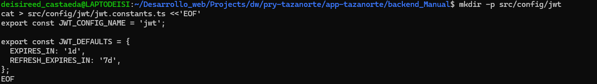

#### 6.6 — config/jwt/jwt.config.ts

Archivo del feature en Clean Architecture.

**Archivo:** `src/config/jwt/jwt.config.ts`

``` bash
mkdir -p src/config/jwt cat > src/config/jwt/jwt.config.ts <<'EOF_BACKEND_IA' import { registerAs } from '@nestjs/config'; import { JWT_CONFIG_NAME, JWT_DEFAULTS } from './jwt.constants';  export const jwtConfig = registerAs(JWT_CONFIG_NAME, () => ({   secret: process.env.JWT_SECRET || '',   expiresIn: process.env.JWT_EXPIRES_IN || JWT_DEFAULTS.EXPIRES_IN,   refreshSecret: process.env.JWT_REFRESH_SECRET || '',   refreshExpiresIn:     process.env.JWT_REFRESH_EXPIRES_IN || JWT_DEFAULTS.REFRESH_EXPIRES_IN, })); EOF_BACKEND_IA
```

**Sugerencia de commit (issue):**

``` bash
git add .
git commit -m "feat: add jwt.config.ts"
```

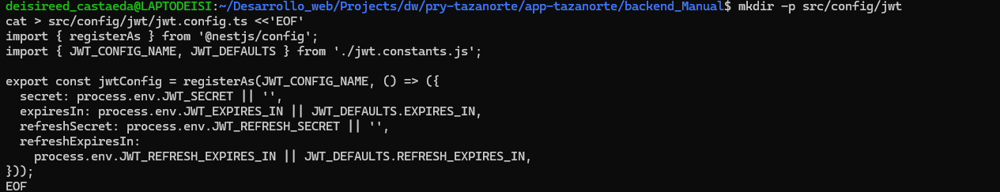

#### 6.7 — config/swagger/swagger.constants.ts

Archivo del feature en Clean Architecture.

**Archivo:** `src/config/swagger/swagger.constants.ts`

``` bash
mkdir -p src/config/swagger cat > src/config/swagger/swagger.constants.ts <<'EOF_BACKEND_IA' export const SWAGGER_TITLE = 'Backend NestJS + Sequelize API'; export const SWAGGER_DESCRIPTION =   'API profesional con Clean Architecture / DDD, JWT y RBAC'; export const SWAGGER_VERSION = '1.0'; export const SWAGGER_PATH = 'api/docs'; EOF_BACKEND_IA
```

**Sugerencia de commit (issue):**

``` bash
git add . 
git commit -m "feat: add swagger.constants.ts"
```

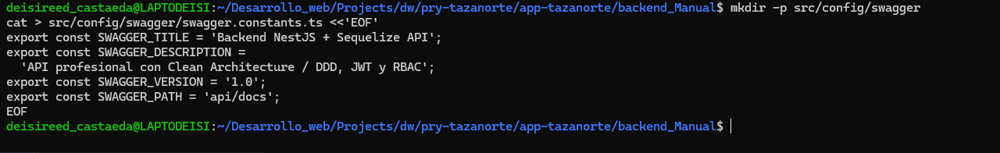

#### 6.8 — config/swagger/swagger.config.ts

Archivo del feature en Clean Architecture.

**Archivo:** `src/config/swagger/swagger.config.ts`

``` bash
mkdir -p src/config/swagger cat > src/config/swagger/swagger.config.ts <<'EOF_BACKEND_IA' import { INestApplication } from '@nestjs/common'; import { DocumentBuilder, SwaggerModule } from '@nestjs/swagger'; import {   SWAGGER_DESCRIPTION,   SWAGGER_PATH,   SWAGGER_TITLE,   SWAGGER_VERSION, } from './swagger.constants';  export function setupSwagger(app: INestApplication): void {   const config = new DocumentBuilder()     .setTitle(SWAGGER_TITLE)     .setDescription(SWAGGER_DESCRIPTION)     .setVersion(SWAGGER_VERSION)     .addBearerAuth(       {         type: 'http',         scheme: 'bearer',         bearerFormat: 'JWT',         name: 'Authorization',         in: 'header',       },       'access-token',     )     .build();    const document = SwaggerModule.createDocument(app, config);   SwaggerModule.setup(SWAGGER_PATH, app, document); } EOF_BACKEND_IA
```

**Sugerencia de commit (issue):**

``` bash
git add . 
git commit -m "feat: add swagger.config.ts"
```

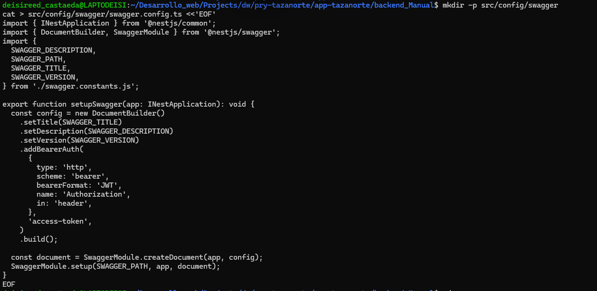

#### 6.9 — common/enums/status.enum.ts

Archivo del feature en Clean Architecture.

**Archivo:** `src/common/enums/status.enum.ts`

``` bash
mkdir -p src/common/enums cat > src/common/enums/status.enum.ts <<'EOF_BACKEND_IA' export enum Status {   ACTIVE = 'ACTIVE',   INACTIVE = 'INACTIVE', } EOF_BACKEND_IA
```

**Sugerencia de commit (issue):**

``` bash
git add . 
git commit -m "feat: add status.enum.ts"
```

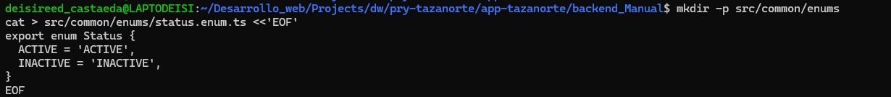

#### 6.10 — common/enums/http-method.enum.ts

Archivo del feature en Clean Architecture.

**Archivo:** `src/common/enums/http-method.enum.ts`

``` bash
mkdir -p src/common/enums cat > src/common/enums/http-method.enum.ts <<'EOF_BACKEND_IA' export enum HttpMethod {   GET = 'GET',   POST = 'POST',   PUT = 'PUT',   PATCH = 'PATCH',   DELETE = 'DELETE', } EOF_BACKEND_IA
```

**Sugerencia de commit (issue):**

``` bash
git add . 
git commit -m "feat: add http-method.enum.ts"
```

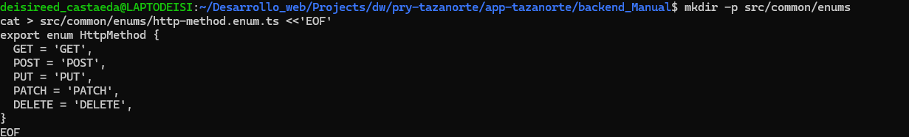

#### 6.11 — common/enums/sort-order.enum.ts

Archivo del feature en Clean Architecture.

**Archivo:** `src/common/enums/sort-order.enum.ts`

``` bash
mkdir -p src/common/enums cat > src/common/enums/sort-order.enum.ts <<'EOF_BACKEND_IA' export enum SortOrder {   ASC = 'ASC',   DESC = 'DESC', } EOF_BACKEND_IA
```

**Sugerencia de commit (issue):**

``` bash
git add . 
git commit -m "feat: add sort-order.enum.ts"
```

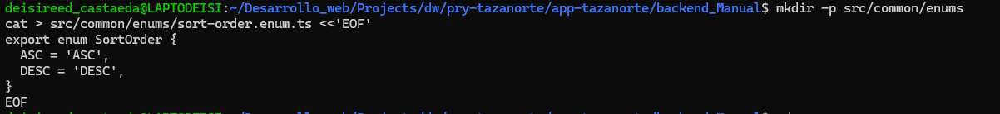

#### 6.12 — common/constants/app.constants.ts

Archivo del feature en Clean Architecture.

**Archivo:** `src/common/constants/app.constants.ts`

``` bash
mkdir -p src/common/constants cat > src/common/constants/app.constants.ts <<'EOF_BACKEND_IA' export const APP_NAME = 'backend_ia'; export const GLOBAL_PREFIX = 'api'; EOF_BACKEND_IA
```

**Sugerencia de commit (issue):**

``` bash
git add .
git commit -m "feat: add app.constants.ts"
```

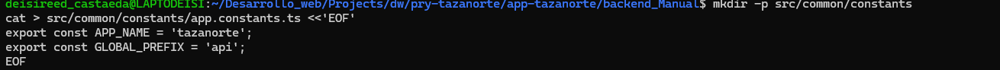

#### 6.13 — common/constants/pagination.constants.ts

Archivo del feature en Clean Architecture.

**Archivo:** `src/common/constants/pagination.constants.ts`

``` bash
mkdir -p src/common/constants cat > src/common/constants/pagination.constants.ts <<'EOF_BACKEND_IA' export const DEFAULT_PAGE = 1; export const DEFAULT_LIMIT = 10; export const MAX_LIMIT = 100; EOF_BACKEND_IA
```

**Sugerencia de commit (issue):**

``` bash
git add .
git commit -m "feat: add pagination.constants.ts"
```

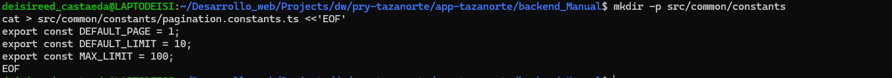

#### 6.14 — common/exceptions/application.exception.ts

Archivo del feature en Clean Architecture.

**Archivo:** `src/common/exceptions/application.exception.ts`

``` bash
mkdir -p src/common/exceptions cat > src/common/exceptions/application.exception.ts <<'EOF_BACKEND_IA' export class ApplicationException extends Error {   public readonly timestamp: string;    constructor(     public readonly message: string,     public readonly statusCode: number = 500,   ) {     super(message);     this.timestamp = new Date().toISOString();     Error.captureStackTrace(this, this.constructor);   } } EOF_BACKEND_IA
```

**Sugerencia de commit (issue):**

``` bash
git add .
git commit -m "feat: add application.exception.ts"
```

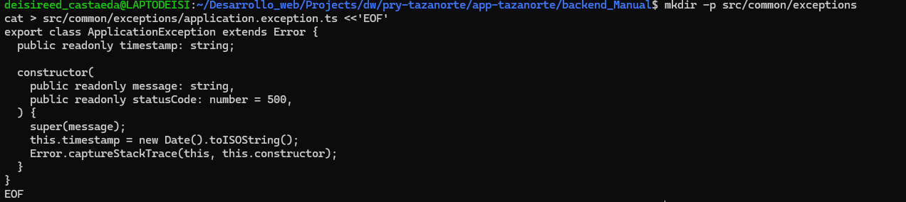

#### 6.15 — common/exceptions/domain.exception.ts

Archivo del feature en Clean Architecture.

**Archivo:** `src/common/exceptions/domain.exception.ts`

``` bash
mkdir -p src/common/exceptions cat > src/common/exceptions/domain.exception.ts <<'EOF_BACKEND_IA' import { ApplicationException } from './application.exception';  export class DomainException extends ApplicationException {   constructor(message: string) {     super(message, 400);   } } EOF_BACKEND_IA
```

**Sugerencia de commit (issue):**

``` bash
git add . 
git commit -m "feat: add domain.exception.ts"
```

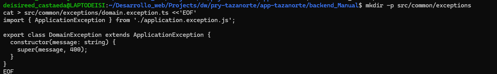

#### 6.16 — common/exceptions/entity-not-found.exception.ts

Archivo del feature en Clean Architecture.

**Archivo:** `src/common/exceptions/entity-not-found.exception.ts`

``` bash
mkdir -p src/common/exceptions cat > src/common/exceptions/entity-not-found.exception.ts <<'EOF_BACKEND_IA' import { ApplicationException } from './application.exception';  export class EntityNotFoundException extends ApplicationException {   constructor(entityName: string, identifier: string | number) {     super(`${entityName} con ID ${identifier} no encontrado`, 404);   } } EOF_BACKEND_IA
```

**Sugerencia de commit (issue):**

``` bash
git add . 
git commit -m "feat: add entity-not-found.exception.ts"
```

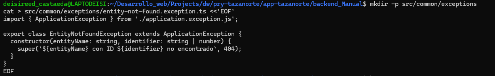

#### 6.17 — common/exceptions/validation.exception.ts

Archivo del feature en Clean Architecture.

**Archivo:** `src/common/exceptions/validation.exception.ts`

``` bash
mkdir -p src/common/exceptions cat > src/common/exceptions/validation.exception.ts <<'EOF_BACKEND_IA' import { ApplicationException } from './application.exception';  export class ValidationException extends ApplicationException {   constructor(message: string = 'Error de validación') {     super(message, 422);   } } EOF_BACKEND_IA
```

**Sugerencia de commit (issue):**

``` bash
git add . 
git commit -m "feat: add validation.exception.ts"
```

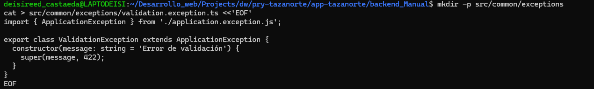

#### 6.18 — common/filters/global-exception.filter.ts

Archivo del feature en Clean Architecture.

**Archivo:** `src/common/filters/global-exception.filter.ts`

``` bash
mkdir -p src/common/filters cat > src/common/filters/global-exception.filter.ts <<'EOF_BACKEND_IA' import {   ExceptionFilter,   Catch,   ArgumentsHost,   HttpException,   HttpStatus, } from '@nestjs/common'; import { Request, Response } from 'express'; import { ApplicationException } from '../exceptions/application.exception';  @Catch() export class GlobalExceptionFilter implements ExceptionFilter {   catch(exception: unknown, host: ArgumentsHost): void {     const ctx = host.switchToHttp();     const response = ctx.getResponse<Response>();     const request = ctx.getRequest<Request>();      let status = HttpStatus.INTERNAL_SERVER_ERROR;     let message: string | string[] = 'Error interno del servidor';      if (exception instanceof ApplicationException) {       status = exception.statusCode;       message = exception.message;     } else if (exception instanceof HttpException) {       status = exception.getStatus();       const res = exception.getResponse();       message = typeof res === 'string' ? res : (res as any).message;     }      response.status(status).json({       statusCode: status,       message,       timestamp: new Date().toISOString(),       path: request.url,     });   } } EOF_BACKEND_IA
```

**Sugerencia de commit (issue):**

``` bash
git add .
git commit -m "feat: add global-exception.filter.ts"
```

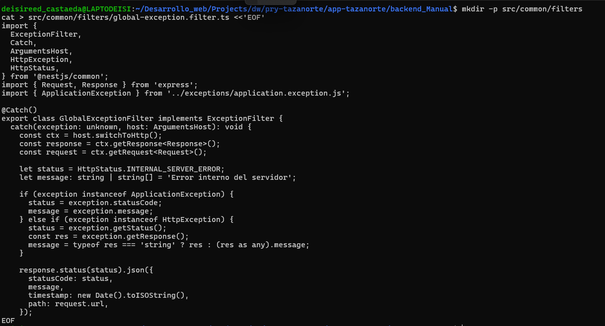

#### 6.19 — common/filters/sequelize-exception.filter.ts

Archivo del feature en Clean Architecture.

**Archivo:** `src/common/filters/sequelize-exception.filter.ts`

``` bash
mkdir -p src/common/filters cat > src/common/filters/sequelize-exception.filter.ts <<'EOF_BACKEND_IA' import { ExceptionFilter, Catch, ArgumentsHost } from '@nestjs/common'; import { Response } from 'express';  @Catch() export class SequelizeExceptionFilter implements ExceptionFilter {   catch(exception: any, host: ArgumentsHost): void {     const ctx = host.switchToHttp();     const response = ctx.getResponse<Response>();      const sequelizeErrors = [       'SequelizeUniqueConstraintError',       'SequelizeForeignKeyConstraintError',       'SequelizeConnectionError',       'SequelizeValidationError',       'SequelizeDatabaseError',     ];      if (!exception?.name || !sequelizeErrors.includes(exception.name)) {       throw exception;     }      let status = 500;     let message = 'Error de base de datos';      if (exception.name === 'SequelizeUniqueConstraintError') {       status = 409;       message = 'El recurso ya existe (violación de unicidad)';     } else if (exception.name === 'SequelizeForeignKeyConstraintError') {       status = 400;       message = 'Violación de clave foránea';     } else if (exception.name === 'SequelizeConnectionError') {       status = 503;       message = 'No se pudo conectar a la base de datos';     } else if (exception.name === 'SequelizeValidationError') {       status = 422;       message = exception.message || 'Error de validación en base de datos';     }      response.status(status).json({       statusCode: status,       message,       timestamp: new Date().toISOString(),     });   } } EOF_BACKEND_IA
```

**Sugerencia de commit (issue):**

``` bash
git add .
git commit -m "feat: add sequelize-exception.filter.ts"
```

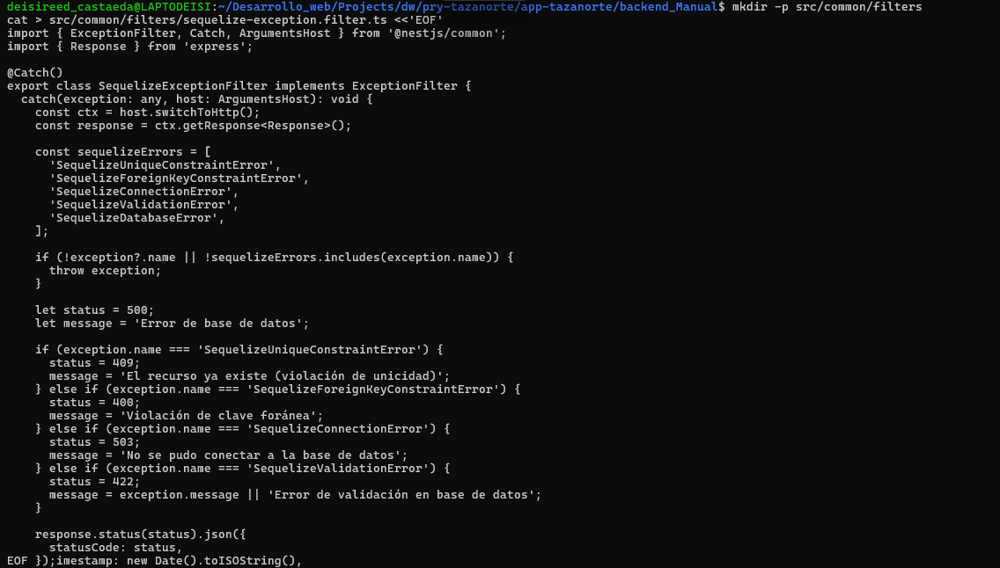

#### 6.20 — common/interceptors/response.interceptor.ts

Archivo del feature en Clean Architecture.

**Archivo:** `src/common/interceptors/response.interceptor.ts`

``` bash
mkdir -p src/common/interceptors cat > src/common/interceptors/response.interceptor.ts <<'EOF_BACKEND_IA' import {   Injectable,   NestInterceptor,   ExecutionContext,   CallHandler, } from '@nestjs/common'; import { Observable } from 'rxjs'; import { map } from 'rxjs/operators';  export interface ApiResponse<T> {   statusCode: number;   message: string;   data: T;   timestamp: string; }  @Injectable() export class ResponseInterceptor<T>   implements NestInterceptor<T, ApiResponse<T>> {   intercept(     context: ExecutionContext,     next: CallHandler,   ): Observable<ApiResponse<T>> {     const response = context.switchToHttp().getResponse();     const statusCode = response.statusCode;      return next.handle().pipe(       map((data) => ({         statusCode,         message: 'Operación exitosa',         data,         timestamp: new Date().toISOString(),       })),     );   } } EOF_BACKEND_IA
```

**Sugerencia de commit (issue):**

``` bash
git add .
git commit -m "feat: add response.interceptor.ts"
```

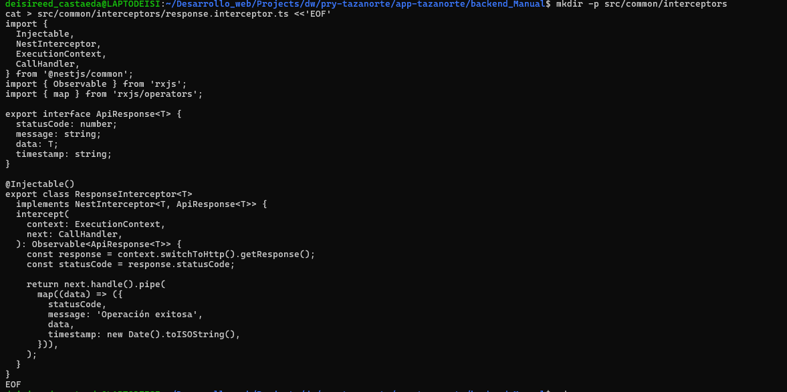

#### 6.21 — common/interceptors/logging.interceptor.ts

Archivo del feature en Clean Architecture.

**Archivo:** `src/common/interceptors/logging.interceptor.ts`

``` bash
mkdir -p src/common/interceptors cat > src/common/interceptors/logging.interceptor.ts <<'EOF_BACKEND_IA' import {   Injectable,   NestInterceptor,   ExecutionContext,   CallHandler,   Logger, } from '@nestjs/common'; import { Observable } from 'rxjs'; import { tap } from 'rxjs/operators';  @Injectable() export class LoggingInterceptor implements NestInterceptor {   private readonly logger = new Logger('HTTP');    intercept(context: ExecutionContext, next: CallHandler): Observable<any> {     const req = context.switchToHttp().getRequest();     const { method, url } = req;     const now = Date.now();      return next.handle().pipe(       tap(() => {         const res = context.switchToHttp().getResponse();         const delay = Date.now() - now;         this.logger.log(`${method} ${url} ${res.statusCode} - ${delay}ms`);       }),     );   } } EOF_BACKEND_IA
```

**Sugerencia de commit (issue):**

``` bash
git add . 
git commit -m "feat: add logging.interceptor.ts"
```

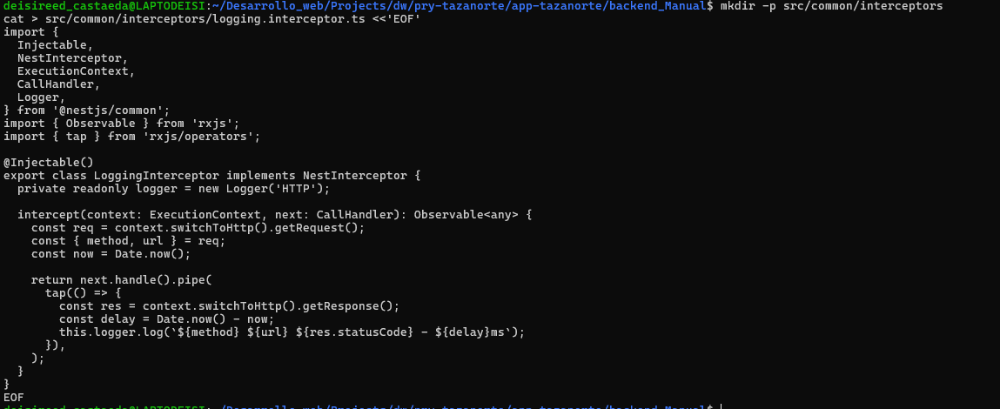

#### 6.22 — common/interceptors/timeout.interceptor.ts

Archivo del feature en Clean Architecture.

**Archivo:** `src/common/interceptors/timeout.interceptor.ts`

``` bash
mkdir -p src/common/interceptors cat > src/common/interceptors/timeout.interceptor.ts <<'EOF_BACKEND_IA' import {   Injectable,   NestInterceptor,   ExecutionContext,   CallHandler,   RequestTimeoutException, } from '@nestjs/common'; import { Observable, throwError, TimeoutError } from 'rxjs'; import { catchError, timeout } from 'rxjs/operators';  @Injectable() export class TimeoutInterceptor implements NestInterceptor {   intercept(context: ExecutionContext, next: CallHandler): Observable<any> {     return next.handle().pipe(       timeout(30000),       catchError((err) => {         if (err instanceof TimeoutError) {           return throwError(() => new RequestTimeoutException());         }         return throwError(() => err);       }),     );   } } EOF_BACKEND_IA
```

**Sugerencia de commit (issue):**

``` bash
git add . 
git commit -m "feat: add timeout.interceptor.ts"
```

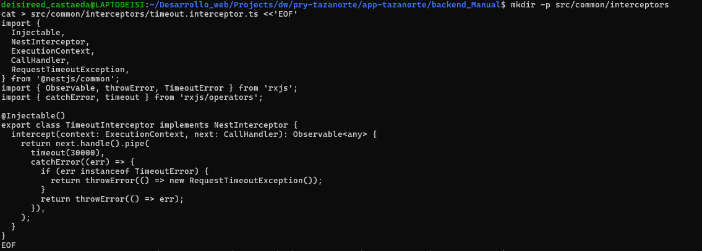

#### 6.23 — common/pipes/validation.pipe.ts

Archivo del feature en Clean Architecture.

**Archivo:** `src/common/pipes/validation.pipe.ts`

``` bash
mkdir -p src/common/pipes cat > src/common/pipes/validation.pipe.ts <<'EOF_BACKEND_IA' import {   PipeTransform,   Injectable,   ArgumentMetadata,   BadRequestException, } from '@nestjs/common'; import { validate } from 'class-validator'; import { plainToInstance } from 'class-transformer';  @Injectable() export class CustomValidationPipe implements PipeTransform<any> {   async transform(value: any, { metatype }: ArgumentMetadata) {     if (!metatype || !this.toValidate(metatype)) {       return value;     }      const object = plainToInstance(metatype, value);     const errors = await validate(object);      if (errors.length > 0) {       const messages = errors.map(         (err) =>           `${err.property}: ${Object.values(err.constraints || {}).join(', ')}`,       );       throw new BadRequestException(messages);     }      return object;   }    private toValidate(metatype: any): boolean {     const types = [String, Boolean, Number, Array, Object];     return !types.includes(metatype);   } } EOF_BACKEND_IA
```

**Sugerencia de commit (issue):**

``` bash
git add .
git commit -m "feat: add validation.pipe.ts"
```

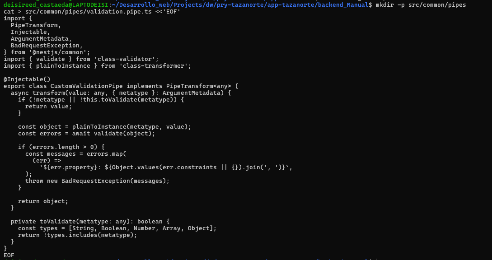

#### 6.24 — common/pipes/parse-positive-int.pipe.ts

Archivo del feature en Clean Architecture.

**Archivo:** `src/common/pipes/parse-positive-int.pipe.ts`

``` bash
mkdir -p src/common/pipes cat > src/common/pipes/parse-positive-int.pipe.ts <<'EOF_BACKEND_IA' import {   PipeTransform,   Injectable,   BadRequestException, } from '@nestjs/common';  @Injectable() export class ParsePositiveIntPipe implements PipeTransform<string, number> {   transform(value: string): number {     const parsed = parseInt(value, 10);      if (isNaN(parsed) || parsed <= 0) {       throw new BadRequestException(         `El valor '${value}' no es un entero positivo`,       );     }      return parsed;   } } EOF_BACKEND_IA
```

**Sugerencia de commit (issue):**

``` bash
git add . 
git commit -m "feat: add parse-positive-int.pipe.ts"
```

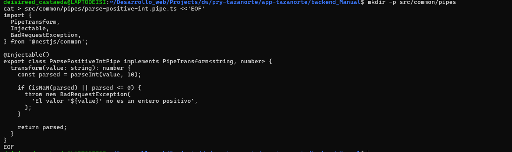

#### 6.25 — common/decorators/public.decorator.ts

Archivo del feature en Clean Architecture.

**Archivo:** `src/common/decorators/public.decorator.ts`

``` bash
mkdir -p src/common/decorators cat > src/common/decorators/public.decorator.ts <<'EOF_BACKEND_IA' import { SetMetadata } from '@nestjs/common';  export const IS_PUBLIC_KEY = 'isPublic'; export const Public = () => SetMetadata(IS_PUBLIC_KEY, true); EOF_BACKEND_IA
```

**Sugerencia de commit (issue):**

``` bash
git add . 
git commit -m "feat: add public.decorator.ts"
```

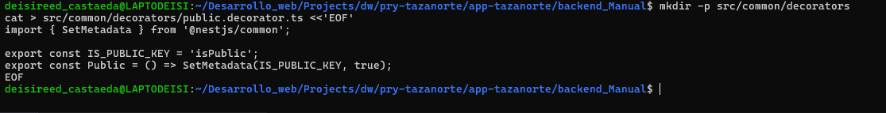

#### 6.26 — common/decorators/roles.decorator.ts

Archivo del feature en Clean Architecture.

**Archivo:** `src/common/decorators/roles.decorator.ts`

``` bash
mkdir -p src/common/decorators cat > src/common/decorators/roles.decorator.ts <<'EOF_BACKEND_IA' import { SetMetadata } from '@nestjs/common';  export const ROLES_KEY = 'roles'; export const Roles = (...roles: string[]) => SetMetadata(ROLES_KEY, roles); EOF_BACKEND_IA
```

**Sugerencia de commit (issue):**

``` bash
git add .
git commit -m "feat: add roles.decorator.ts"
```

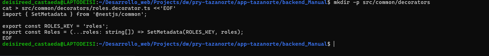

#### 6.27 — common/decorators/current-user.decorator.ts

Archivo del feature en Clean Architecture.

**Archivo:** `src/common/decorators/current-user.decorator.ts`

``` bash
mkdir -p src/common/decorators cat > src/common/decorators/current-user.decorator.ts <<'EOF_BACKEND_IA' import { createParamDecorator, ExecutionContext } from '@nestjs/common';  export const CurrentUser = createParamDecorator(   (data: string | undefined, ctx: ExecutionContext) => {     const request = ctx.switchToHttp().getRequest();     const user = request.user;     return data ? user?.[data] : user;   }, ); EOF_BACKEND_IA
```

**Sugerencia de commit (issue):**

``` bash
git add .
git commit -m "feat: add current-user.decorator.ts"
```

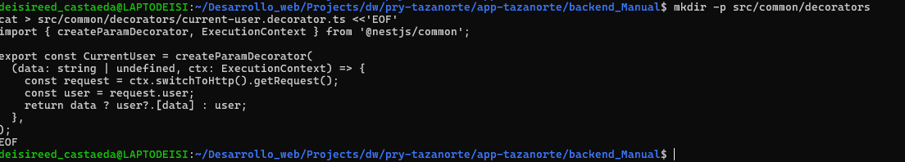

#### 6.28 — common/decorators/resource.decorator.ts

Archivo del feature en Clean Architecture.

**Archivo:** `src/common/decorators/resource.decorator.ts`

``` bash
mkdir -p src/common/decorators cat > src/common/decorators/resource.decorator.ts <<'EOF_BACKEND_IA' import { SetMetadata } from '@nestjs/common';  export const RESOURCE_KEY = 'resource'; export const ResourceMeta = (path: string, method: string) =>   SetMetadata(RESOURCE_KEY, { path, method }); EOF_BACKEND_IA
```

**Sugerencia de commit (issue):**

``` bash
git add . 
git commit -m "feat: add resource.decorator.ts"
```

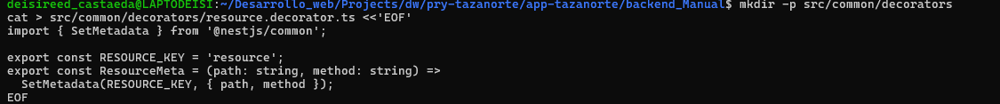

#### 6.29 — common/interfaces/authenticated-user.interface.ts

Archivo del feature en Clean Architecture.

**Archivo:** `src/common/interfaces/authenticated-user.interface.ts`

``` bash
mkdir -p src/common/interfaces cat > src/common/interfaces/authenticated-user.interface.ts <<'EOF_BACKEND_IA' export interface AuthenticatedUser {   id: number;   email: string;   username: string;   roles: string[]; } EOF_BACKEND_IA
```

**Sugerencia de commit (issue):**

``` bash
git add . 
git commit -m "feat: add authenticated-user.interface.ts"
```

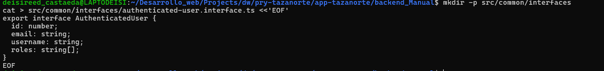

#### 6.30 — common/interfaces/pagination.interface.ts

Archivo del feature en Clean Architecture.

**Archivo:** `src/common/interfaces/pagination.interface.ts`

``` bash
mkdir -p src/common/interfaces cat > src/common/interfaces/pagination.interface.ts <<'EOF_BACKEND_IA' export interface PaginationMeta {   page: number;   limit: number;   total: number;   totalPages: number; }  export interface PaginatedResult<T> {   items: T[];   meta: PaginationMeta; } EOF_BACKEND_IA
```

**Sugerencia de commit (issue):**

``` bash
git add . 
git commit -m "feat: add pagination.interface.ts"
```

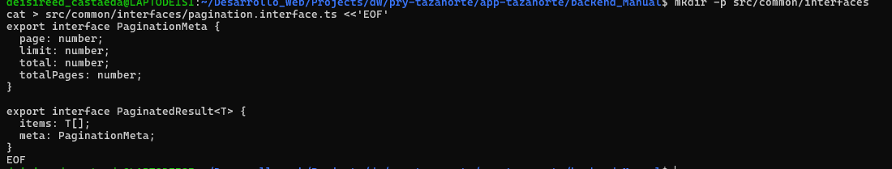

#### 6.31 — common/interfaces/api-response.interface.ts

Archivo del feature en Clean Architecture.

**Archivo:** `src/common/interfaces/api-response.interface.ts`

``` bash
mkdir -p src/common/interfaces cat > src/common/interfaces/api-response.interface.ts <<'EOF_BACKEND_IA' export interface ApiResponseBody<T> {   statusCode: number;   message: string;   data: T;   timestamp: string; } EOF_BACKEND_IA
```

**Sugerencia de commit (issue):**

``` bash
git add .
git commit -m "feat: add api-response.interface.ts"
```

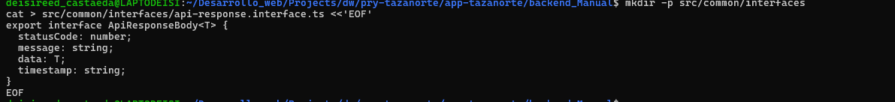

#### 6.32 — common/types/nullable.type.ts

Archivo del feature en Clean Architecture.

**Archivo:** `src/common/types/nullable.type.ts`

``` bash
mkdir -p src/common/types cat > src/common/types/nullable.type.ts <<'EOF_BACKEND_IA' export type Nullable<T> = T | null; EOF_BACKEND_IA
```

**Sugerencia de commit (issue):**

``` bash
git add .
git commit -m "feat: add nullable.type.ts"
```

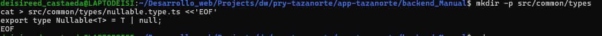

#### 6.33 — common/types/optional.type.ts

Archivo del feature en Clean Architecture.

**Archivo:** `src/common/types/optional.type.ts`

``` bash
mkdir -p src/common/types cat > src/common/types/optional.type.ts <<'EOF_BACKEND_IA' export type Optional<T> = T | undefined; EOF_BACKEND_IA
```

**Sugerencia de commit (issue):**

``` bash
git add . 
git commit -m "feat: add optional.type.ts"
```

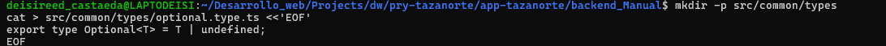

#### 6.34 — common/utils/pagination.util.ts

Archivo del feature en Clean Architecture.

**Archivo:** `src/common/utils/pagination.util.ts`

``` bash
mkdir -p src/common/utils cat > src/common/utils/pagination.util.ts <<'EOF_BACKEND_IA' import {   DEFAULT_LIMIT,   DEFAULT_PAGE,   MAX_LIMIT, } from '../constants/pagination.constants'; import { PaginatedResult } from '../interfaces/pagination.interface';  export function normalizePagination(page?: number, limit?: number) {   const safePage = !page || page < 1 ? DEFAULT_PAGE : page;   const safeLimit = !limit || limit < 1 ? DEFAULT_LIMIT : Math.min(limit, MAX_LIMIT);   const offset = (safePage - 1) * safeLimit;   return { page: safePage, limit: safeLimit, offset }; }  export function buildPaginatedResult<T>(   items: T[],   total: number,   page: number,   limit: number, ): PaginatedResult<T> {   return {     items,     meta: {       page,       limit,       total,       totalPages: Math.ceil(total / limit) || 0,     },   }; } EOF_BACKEND_IA
```

**Sugerencia de commit (issue):**

``` bash
git add .
git commit -m "feat: add pagination.util.ts"
```

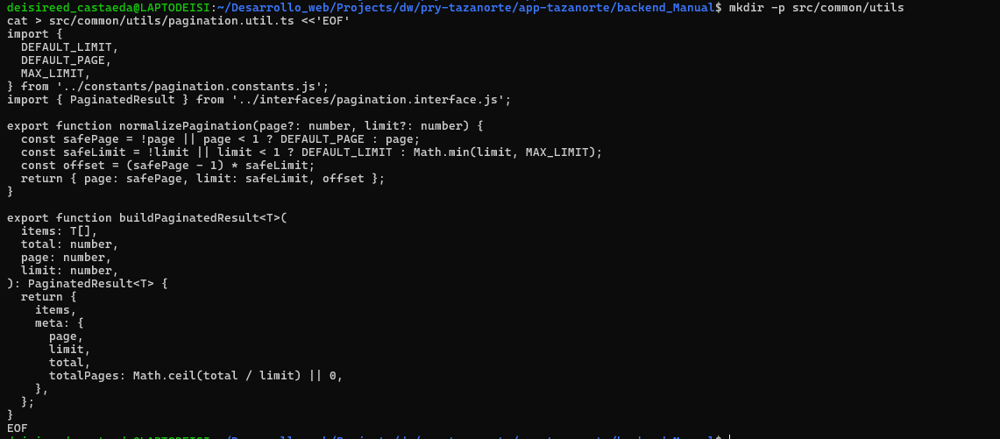

#### 6.35 — common/utils/date.util.ts

Archivo del feature en Clean Architecture.

**Archivo:** `src/common/utils/date.util.ts`

``` bash
mkdir -p src/common/utils cat > src/common/utils/date.util.ts <<'EOF_BACKEND_IA' export function addDays(date: Date, days: number): Date {   const result = new Date(date);   result.setDate(result.getDate() + days);   return result; }  export function parseDurationToMs(duration: string): number {   const match = /^(\d+)([smhd])$/.exec(duration);   if (!match) {     return 24 * 60 * 60 * 1000;   }    const value = parseInt(match[1], 10);   const unit = match[2];    switch (unit) {     case 's':       return value * 1000;     case 'm':       return value * 60 * 1000;     case 'h':       return value * 60 * 60 * 1000;     case 'd':       return value * 24 * 60 * 60 * 1000;     default:       return 24 * 60 * 60 * 1000;   } } EOF_BACKEND_IA
```

**Sugerencia de commit (issue):**

``` bash
git add .
git commit -m "feat: add date.util.ts"
```

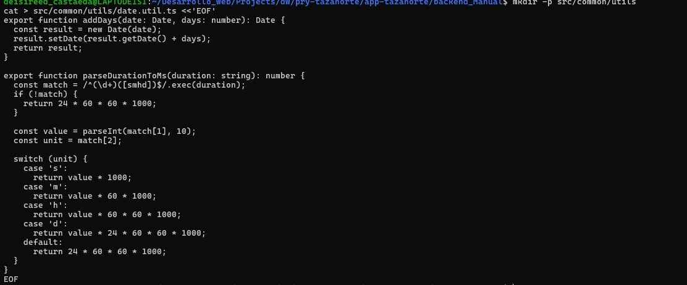

#### 6.36 — common/utils/string.util.ts

Archivo del feature en Clean Architecture.

**Archivo:** `src/common/utils/string.util.ts`

``` bash
mkdir -p src/common/utils cat > src/common/utils/string.util.ts <<'EOF_BACKEND_IA' export function normalizeEmail(email: string): string {   return email.trim().toLowerCase(); }  export function isBlank(value?: string | null): boolean {   return !value || value.trim().length === 0; } EOF_BACKEND_IA
```

**Sugerencia de commit (issue):**

``` bash
git add . 
git commit -m "feat: add string.util.ts"
```

#### 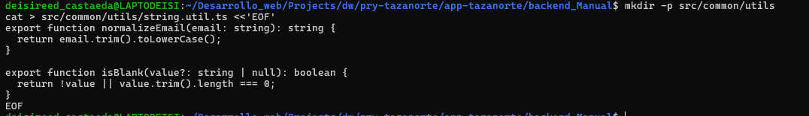

#### 6.37 — infrastructure/security/hashing/password-hasher.interface.ts

Archivo del feature en Clean Architecture.

**Archivo:** `src/infrastructure/security/hashing/password-hasher.interface.ts`

``` bash
mkdir -p src/infrastructure/security/hashing cat > src/infrastructure/security/hashing/password-hasher.interface.ts <<'EOF_BACKEND_IA' export const PASSWORD_HASHER = 'PASSWORD_HASHER';  export interface IPasswordHasher {   hash(plain: string): Promise<string>;   compare(plain: string, hashed: string): Promise<boolean>; } EOF_BACKEND_IA
```

**Sugerencia de commit (issue):**

``` bash
git add . 
git commit -m "feat: add password-hasher.interface.ts"
```

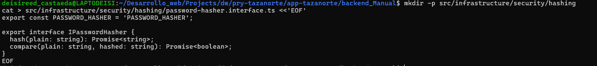

#### 6.38 — infrastructure/security/hashing/bcrypt-password-hasher.service.ts

Archivo del feature en Clean Architecture.

**Archivo:** `src/infrastructure/security/hashing/bcrypt-password-hasher.service.ts`

``` bash
mkdir -p src/infrastructure/security/hashing cat > src/infrastructure/security/hashing/bcrypt-password-hasher.service.ts <<'EOF_BACKEND_IA' import { Injectable } from '@nestjs/common'; import * as bcrypt from 'bcrypt'; import { IPasswordHasher } from './password-hasher.interface';  @Injectable() export class BcryptPasswordHasherService implements IPasswordHasher {   private readonly rounds = 10;    async hash(plain: string): Promise<string> {     return bcrypt.hash(plain, this.rounds);   }    async compare(plain: string, hashed: string): Promise<boolean> {     return bcrypt.compare(plain, hashed);   } } EOF_BACKEND_IA
```

**Sugerencia de commit (issue):**

``` bash
git add .
git commit -m "feat: add bcrypt-password-hasher.service.ts"
```

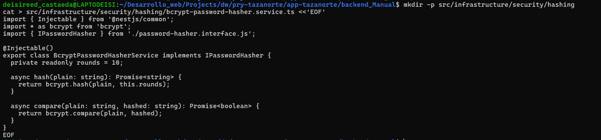

#### 6.39 — infrastructure/security/tokens/token.interface.ts

Archivo del feature en Clean Architecture.

**Archivo:** `src/infrastructure/security/tokens/token.interface.ts`

``` bash
mkdir -p src/infrastructure/security/tokens cat > src/infrastructure/security/tokens/token.interface.ts <<'EOF_BACKEND_IA' export const TOKEN_SERVICE = 'TOKEN_SERVICE';  export interface TokenPayload {   sub: number;   email: string;   username: string;   roles: string[]; }  export interface IssuedTokens {   accessToken: string;   refreshToken: string;   expiresIn: string; }  export interface ITokenService {   signAccessToken(payload: TokenPayload): Promise<string>;   signRefreshToken(payload: TokenPayload): Promise<string>;   verifyAccessToken(token: string): Promise<TokenPayload>;   verifyRefreshToken(token: string): Promise<TokenPayload>;   issueTokens(payload: TokenPayload): Promise<IssuedTokens>; } EOF_BACKEND_IA
```

**Sugerencia de commit (issue):**

``` bash
git add . 
git commit -m "feat: add token.interface.ts"
```

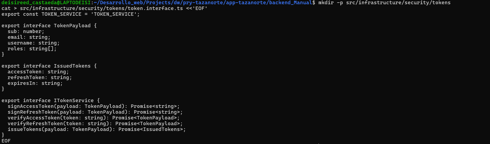

#### 6.40 — infrastructure/security/tokens/token.service.ts

Archivo del feature en Clean Architecture.

**Archivo:** `src/infrastructure/security/tokens/token.service.ts`

``` bash
mkdir -p src/infrastructure/security/tokens cat > src/infrastructure/security/tokens/token.service.ts <<'EOF_BACKEND_IA' import { Injectable } from '@nestjs/common'; import { ConfigService } from '@nestjs/config'; import { JwtService } from '@nestjs/jwt'; import {   ITokenService,   IssuedTokens,   TokenPayload, } from './token.interface';  @Injectable() export class TokenService implements ITokenService {   constructor(     private readonly jwtService: JwtService,     private readonly configService: ConfigService,   ) {}    async signAccessToken(payload: TokenPayload): Promise<string> {     return this.jwtService.signAsync(payload, {       secret: this.configService.get<string>('environment.jwt.secret'),       expiresIn: this.configService.get<string>('environment.jwt.expiresIn') as any,     });   }    async signRefreshToken(payload: TokenPayload): Promise<string> {     return this.jwtService.signAsync(payload, {       secret: this.configService.get<string>('environment.jwt.refreshSecret'),       expiresIn: this.configService.get<string>(         'environment.jwt.refreshExpiresIn',       ) as any,     });   }    async verifyAccessToken(token: string): Promise<TokenPayload> {     return this.jwtService.verifyAsync<TokenPayload>(token, {       secret: this.configService.get<string>('environment.jwt.secret'),     });   }    async verifyRefreshToken(token: string): Promise<TokenPayload> {     return this.jwtService.verifyAsync<TokenPayload>(token, {       secret: this.configService.get<string>('environment.jwt.refreshSecret'),     });   }    async issueTokens(payload: TokenPayload): Promise<IssuedTokens> {     const [accessToken, refreshToken] = await Promise.all([       this.signAccessToken(payload),       this.signRefreshToken(payload),     ]);      return {       accessToken,       refreshToken,       expiresIn:         this.configService.get<string>('environment.jwt.expiresIn') || '1d',     };   } } EOF_BACKEND_IA
```

**Sugerencia de commit (issue):**

``` bash
git add .
git commit -m "feat: add token.service.ts"
```

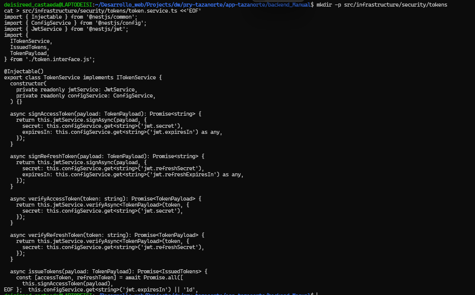

#### 6.41 — infrastructure/security/security.module.ts

Módulo Nest del feature: cablea providers, tokens DI y controller.

**Archivo:** `src/infrastructure/security/security.module.ts`

``` bash
mkdir -p src/infrastructure/security cat > src/infrastructure/security/security.module.ts <<'EOF_BACKEND_IA' import { Global, Module } from '@nestjs/common'; import { ConfigModule, ConfigService } from '@nestjs/config'; import { JwtModule } from '@nestjs/jwt'; import { PASSWORD_HASHER } from './hashing/password-hasher.interface'; import { BcryptPasswordHasherService } from './hashing/bcrypt-password-hasher.service'; import { TOKEN_SERVICE } from './tokens/token.interface'; import { TokenService } from './tokens/token.service';  @Global() @Module({   imports: [     JwtModule.registerAsync({       imports: [ConfigModule],       inject: [ConfigService],       useFactory: (configService: ConfigService) => ({         secret: configService.get<string>('environment.jwt.secret') ?? '',         signOptions: {           expiresIn: (configService.get<string>('environment.jwt.expiresIn') ??             '1d') as any,         },       }),     }),   ],   providers: [     BcryptPasswordHasherService,     {       provide: PASSWORD_HASHER,       useExisting: BcryptPasswordHasherService,     },     TokenService,     {       provide: TOKEN_SERVICE,       useExisting: TokenService,     },   ],   exports: [     JwtModule,     BcryptPasswordHasherService,     PASSWORD_HASHER,     TokenService,     TOKEN_SERVICE,   ], }) export class SecurityModule {} EOF_BACKEND_IA
```

**Sugerencia de commit (issue):**

``` bash
git add . 
git commit -m "feat: wire nest module security.module.ts"
```

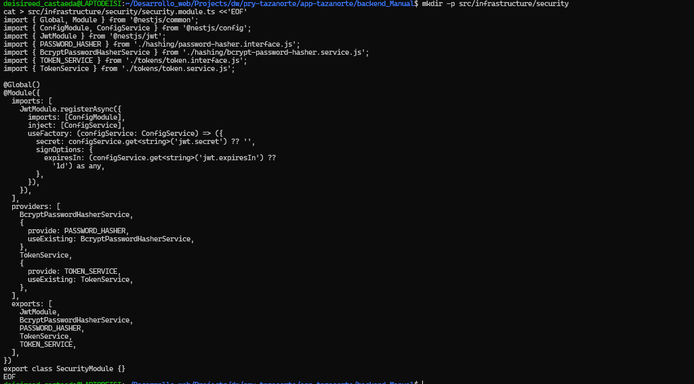

#### 6.42 — Actualizar main.ts (bootstrap completo)

Prefix global, filters, interceptors, pipes, Swagger y manejo amigable de EADDRINUSE.

**Archivo:** `src/main.ts`

``` bash
mkdir -p src cat > src/main.ts <<'EOF_BACKEND_IA' import { NestFactory } from '@nestjs/core'; import { ConfigService } from '@nestjs/config'; import { AppModule } from './app.module'; import { getLoggerConfig } from './config/logger/logger.config'; import { GlobalExceptionFilter } from './common/filters/global-exception.filter'; import { ResponseInterceptor } from './common/interceptors/response.interceptor'; import { LoggingInterceptor } from './common/interceptors/logging.interceptor'; import { TimeoutInterceptor } from './common/interceptors/timeout.interceptor'; import { CustomValidationPipe } from './common/pipes/validation.pipe'; import { setupSwagger } from './config/swagger/swagger.config'; import { GLOBAL_PREFIX } from './common/constants/app.constants';  async function bootstrap() {   const app = await NestFactory.create(AppModule, {     logger: getLoggerConfig().logLevels,   });    const configService = app.get(ConfigService);   const port = configService.get<number>('app.port', 3002);    app.setGlobalPrefix(GLOBAL_PREFIX);    app.useGlobalFilters(new GlobalExceptionFilter());    app.useGlobalInterceptors(     new ResponseInterceptor(),     new LoggingInterceptor(),     new TimeoutInterceptor(),   );    app.useGlobalPipes(new CustomValidationPipe());    setupSwagger(app);    try {     await app.listen(port);     console.log(`🚀 Application running on: http://localhost:${port}`);     console.log(`📘 Swagger: http://localhost:${port}/api/docs`);   } catch (error: any) {     if (error?.code === 'EADDRINUSE') {       console.error(         `❌ El puerto ${port} ya está en uso (EADDRINUSE).\n` +           `   Solución rápida:\n` +           `   1) npm run free:port\n` +           `   2) npm run start:dev\n` +           `   O cambia PORT en el archivo .env`,       );       await app.close();       process.exit(1);     }     throw error;   } } bootstrap(); EOF_BACKEND_IA
```

**Sugerencia de commit (issue):**

``` bash
git add . 
git commit -m "feat: harden main.ts bootstrap with swagger and global pipes"
```

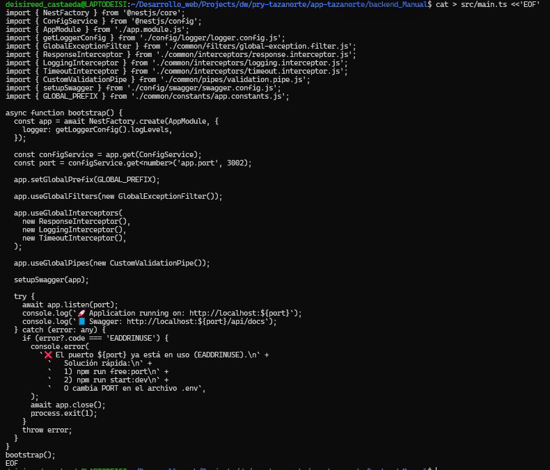

#### 6.43 — Actualizar app.module.ts (base sin features ni guards)

Cablea Config + Sequelize + Security + Logger. Business/Auth y guards llegan en fases posteriores.

**Archivo:** `src/app.module.ts`

``` bash
mkdir -p src cat > src/app.module.ts <<'EOF_BACKEND_IA' import { Module } from '@nestjs/common'; import { ConfigModule } from '@nestjs/config'; import { envConfig } from './config/environment/env.config'; import { appConfig } from './config/app/app.config'; import { jwtConfig } from './config/jwt/jwt.config'; import { LoggerModule } from './config/logger/logger.module'; import { SequelizeDatabaseModule } from './infrastructure/database/sequelize/sequelize.module'; import { SecurityModule } from './infrastructure/security/security.module'; import { AppController } from './app.controller'; import { AppService } from './app.service';  @Module({   imports: [     ConfigModule.forRoot({       isGlobal: true,       load: [envConfig, appConfig, jwtConfig],       envFilePath: '.env',     }),     SequelizeDatabaseModule,     SecurityModule,     LoggerModule,   ],   controllers: [AppController],   providers: [     AppService,   ], }) export class AppModule {} EOF_BACKEND_IA
```

**Sugerencia de commit (issue):**

``` bash
git add . 
git commit -m "feat: wire AppModule with config database security logger"
```

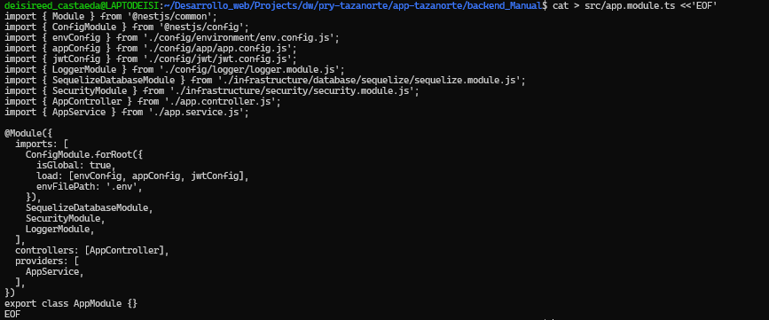

#### 6.44 — Verificar bootstrap transversal

La app debe arrancar, mostrar Swagger en `/api/docs` y conectar a BD. Todavía no hay endpoints de negocio.

``` bash
npm run start:dev # Abre http://localhost:3002/api/docs # Ctrl+C
```

**Sugerencia de commit (issue):**

``` bash
git add . 
git commit -m "test: verify base infrastructure bootstrap"
```

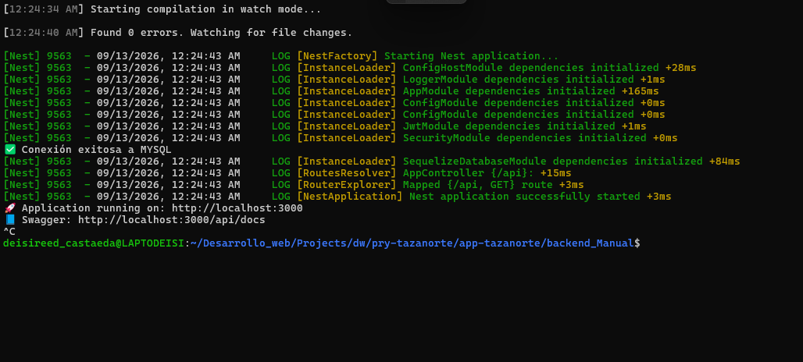

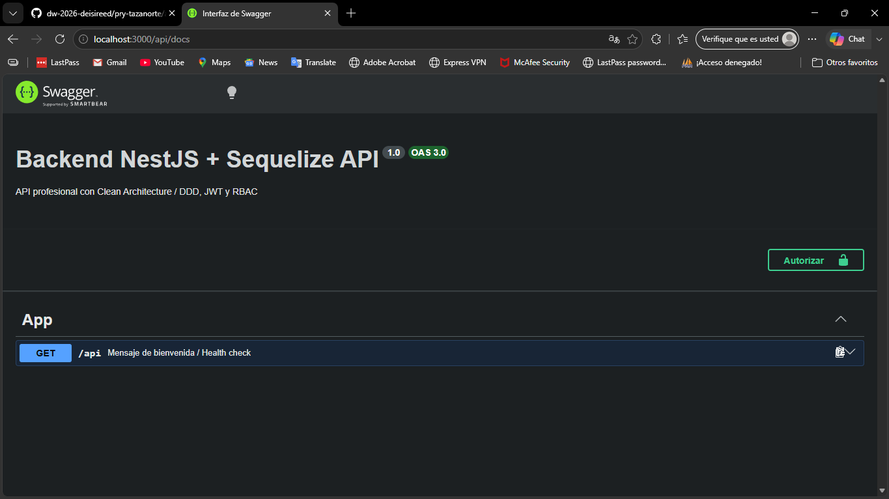

## FASE 7 — `06_BUSINESS_CLIENTS`

### Business — Clients (patrón completo CA)

> **Objetivo de la fase:** Primera entidad de negocio. Orden lógico: dominio → infraestructura → aplicación → presentación → módulo → cableado → verificación.

#### 7.1 — features/business/clients/domain/entities/client.entity.ts

Entidad de dominio (TypeScript puro). No extiende Sequelize `Model`. Aquí viven las reglas del negocio.

**Archivo:** `src/features/business/clients/domain/entities/client.entity.ts`

``` bash
mkdir -p src/features/business/clients/domain/entities cat > src/features/business/clients/domain/entities/client.entity.ts <<'EOF_BACKEND_IA' import { Status } from '../../../../../common/enums/status.enum'; import { isValidEmail } from '../validators/client-email.validator'; import { isValidPhone } from '../validators/client-phone.validator';  export interface ClientProps {   id?: number;   name: string;   address?: string;   phone?: string;   email?: string;   password?: string;   status?: Status;   createdAt?: Date;   updatedAt?: Date; }  export class Client {   id?: number;   name: string;   address?: string;   phone?: string;   email?: string;   password?: string;   status: Status;   createdAt?: Date;   updatedAt?: Date;    private constructor(props: ClientProps) {     this.id = props.id;     this.name = props.name;     this.address = props.address;     this.phone = props.phone;     this.email = props.email;     this.password = props.password;     this.status = props.status ?? Status.ACTIVE;     this.createdAt = props.createdAt;     this.updatedAt = props.updatedAt;   }    static create(     props: Omit<ClientProps, 'id' | 'status' | 'createdAt' | 'updatedAt'>,   ): Client {     if (!props.name?.trim()) {       throw new Error('El nombre del cliente es requerido');     }      if (props.email && !isValidEmail(props.email)) {       throw new Error('El email del cliente no es válido');     }      if (props.phone && !isValidPhone(props.phone)) {       throw new Error('El teléfono del cliente no es válido');     }      return new Client(props);   }    static reconstitute(props: ClientProps): Client {     return new Client(props);   }    update(     props: Partial<       Omit<ClientProps, 'id' | 'status' | 'createdAt' | 'updatedAt'>     >,   ): void {     if (props.name !== undefined) {       if (!props.name.trim()) {         throw new Error('El nombre del cliente es requerido');       }       this.name = props.name;     }      if (props.address !== undefined) {       this.address = props.address;     }      if (props.phone !== undefined) {       if (props.phone && !isValidPhone(props.phone)) {         throw new Error('El teléfono del cliente no es válido');       }       this.phone = props.phone;     }      if (props.email !== undefined) {       if (props.email && !isValidEmail(props.email)) {         throw new Error('El email del cliente no es válido');       }       this.email = props.email;     }      if (props.password !== undefined) {       this.password = props.password;     }   }    deactivate(): void {     this.status = Status.INACTIVE;   } } EOF_BACKEND_IA
```

**Sugerencia de commit (issue):**

``` bash
git add . 
git commit -m "feat: add domain entity client.entity.ts"
```

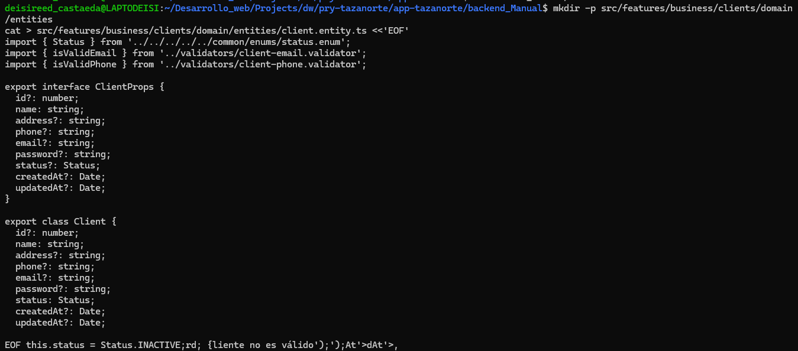

#### 7.2 — features/business/clients/domain/exceptions/client-email-already-exists.exception.ts

Excepción de dominio. El caso de uso la lanza; el filter HTTP la traduce a status code.

**Archivo:** `src/features/business/clients/domain/exceptions/client-email-already-exists.exception.ts`

``` bash
mkdir -p src/features/business/clients/domain/exceptions cat > src/features/business/clients/domain/exceptions/client-email-already-exists.exception.ts <<'EOF_BACKEND_IA' import { DomainException } from '../../../../../common/exceptions/domain.exception';  export class ClientEmailAlreadyExistsException extends DomainException {   constructor(email: string) {     super(`El email '${email}' ya está registrado`);   } } EOF_BACKEND_IA
```

**Sugerencia de commit (issue):**

``` bash
git add .
git commit -m "feat: add domain exception client-email-already-exists.exception.ts"
```

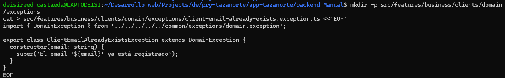

#### 7.3 — features/business/clients/domain/exceptions/client-not-found.exception.ts

Excepción de dominio. El caso de uso la lanza; el filter HTTP la traduce a status code.

**Archivo:** `src/features/business/clients/domain/exceptions/client-not-found.exception.ts`

``` bash
mkdir -p src/features/business/clients/domain/exceptions cat > src/features/business/clients/domain/exceptions/client-not-found.exception.ts <<'EOF_BACKEND_IA' import { EntityNotFoundException } from '../../../../../common/exceptions/entity-not-found.exception';  export class ClientNotFoundException extends EntityNotFoundException {   constructor(id: number) {     super('Cliente', id);   } } EOF_BACKEND_IA
```

**Sugerencia de commit (issue):**

``` bash
git add .
git commit -m "feat: add domain exception client-not-found.exception.ts"
```

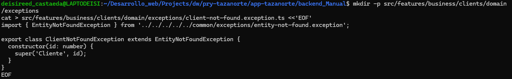

#### 7.4 — features/business/clients/domain/interfaces/client-repository.interface.ts

Puerto (contrato) del repositorio. La aplicación depende de esta interface, no de Sequelize.

**Archivo:** `src/features/business/clients/domain/interfaces/client-repository.interface.ts`

``` bash
mkdir -p src/features/business/clients/domain/interfaces cat > src/features/business/clients/domain/interfaces/client-repository.interface.ts <<'EOF_BACKEND_IA' import { PaginatedResult } from '../../../../../common/interfaces/pagination.interface'; import { Client } from '../entities/client.entity';  export const CLIENT_REPOSITORY = 'CLIENT_REPOSITORY';  export interface ClientFindAllParams {   page?: number;   limit?: number;   search?: string; }  export interface IClientRepository {   create(client: Client): Promise<Client>;   update(client: Client): Promise<Client>;   delete(id: number): Promise<void>;   findById(id: number): Promise<Client | null>;   findByEmail(email: string): Promise<Client | null>;   findAll(params: ClientFindAllParams): Promise<PaginatedResult<Client>>; } EOF_BACKEND_IA
```

**Sugerencia de commit (issue):**

``` bash
git add .
git commit -m "feat: add repository port client-repository.interface.ts"
```

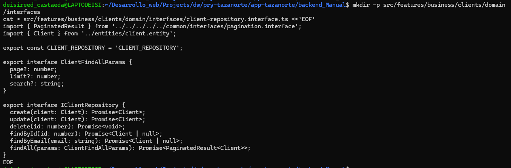

#### 7.5 — features/business/clients/domain/validators/client-email.validator.ts

Validador de dominio reutilizable (reglas independientes del framework HTTP).

**Archivo:** `src/features/business/clients/domain/validators/client-email.validator.ts`

``` bash
mkdir -p src/features/business/clients/domain/validators cat > src/features/business/clients/domain/validators/client-email.validator.ts <<'EOF_BACKEND_IA' export function isValidEmail(email: string): boolean {   const emailRegex = /^[^\s@]+@[^\s@]+\.[^\s@]+$/;   return emailRegex.test(email); } EOF_BACKEND_IA
```

**Sugerencia de commit (issue):**

``` bash
git add .
git commit -m "feat: add domain validator client-email.validator.ts"
```

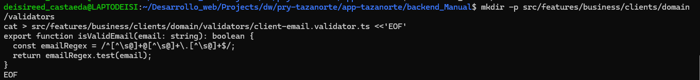

#### 7.6 — features/business/clients/domain/validators/client-phone.validator.ts

Validador de dominio reutilizable (reglas independientes del framework HTTP).

**Archivo:** `src/features/business/clients/domain/validators/client-phone.validator.ts`

``` bash
mkdir -p src/features/business/clients/domain/validators cat > src/features/business/clients/domain/validators/client-phone.validator.ts <<'EOF_BACKEND_IA' export function isValidPhone(phone: string): boolean {   const phoneRegex = /^[+]?[\d\s()-]{7,20}$/;   return phoneRegex.test(phone); } EOF_BACKEND_IA
```

**Sugerencia de commit (issue):**

``` bash
git add . 
git commit -m "feat: add domain validator client-phone.validator.ts"
```

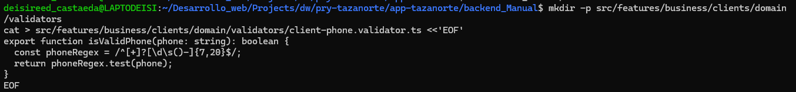

#### 7.7 — features/business/clients/infrastructure/persistence/models/client.model.ts

Modelo Sequelize (`@Table`). Solo infraestructura: mapeo a tabla física.

**Archivo:** `src/features/business/clients/infrastructure/persistence/models/client.model.ts`

``` bash
mkdir -p src/features/business/clients/infrastructure/persistence/models cat > src/features/business/clients/infrastructure/persistence/models/client.model.ts <<'EOF_BACKEND_IA' import {   AutoIncrement,   Column,   CreatedAt,   DataType,   HasMany,   Model,   PrimaryKey,   Table,   UpdatedAt, } from 'sequelize-typescript'; import { Status } from '../../../../../../common/enums/status.enum';  @Table({ tableName: 'clients' }) export class ClientModel extends Model {   @PrimaryKey   @AutoIncrement   @Column(DataType.INTEGER)   declare id: number;    @Column({ type: DataType.STRING(150), allowNull: false })   declare name: string;    @Column({ type: DataType.STRING(255), allowNull: true })   declare address: string | null;    @Column({ type: DataType.STRING(30), allowNull: true })   declare phone: string | null;    @Column({ type: DataType.STRING(150), allowNull: true, unique: true })   declare email: string | null;    @Column({ type: DataType.STRING(255), allowNull: true })   declare password: string | null;    @Column({     type: DataType.ENUM(...Object.values(Status)),     allowNull: false,     defaultValue: Status.ACTIVE,   })   declare status: Status;    @CreatedAt   declare createdAt: Date;    @UpdatedAt   declare updatedAt: Date;    @HasMany(() => require('../../../../sales/infrastructure/persistence/models/sale.model').SaleModel)   declare sales: unknown[]; } EOF_BACKEND_IA
```

**Sugerencia de commit (issue):**

``` bash
git add .
git commit -m "feat: add sequelize model client.model.ts"
```

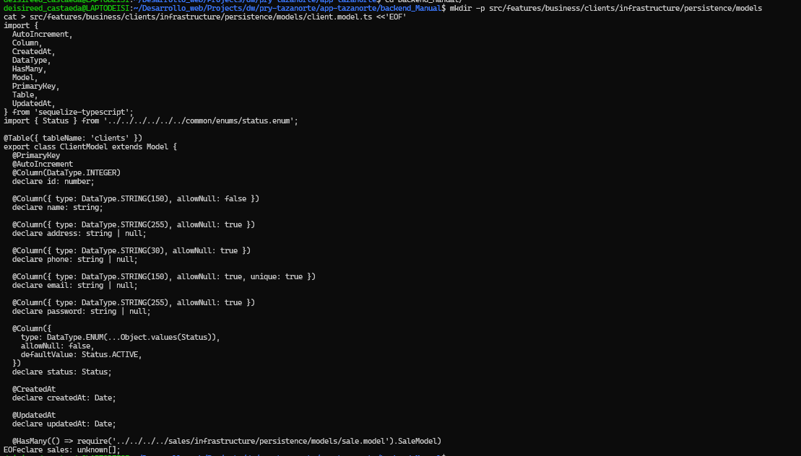

#### 7.8 —features/business/clients/infrastructure/persistence/repositories/client.repository.ts

Adaptador del repositorio: implementa el puerto de dominio con Sequelize.

**Archivo:** `src/features/business/clients/infrastructure/persistence/repositories/client.repository.ts`

``` bash
mkdir -p src/features/business/clients/infrastructure/persistence/repositories cat > src/features/business/clients/infrastructure/persistence/repositories/client.repository.ts <<'EOF_BACKEND_IA' import { Injectable } from '@nestjs/common'; import { Op } from 'sequelize'; import {   buildPaginatedResult,   normalizePagination, } from '../../../../../../common/utils/pagination.util'; import { Client } from '../../../domain/entities/client.entity'; import {   ClientFindAllParams,   IClientRepository, } from '../../../domain/interfaces/client-repository.interface'; import { ClientMapper } from '../../../application/mappers/client.mapper'; import { ClientModel } from '../models/client.model';  @Injectable() export class ClientRepository implements IClientRepository {   async create(client: Client): Promise<Client> {     const model = await ClientModel.create(ClientMapper.toPersistence(client));     return ClientMapper.toDomain(model);   }    async update(client: Client): Promise<Client> {     await ClientModel.update(ClientMapper.toPersistence(client), {       where: { id: client.id },     });     const updated = await ClientModel.findByPk(client.id!);     return ClientMapper.toDomain(updated!);   }    async delete(id: number): Promise<void> {     await ClientModel.destroy({ where: { id } });   }    async findById(id: number): Promise<Client | null> {     const model = await ClientModel.findByPk(id);     return model ? ClientMapper.toDomain(model) : null;   }    async findByEmail(email: string): Promise<Client | null> {     const model = await ClientModel.findOne({ where: { email } });     return model ? ClientMapper.toDomain(model) : null;   }    async findAll(params: ClientFindAllParams) {     const { page, limit, offset } = normalizePagination(       params.page,       params.limit,     );      const where = params.search       ? {           [Op.or]: [             { name: { [Op.like]: `%${params.search}%` } },             { email: { [Op.like]: `%${params.search}%` } },           ],         }       : {};      const { rows, count } = await ClientModel.findAndCountAll({       where,       limit,       offset,       order: [['createdAt', 'DESC']],     });      return buildPaginatedResult(       rows.map((row) => ClientMapper.toDomain(row)),       count,       page,       limit,     );   } } EOF_BACKEND_IA
```

**Sugerencia de commit (issue):**

``` bash
git add . 
git commit -m "feat: add sequelize repository client.repository.ts"
```

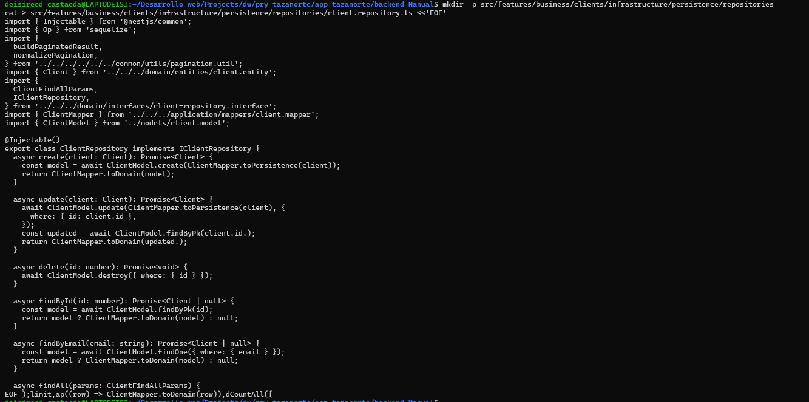

#### 7.9 — features/business/clients/infrastructure/persistence/migrations/create-clients-table.migration.ts

Migración documental/auxiliar de la tabla. En dev el sync de Sequelize crea el esquema.

**Archivo:** `src/features/business/clients/infrastructure/persistence/migrations/create-clients-table.migration.ts`

``` bash
mkdir -p src/features/business/clients/infrastructure/persistence/migrations cat > src/features/business/clients/infrastructure/persistence/migrations/create-clients-table.migration.ts <<'EOF_BACKEND_IA' export const createClientsTableMigration = {   name: 'create-clients-table',   async up(): Promise<void> {     // Sequelize sync handles table creation in development.     // Production: CREATE TABLE clients (id, name, address, phone, email, password, status, createdAt, updatedAt)   },   async down(): Promise<void> {     // Production: DROP TABLE clients   }, }; EOF_BACKEND_IA
```

**Sugerencia de commit (issue):**

``` bash
git add .
git commit -m "chore: add migration create-clients-table.migration.ts"
```

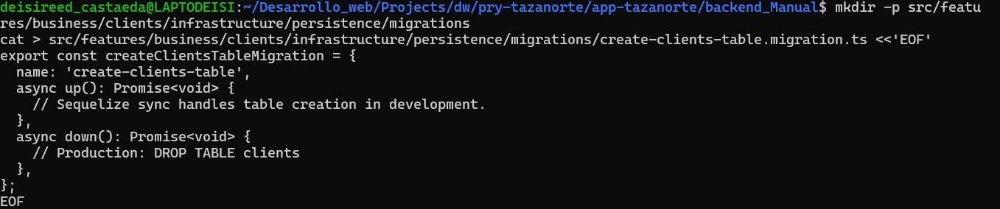

#### 7.10 — features/business/clients/infrastructure/persistence/seeders/clients.seeder.ts

Seeder de datos iniciales para desarrollo y verificación física en BD.

**Archivo:** `src/features/business/clients/infrastructure/persistence/seeders/clients.seeder.ts`

``` bash
mkdir -p src/features/business/clients/infrastructure/persistence/seeders cat > src/features/business/clients/infrastructure/persistence/seeders/clients.seeder.ts <<'EOF_BACKEND_IA' import { ClientModel } from '../models/client.model'; import { BcryptPasswordHasherService } from '../../../../../../infrastructure/security/hashing/bcrypt-password-hasher.service'; import { Status } from '../../../../../../common/enums/status.enum';  export async function seedClients(): Promise<void> {   const count = await ClientModel.count();   if (count > 0) {     return;   }    const hasher = new BcryptPasswordHasherService();    await ClientModel.bulkCreate([     {       name: 'Juan Pérez',       address: 'Calle Principal 123',       phone: '+57 300 1234567',       email: 'juan.perez@example.com',       password: await hasher.hash('password123'),       status: Status.ACTIVE,     },     {       name: 'María García',       address: 'Av. Central 456',       phone: '+57 310 9876543',       email: 'maria.garcia@example.com',       password: await hasher.hash('password123'),       status: Status.ACTIVE,     },   ]); } EOF_BACKEND_IA
```

**Sugerencia de commit (issue):**

``` bash
git add . 
git commit -m "chore: add seeder clients.seeder.ts"
```

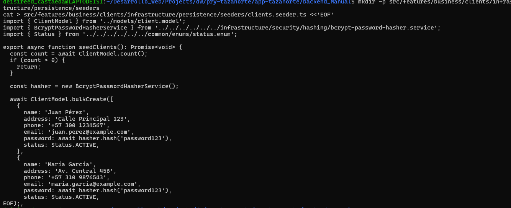

#### 7.11 — features/business/clients/application/dto/client-filter.dto.ts

DTO de entrada/salida HTTP con `class-validator` / Swagger.

**Archivo:** `src/features/business/clients/application/dto/client-filter.dto.ts`

``` bash
mkdir -p src/features/business/clients/application/dto cat > src/features/business/clients/application/dto/client-filter.dto.ts <<'EOF_BACKEND_IA' import { ApiPropertyOptional } from '@nestjs/swagger'; import { Type } from 'class-transformer'; import { IsInt, IsOptional, IsPositive, IsString, Min } from 'class-validator';  export class ClientFilterDto {   @ApiPropertyOptional({ example: 1, default: 1 })   @IsOptional()   @Type(() => Number)   @IsInt()   @Min(1)   page?: number;    @ApiPropertyOptional({ example: 10, default: 10 })   @IsOptional()   @Type(() => Number)   @IsInt()   @IsPositive()   limit?: number;    @ApiPropertyOptional({ example: 'juan' })   @IsOptional()   @IsString()   search?: string; } EOF_BACKEND_IA
```

**Sugerencia de commit (issue):**

``` bash
git add . 
git commit -m "feat: add dto client-filter.dto.ts"
```

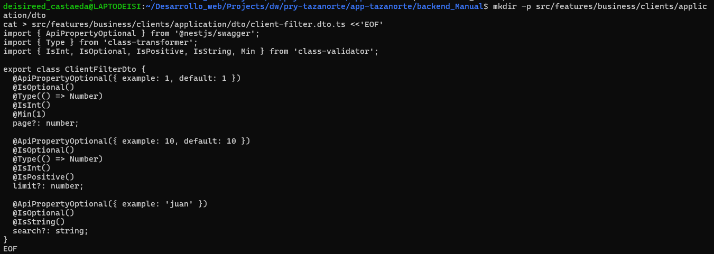

#### 7.12 — features/business/clients/application/dto/client-response.dto.ts

DTO de entrada/salida HTTP con `class-validator` / Swagger.

**Archivo:** `src/features/business/clients/application/dto/client-response.dto.ts`

``` bash
mkdir -p src/features/business/clients/application/dto cat > src/features/business/clients/application/dto/client-response.dto.ts <<'EOF_BACKEND_IA' import { ApiProperty, ApiPropertyOptional } from '@nestjs/swagger'; import { Status } from '../../../../../common/enums/status.enum';  export class ClientResponseDto {   @ApiProperty({ example: 1 })   id: number;    @ApiProperty({ example: 'Juan Pérez' })   name: string;    @ApiPropertyOptional({ example: 'Calle Principal 123' })   address?: string;    @ApiPropertyOptional({ example: '+57 300 1234567' })   phone?: string;    @ApiPropertyOptional({ example: 'juan.perez@example.com' })   email?: string;    @ApiProperty({ enum: Status, example: Status.ACTIVE })   status: Status;    @ApiProperty()   createdAt: Date;    @ApiProperty()   updatedAt: Date; } EOF_BACKEND_IA
```

**Sugerencia de commit (issue):**

``` bash
git add . 
git commit -m "feat: add dto client-response.dto.ts"
```

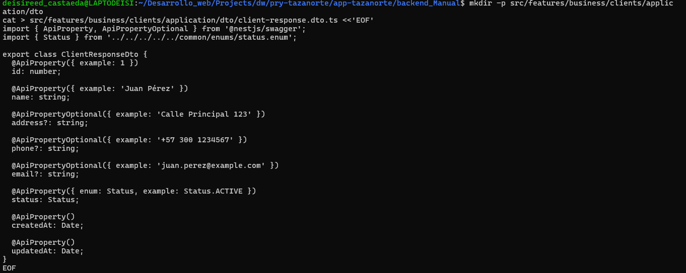

#### 7.13 — features/business/clients/application/dto/create-client.dto.ts

DTO de entrada/salida HTTP con `class-validator` / Swagger.

**Archivo:** `src/features/business/clients/application/dto/create-client.dto.ts`

``` bash
mkdir -p src/features/business/clients/application/dto cat > src/features/business/clients/application/dto/create-client.dto.ts <<'EOF_BACKEND_IA' import { ApiProperty, ApiPropertyOptional } from '@nestjs/swagger'; import {   IsEmail,   IsNotEmpty,   IsOptional,   IsString,   MaxLength,   MinLength, } from 'class-validator';  export class CreateClientDto {   @ApiProperty({ example: 'Juan Pérez' })   @IsString()   @IsNotEmpty()   @MaxLength(150)   name: string;    @ApiPropertyOptional({ example: 'Calle Principal 123' })   @IsOptional()   @IsString()   @MaxLength(255)   address?: string;    @ApiPropertyOptional({ example: '+57 300 1234567' })   @IsOptional()   @IsString()   @MaxLength(30)   phone?: string;    @ApiPropertyOptional({ example: 'juan.perez@example.com' })   @IsOptional()   @IsEmail()   @MaxLength(150)   email?: string;    @ApiPropertyOptional({ example: 'password123' })   @IsOptional()   @IsString()   @MinLength(6)   @MaxLength(255)   password?: string; } EOF_BACKEND_IA
```

**Sugerencia de commit (issue):**

``` bash
git add . 
git commit -m "feat: add dto create-client.dto.ts"
```

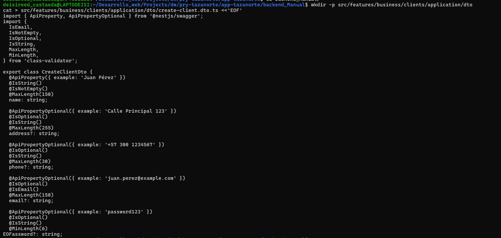

#### 7.14 — features/business/clients/application/dto/update-client.dto.ts

DTO de entrada/salida HTTP con `class-validator` / Swagger.

**Archivo:** `src/features/business/clients/application/dto/update-client.dto.ts`

``` bash
mkdir -p src/features/business/clients/application/dto cat > src/features/business/clients/application/dto/update-client.dto.ts <<'EOF_BACKEND_IA' import { PartialType } from '@nestjs/mapped-types'; import { CreateClientDto } from './create-client.dto';  export class UpdateClientDto extends PartialType(CreateClientDto) {} EOF_BACKEND_IA
```

**Sugerencia de commit (issue):**

``` bash
git add .
git commit -m "feat: add dto update-client.dto.ts"
```

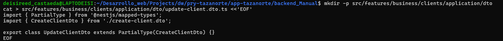

#### 7.15 — features/business/clients/application/mappers/client.mapper.ts

Mapper entre entidad de dominio y DTO de respuesta.

**Archivo:** `src/features/business/clients/application/mappers/client.mapper.ts`

``` bash
mkdir -p src/features/business/clients/application/mappers cat > src/features/business/clients/application/mappers/client.mapper.ts <<'EOF_BACKEND_IA' import { Status } from '../../../../../common/enums/status.enum'; import { Client } from '../../domain/entities/client.entity'; import { ClientResponseDto } from '../dto/client-response.dto'; import { ClientModel } from '../../infrastructure/persistence/models/client.model';  export class ClientMapper {   static toDomain(model: ClientModel): Client {     return Client.reconstitute({       id: model.id,       name: model.name,       address: model.address ?? undefined,       phone: model.phone ?? undefined,       email: model.email ?? undefined,       password: model.password ?? undefined,       status: model.status,       createdAt: model.createdAt,       updatedAt: model.updatedAt,     });   }    static toResponse(entity: Client): ClientResponseDto {     return {       id: entity.id!,       name: entity.name,       address: entity.address,       phone: entity.phone,       email: entity.email,       status: entity.status,       createdAt: entity.createdAt!,       updatedAt: entity.updatedAt!,     };   }    static toPersistence(entity: Client): Partial<ClientModel> {     return {       id: entity.id,       name: entity.name,       address: entity.address ?? null,       phone: entity.phone ?? null,       email: entity.email ?? null,       password: entity.password ?? null,       status: entity.status ?? Status.ACTIVE,     };   } } EOF_BACKEND_IA
```

**Sugerencia de commit (issue):**

``` bash
git add .
git commit -m "feat: add mapper client.mapper.ts"
```

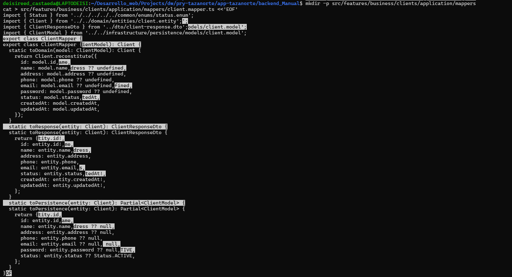

#### 7.16 — features/business/clients/application/use-cases/create-client.use-case.ts

Caso de uso (aplicación). Orquesta dominio + repositorio. El controller solo lo invoca.

**Archivo:** `src/features/business/clients/application/use-cases/create-client.use-case.ts`

``` bash
mkdir -p src/features/business/clients/application/use-cases cat > src/features/business/clients/application/use-cases/create-client.use-case.ts <<'EOF_BACKEND_IA' import { Inject, Injectable } from '@nestjs/common'; import {   type IPasswordHasher,   PASSWORD_HASHER, } from '../../../../../infrastructure/security/hashing/password-hasher.interface'; import { ClientEmailAlreadyExistsException } from '../../domain/exceptions/client-email-already-exists.exception'; import { Client } from '../../domain/entities/client.entity'; import {   CLIENT_REPOSITORY,   type IClientRepository, } from '../../domain/interfaces/client-repository.interface'; import { CreateClientDto } from '../dto/create-client.dto'; import { ClientMapper } from '../mappers/client.mapper';  @Injectable() export class CreateClientUseCase {   constructor(     @Inject(CLIENT_REPOSITORY)     private readonly clientRepository: IClientRepository,     @Inject(PASSWORD_HASHER)     private readonly passwordHasher: IPasswordHasher,   ) {}    async execute(dto: CreateClientDto) {     if (dto.email) {       const existing = await this.clientRepository.findByEmail(dto.email);       if (existing) {         throw new ClientEmailAlreadyExistsException(dto.email);       }     }      let password = dto.password;     if (password) {       password = await this.passwordHasher.hash(password);     }      const client = Client.create({       name: dto.name,       address: dto.address,       phone: dto.phone,       email: dto.email,       password,     });      const created = await this.clientRepository.create(client);     return ClientMapper.toResponse(created);   } } EOF_BACKEND_IA
```

**Sugerencia de commit (issue):**

``` bash
git add . 
git commit -m "feat: add use case create-client.use-case.ts"
```

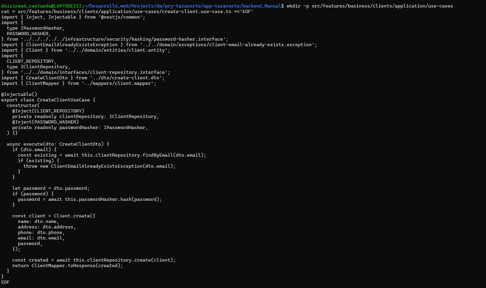

#### 7.17 — features/business/clients/application/use-cases/delete-client.use-case.ts

Caso de uso (aplicación). Orquesta dominio + repositorio. El controller solo lo invoca.

**Archivo:** `src/features/business/clients/application/use-cases/delete-client.use-case.ts`

``` bash
mkdir -p src/features/business/clients/application/use-cases cat > src/features/business/clients/application/use-cases/delete-client.use-case.ts <<'EOF_BACKEND_IA' import { Inject, Injectable } from '@nestjs/common'; import { ClientNotFoundException } from '../../domain/exceptions/client-not-found.exception'; import {   CLIENT_REPOSITORY,   type IClientRepository, } from '../../domain/interfaces/client-repository.interface';  @Injectable() export class DeleteClientUseCase {   constructor(     @Inject(CLIENT_REPOSITORY)     private readonly clientRepository: IClientRepository,   ) {}    async execute(id: number): Promise<void> {     const client = await this.clientRepository.findById(id);     if (!client) {       throw new ClientNotFoundException(id);     }      await this.clientRepository.delete(id);   } } EOF_BACKEND_IA
```

**Sugerencia de commit (issue):**

``` bash
git add . 
git commit -m "feat: add use case delete-client.use-case.ts"
```

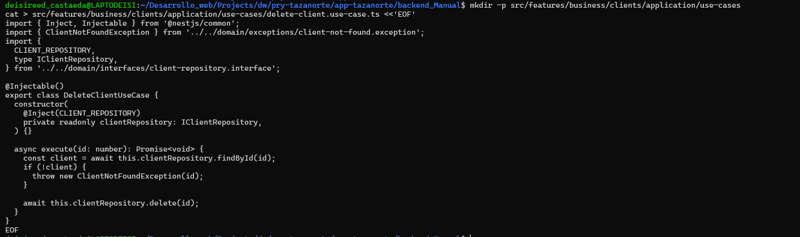

#### 7.18 — features/business/clients/application/use-cases/get-client.use-case.ts

Caso de uso (aplicación). Orquesta dominio + repositorio. El controller solo lo invoca.

**Archivo:** `src/features/business/clients/application/use-cases/get-client.use-case.ts`

``` bash
mkdir -p src/features/business/clients/application/use-cases cat > src/features/business/clients/application/use-cases/get-client.use-case.ts <<'EOF_BACKEND_IA' import { Inject, Injectable } from '@nestjs/common'; import { ClientNotFoundException } from '../../domain/exceptions/client-not-found.exception'; import {   CLIENT_REPOSITORY,   type IClientRepository, } from '../../domain/interfaces/client-repository.interface'; import { ClientMapper } from '../mappers/client.mapper';  @Injectable() export class GetClientUseCase {   constructor(     @Inject(CLIENT_REPOSITORY)     private readonly clientRepository: IClientRepository,   ) {}    async execute(id: number) {     const client = await this.clientRepository.findById(id);     if (!client) {       throw new ClientNotFoundException(id);     }      return ClientMapper.toResponse(client);   } } EOF_BACKEND_IA
```

**Sugerencia de commit (issue):**

``` bash
git add .
git commit -m "feat: add use case get-client.use-case.ts"
```

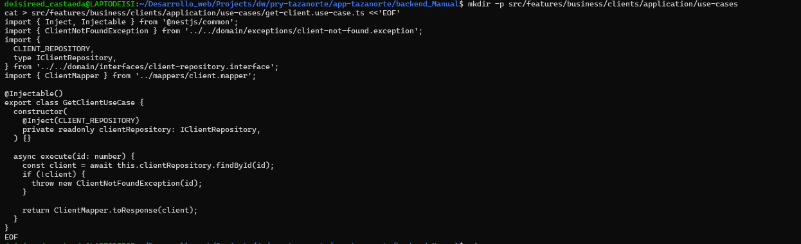

#### 7.19 — features/business/clients/application/use-cases/list-clients.use-case.ts

Caso de uso (aplicación). Orquesta dominio + repositorio. El controller solo lo invoca.

**Archivo:** `src/features/business/clients/application/use-cases/list-clients.use-case.ts`

``` bash
mkdir -p src/features/business/clients/application/use-cases cat > src/features/business/clients/application/use-cases/list-clients.use-case.ts <<'EOF_BACKEND_IA' import { Inject, Injectable } from '@nestjs/common'; import {   CLIENT_REPOSITORY,   type IClientRepository, } from '../../domain/interfaces/client-repository.interface'; import { ClientFilterDto } from '../dto/client-filter.dto'; import { ClientMapper } from '../mappers/client.mapper';  @Injectable() export class ListClientsUseCase {   constructor(     @Inject(CLIENT_REPOSITORY)     private readonly clientRepository: IClientRepository,   ) {}    async execute(filter: ClientFilterDto) {     const result = await this.clientRepository.findAll(filter);     return {       items: result.items.map((client) => ClientMapper.toResponse(client)),       meta: result.meta,     };   } } EOF_BACKEND_IA
```

**Sugerencia de commit (issue):**

``` bash
git add . 
git commit -m "feat: add use case list-clients.use-case.ts"
```

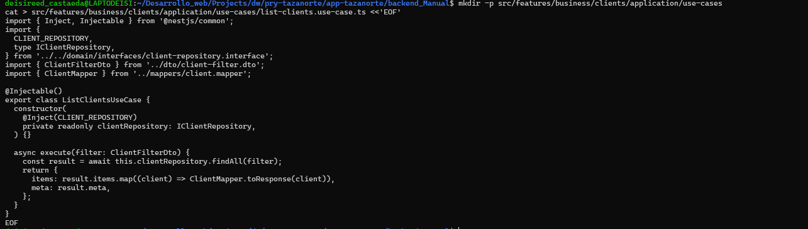

#### 7.20 — features/business/clients/application/use-cases/update-client.use-case.ts

Caso de uso (aplicación). Orquesta dominio + repositorio. El controller solo lo invoca.

**Archivo:** `src/features/business/clients/application/use-cases/update-client.use-case.ts`

``` bash
mkdir -p src/features/business/clients/application/use-cases cat > src/features/business/clients/application/use-cases/update-client.use-case.ts <<'EOF_BACKEND_IA' import { Inject, Injectable } from '@nestjs/common'; import {   type IPasswordHasher,   PASSWORD_HASHER, } from '../../../../../infrastructure/security/hashing/password-hasher.interface'; import { ClientEmailAlreadyExistsException } from '../../domain/exceptions/client-email-already-exists.exception'; import { ClientNotFoundException } from '../../domain/exceptions/client-not-found.exception'; import {   CLIENT_REPOSITORY,   type IClientRepository, } from '../../domain/interfaces/client-repository.interface'; import { UpdateClientDto } from '../dto/update-client.dto'; import { ClientMapper } from '../mappers/client.mapper';  @Injectable() export class UpdateClientUseCase {   constructor(     @Inject(CLIENT_REPOSITORY)     private readonly clientRepository: IClientRepository,     @Inject(PASSWORD_HASHER)     private readonly passwordHasher: IPasswordHasher,   ) {}    async execute(id: number, dto: UpdateClientDto) {     const client = await this.clientRepository.findById(id);     if (!client) {       throw new ClientNotFoundException(id);     }      if (dto.email && dto.email !== client.email) {       const existing = await this.clientRepository.findByEmail(dto.email);       if (existing) {         throw new ClientEmailAlreadyExistsException(dto.email);       }     }      const updateData = { ...dto };     if (dto.password) {       updateData.password = await this.passwordHasher.hash(dto.password);     }      client.update(updateData);     const updated = await this.clientRepository.update(client);     return ClientMapper.toResponse(updated);   } } EOF_BACKEND_IA
```

**Sugerencia de commit (issue):**

``` bash
git add . 
git commit -m "feat: add use case update-client.use-case.ts"
```

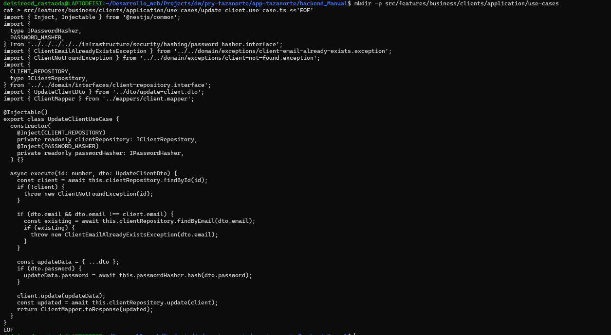

#### 7.21 — features/business/clients/presentation/http/serializers/client.serializer.ts

Serializer de presentación (forma estable de la respuesta HTTP).

**Archivo:** `src/features/business/clients/presentation/http/serializers/client.serializer.ts`

``` bash
mkdir -p src/features/business/clients/presentation/http/serializers cat > src/features/business/clients/presentation/http/serializers/client.serializer.ts <<'EOF_BACKEND_IA' import { Client } from '../../../domain/entities/client.entity'; import { ClientResponseDto } from '../../../application/dto/client-response.dto'; import { ClientMapper } from '../../../application/mappers/client.mapper';  export class ClientSerializer {   static serialize(entity: Client): ClientResponseDto {     return ClientMapper.toResponse(entity);   } } EOF_BACKEND_IA
```

**Sugerencia de commit (issue):**

``` bash
git add . 
git commit -m "feat: add serializer client.serializer.ts"
```

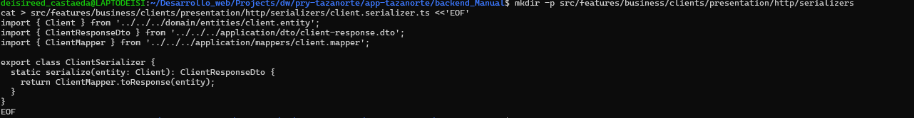

#### 7.22 — features/business/clients/presentation/http/controllers/clients.controller.ts

Controller delgado: valida DTO, llama use-case, devuelve respuesta.

**Archivo:** `src/features/business/clients/presentation/http/controllers/clients.controller.ts`

``` bash
mkdir -p src/features/business/clients/presentation/http/controllers cat > src/features/business/clients/presentation/http/controllers/clients.controller.ts <<'EOF_BACKEND_IA' import {   Body,   Controller,   Delete,   Get,   HttpCode,   HttpStatus,   Param,   Patch,   Post,   Query, } from '@nestjs/common'; import {   ApiCreatedResponse,   ApiNoContentResponse,   ApiOkResponse,   ApiOperation,   ApiTags, } from '@nestjs/swagger'; import { ParsePositiveIntPipe } from '../../../../../../common/pipes/parse-positive-int.pipe'; import { CreateClientDto } from '../../../application/dto/create-client.dto'; import { UpdateClientDto } from '../../../application/dto/update-client.dto'; import { ClientFilterDto } from '../../../application/dto/client-filter.dto'; import { ClientResponseDto } from '../../../application/dto/client-response.dto'; import { CreateClientUseCase } from '../../../application/use-cases/create-client.use-case'; import { UpdateClientUseCase } from '../../../application/use-cases/update-client.use-case'; import { DeleteClientUseCase } from '../../../application/use-cases/delete-client.use-case'; import { GetClientUseCase } from '../../../application/use-cases/get-client.use-case'; import { ListClientsUseCase } from '../../../application/use-cases/list-clients.use-case';  @ApiTags('Clients') @Controller('clients') export class ClientsController {   constructor(     private readonly createClientUseCase: CreateClientUseCase,     private readonly updateClientUseCase: UpdateClientUseCase,     private readonly deleteClientUseCase: DeleteClientUseCase,     private readonly getClientUseCase: GetClientUseCase,     private readonly listClientsUseCase: ListClientsUseCase,   ) {}    @Post()   @ApiOperation({ summary: 'Crear un cliente' })   @ApiCreatedResponse({ type: ClientResponseDto })   create(@Body() dto: CreateClientDto) {     return this.createClientUseCase.execute(dto);   }    @Get()   @ApiOperation({ summary: 'Listar clientes' })   @ApiOkResponse({ type: [ClientResponseDto] })   findAll(@Query() filter: ClientFilterDto) {     return this.listClientsUseCase.execute(filter);   }    @Get(':id')   @ApiOperation({ summary: 'Obtener un cliente por ID' })   @ApiOkResponse({ type: ClientResponseDto })   findOne(@Param('id', ParsePositiveIntPipe) id: number) {     return this.getClientUseCase.execute(id);   }    @Patch(':id')   @ApiOperation({ summary: 'Actualizar un cliente' })   @ApiOkResponse({ type: ClientResponseDto })   update(     @Param('id', ParsePositiveIntPipe) id: number,     @Body() dto: UpdateClientDto,   ) {     return this.updateClientUseCase.execute(id, dto);   }    @Delete(':id')   @HttpCode(HttpStatus.NO_CONTENT)   @ApiOperation({ summary: 'Eliminar un cliente' })   @ApiNoContentResponse()   remove(@Param('id', ParsePositiveIntPipe) id: number) {     return this.deleteClientUseCase.execute(id);   } } EOF_BACKEND_IA
```

**Sugerencia de commit (issue):**

``` bash
git add .
git commit -m "feat: add controller clients.controller.ts"
```

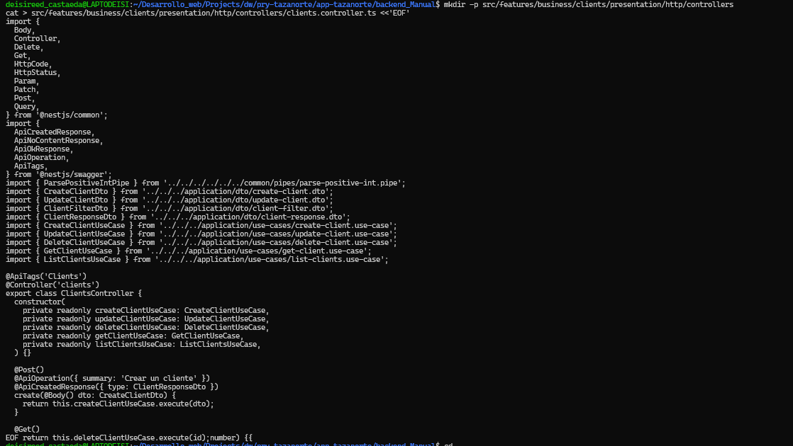

#### 7.23 — features/business/clients/index.ts

Barrel export del feature para imports limpios.

**Archivo:** `src/features/business/clients/index.ts`

``` bash
mkdir -p src/features/business/clients cat > src/features/business/clients/index.ts <<'EOF_BACKEND_IA' export { ClientsModule } from './clients.module'; EOF_BACKEND_IA
```

**Sugerencia de commit (issue):**

``` bash
git add . 
git commit -m "chore: add barrel export clients"
```

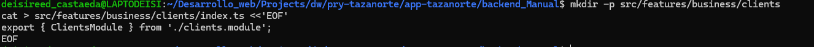

#### 7.24 — features/business/clients/clients.module.ts

Módulo Nest del feature: cablea providers, tokens DI y controller.

**Archivo:** `src/features/business/clients/clients.module.ts`

``` bash
mkdir -p src/features/business/clients cat > src/features/business/clients/clients.module.ts <<'EOF_BACKEND_IA' import { Module } from '@nestjs/common'; import { BcryptPasswordHasherService } from '../../../infrastructure/security/hashing/bcrypt-password-hasher.service'; import { PASSWORD_HASHER } from '../../../infrastructure/security/hashing/password-hasher.interface'; import { CLIENT_REPOSITORY } from './domain/interfaces/client-repository.interface'; import { ClientRepository } from './infrastructure/persistence/repositories/client.repository'; import { CreateClientUseCase } from './application/use-cases/create-client.use-case'; import { UpdateClientUseCase } from './application/use-cases/update-client.use-case'; import { DeleteClientUseCase } from './application/use-cases/delete-client.use-case'; import { GetClientUseCase } from './application/use-cases/get-client.use-case'; import { ListClientsUseCase } from './application/use-cases/list-clients.use-case'; import { ClientsController } from './presentation/http/controllers/clients.controller';  @Module({   controllers: [ClientsController],   providers: [     ClientRepository,     { provide: CLIENT_REPOSITORY, useExisting: ClientRepository },     BcryptPasswordHasherService,     { provide: PASSWORD_HASHER, useExisting: BcryptPasswordHasherService },     CreateClientUseCase,     UpdateClientUseCase,     DeleteClientUseCase,     GetClientUseCase,     ListClientsUseCase,   ],   exports: [CLIENT_REPOSITORY], }) export class ClientsModule {} EOF_BACKEND_IA
```

**Sugerencia de commit (issue):**

``` bash
git add . 
git commit -m "feat: wire nest module clients.module.ts"
```

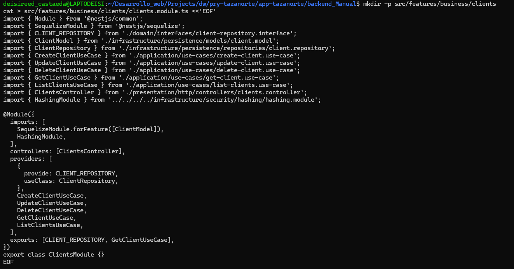

#### 7.25 — Actualizar sequelize.factory.ts (registrar modelos)

Registra en ALL_MODELS solo los modelos ya creados (orden de dependencias).

**Archivo:** `src/infrastructure/database/sequelize/sequelize.factory.ts`

``` bash
mkdir -p src/infrastructure/database/sequelize cat > src/infrastructure/database/sequelize/sequelize.factory.ts <<'EOF_BACKEND_IA' import { Sequelize } from 'sequelize-typescript'; import { DatabaseDialect } from '../../../config/environment/env.interface'; import { getSequelizeOptions } from './sequelize.options';  import { ClientModel } from '../../../features/business/clients/infrastructure/persistence/models/client.model';  export const ALL_MODELS = [   ClientModel, ];  export async function createSequelizeInstance(   dialect: DatabaseDialect, ): Promise<Sequelize> {   const options = getSequelizeOptions(dialect);    let dialectModule: any;    switch (dialect) {     case DatabaseDialect.MySQL:       dialectModule = require('mysql2');       break;     case DatabaseDialect.Postgres:       dialectModule = require('pg');       break;     case DatabaseDialect.MSSQL:       dialectModule = require('tedious');       break;     case DatabaseDialect.Oracle:       dialectModule = require('oracledb');       break;     default:       throw new Error(`Dialecto no soportado: ${dialect}`);   }    const sequelize = new Sequelize({     ...options,     dialectModule,     models: ALL_MODELS,   } as any);    try {     await sequelize.authenticate();     console.log(`✅ Conexión exitosa a ${dialect.toUpperCase()}`);   } catch (error: any) {     console.error(       `❌ Error conectando a ${dialect.toUpperCase()}:`,       error.message,     );     throw error;   }    if (process.env.NODE_ENV !== 'production') {     await sequelize.sync({ alter: false });     console.log('✅ Tablas sincronizadas');   }    return sequelize; } EOF_BACKEND_IA
```

**Sugerencia de commit (issue):**

``` bash
git add . 
git commit -m "feat: register ClientModel in sequelize factory"
```

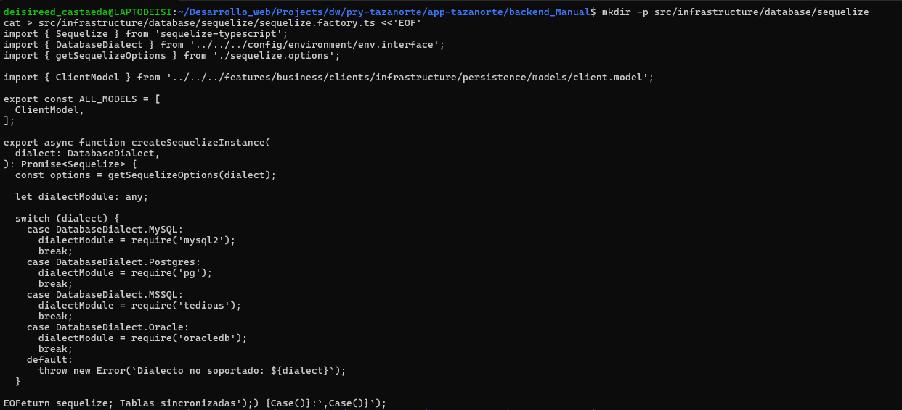

#### 7.26 — Actualizar business.module.ts

Agrega el feature module de negocio recién terminado.

**Archivo:** `src/features/business/business.module.ts`

``` bash
mkdir -p src/features/business cat > src/features/business/business.module.ts <<'EOF_BACKEND_IA' import { Module } from '@nestjs/common'; import { ClientsModule } from './clients/clients.module';  @Module({   imports: [ClientsModule],   exports: [ClientsModule], }) export class BusinessModule {} EOF_BACKEND_IA
```

**Sugerencia de commit (issue):**

``` bash
git add . 
git commit -m "feat: export ClientsModule from BusinessModule"
```

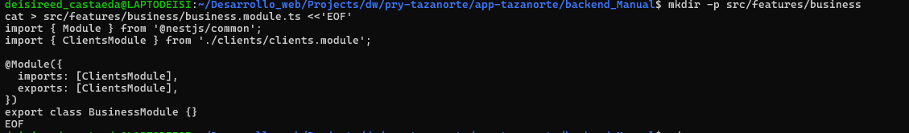

#### 7.27 — Actualizar database-seeder.service.ts

Ejecuta seeders en orden de dependencias al arrancar (dev).

**Archivo:** `src/infrastructure/database/seeders/database-seeder.service.ts`

``` bash
mkdir -p src/infrastructure/database/seeders cat > src/infrastructure/database/seeders/database-seeder.service.ts <<'EOF_BACKEND_IA' import { Injectable, Logger, OnModuleInit } from '@nestjs/common'; import { seedClients } from '../../../features/business/clients/infrastructure/persistence/seeders/clients.seeder';  /**  * Ejecuta seeders en orden de dependencias.  * Solo en entornos no productivos.  */ @Injectable() export class DatabaseSeederService implements OnModuleInit {   private readonly logger = new Logger(DatabaseSeederService.name);    async onModuleInit(): Promise<void> {     if (process.env.NODE_ENV === 'production') {       return;     }      try {       await seedClients();       this.logger.log('✅ Seeders ejecutados');     } catch (error: any) {       this.logger.error(`❌ Error en seeders: ${error.message}`, error.stack);       throw error;     }   } } EOF_BACKEND_IA
```

**Sugerencia de commit (issue):**

``` bash
git add . 
git commit -m "chore: run seedClients on bootstrap"
```

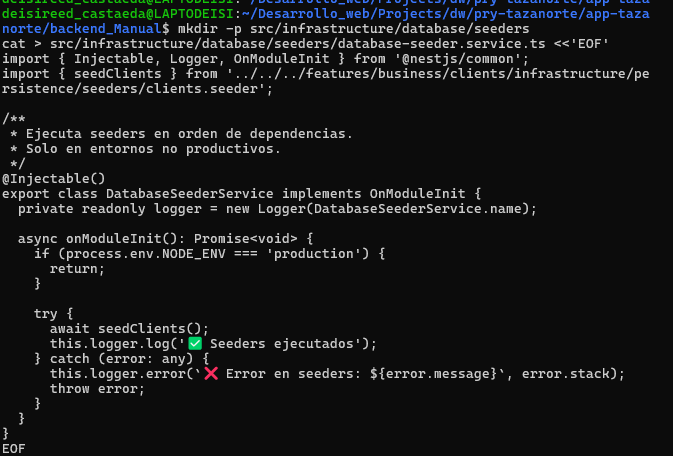

#### 7.28 — Actualizar app.module.ts

Importa BusinessModule y/o AuthModule según el avance. Los guards globales llegan en la fase RBAC.

**Archivo:** `src/app.module.ts`

``` bash
mkdir -p src cat > src/app.module.ts <<'EOF_BACKEND_IA' import { Module } from '@nestjs/common'; import { ConfigModule } from '@nestjs/config'; import { envConfig } from './config/environment/env.config'; import { appConfig } from './config/app/app.config'; import { jwtConfig } from './config/jwt/jwt.config'; import { LoggerModule } from './config/logger/logger.module'; import { SequelizeDatabaseModule } from './infrastructure/database/sequelize/sequelize.module'; import { SecurityModule } from './infrastructure/security/security.module'; import { BusinessModule } from './features/business/business.module'; import { AppController } from './app.controller'; import { AppService } from './app.service';  @Module({   imports: [     ConfigModule.forRoot({       isGlobal: true,       load: [envConfig, appConfig, jwtConfig],       envFilePath: '.env',     }),     SequelizeDatabaseModule,     SecurityModule,     LoggerModule,     BusinessModule,   ],   controllers: [AppController],   providers: [     AppService,   ], }) export class AppModule {} EOF_BACKEND_IA
```

**Sugerencia de commit (issue):**

``` bash
git add .
git commit -m "feat: import BusinessModule into AppModule"
```

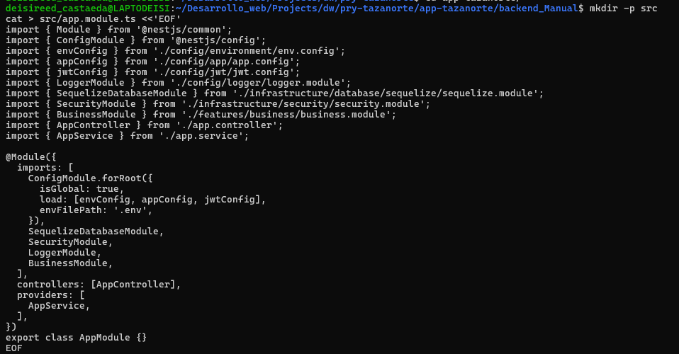

#### 7.29 — Verificar tabla física `clients` y API

Arranca la app. Debe crear/sync tabla `clients`, correr seeder y exponer `/api/clients`. Prueba list/create en Swagger o curl.

``` bash
npm run start:dev
```

**Sugerencia de commit (issue):**

``` bash
git add . 
git commit -m "test: verify clients table and crud endpoints"
```

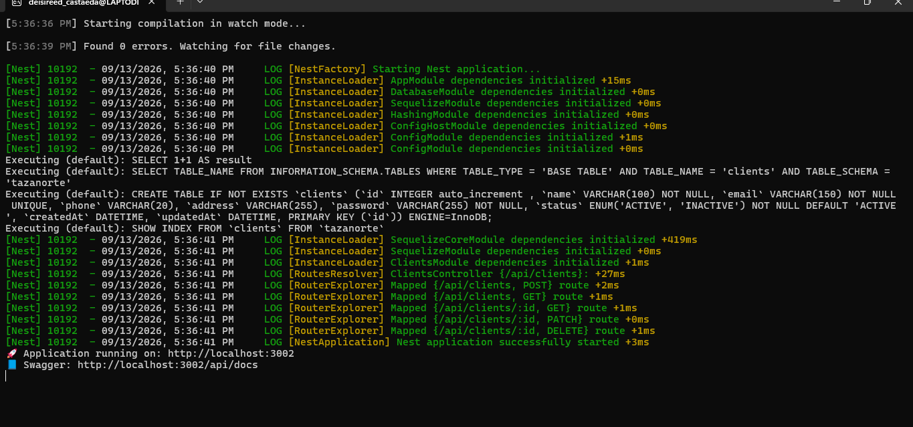

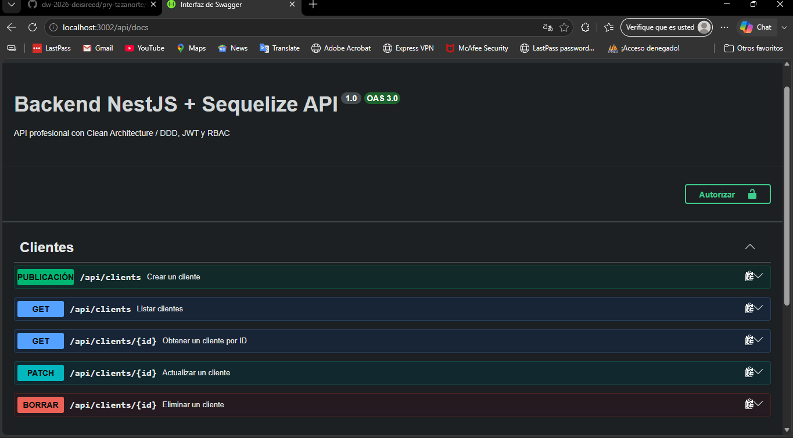

## FASE 8 — `07_BUSINESS_PRODUCTProps`

### Business — ProductTypes

> **Objetivo de la fase:** Catálogo de tipos de producto. Misma plantilla CA que Clients.

#### 8.1 — features/business/productProps/domain/entities/product-type.entity.ts

Entidad de dominio (TypeScript puro). No extiende Sequelize `Model`. Aquí viven las reglas del negocio.

**Archivo:** `src/features/business/product-types/domain/entities/product-type.entity.ts`

``` bash
mkdir -p src/features/business/product-types/domain/entities cat > src/features/business/product-types/domain/entities/product-type.entity.ts <<'EOF_BACKEND_IA' import { Status } from '../../../../../common/enums/status.enum';  export interface ProductTypeProps {   id?: number;   name: string;   description?: string;   status?: Status;   createdAt?: Date;   updatedAt?: Date; }  export class ProductType {   id?: number;   name: string;   description?: string;   status: Status;   createdAt?: Date;   updatedAt?: Date;    private constructor(props: ProductTypeProps) {     this.id = props.id;     this.name = props.name;     this.description = props.description;     this.status = props.status ?? Status.ACTIVE;     this.createdAt = props.createdAt;     this.updatedAt = props.updatedAt;   }    static create(     props: Omit<ProductTypeProps, 'id' | 'status' | 'createdAt' | 'updatedAt'>,   ): ProductType {     if (!props.name?.trim()) {       throw new Error('El nombre del tipo de producto es requerido');     }      return new ProductType(props);   }    static reconstitute(props: ProductTypeProps): ProductType {     return new ProductType(props);   }    update(     props: Partial<       Omit<ProductTypeProps, 'id' | 'status' | 'createdAt' | 'updatedAt'>     >,   ): void {     if (props.name !== undefined) {       if (!props.name.trim()) {         throw new Error('El nombre del tipo de producto es requerido');       }       this.name = props.name;     }      if (props.description !== undefined) {       this.description = props.description;     }   }    deactivate(): void {     this.status = Status.INACTIVE;   } } EOF_BACKEND_IA
```

**Sugerencia de commit (issue):**

``` bash
git add . 
git commit -m "feat: add domain entity product-type.entity.ts"
```

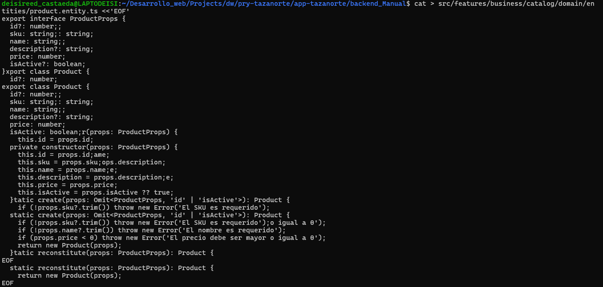

#### 8.2 — features/business/productProps/domain/exceptions/product-type-not-found.exception.ts

Excepción de dominio. El caso de uso la lanza; el filter HTTP la traduce a status code.

**Archivo:** `src/features/business/product-types/domain/exceptions/product-type-not-found.exception.ts`

``` bash
mkdir -p src/features/business/product-types/domain/exceptions cat > src/features/business/product-types/domain/exceptions/product-type-not-found.exception.ts <<'EOF_BACKEND_IA' import { EntityNotFoundException } from '../../../../../common/exceptions/entity-not-found.exception';  export class ProductTypeNotFoundException extends EntityNotFoundException {   constructor(id: number) {     super('Tipo de producto', id);   } } EOF_BACKEND_IA
```

**Sugerencia de commit (issue):**

``` bash
git add . 
git commit -m "feat: add domain exception product-type-not-found.exception.ts"
```

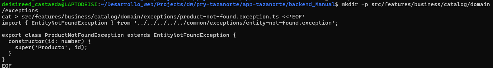

#### 8.3 — /features/business/catalog/domain/interfaces

Puerto (contrato) del repositorio. La aplicación depende de esta interface, no de Sequelize.

**Archivo:** `src/features/business/product-types/domain/interfaces/product-type-repository.interface.ts`

``` bash
mkdir -p src/features/business/product-types/domain/interfaces cat > src/features/business/product-types/domain/interfaces/product-type-repository.interface.ts <<'EOF_BACKEND_IA' import { PaginatedResult } from '../../../../../common/interfaces/pagination.interface'; import { ProductType } from '../entities/product-type.entity';  export const PRODUCT_TYPE_REPOSITORY = 'PRODUCT_TYPE_REPOSITORY';  export interface ProductTypeFindAllParams {   page?: number;   limit?: number;   search?: string; }  export interface IProductTypeRepository {   create(productType: ProductType): Promise<ProductType>;   update(productType: ProductType): Promise<ProductType>;   delete(id: number): Promise<void>;   findById(id: number): Promise<ProductType | null>;   findAll(params: ProductTypeFindAllParams): Promise<PaginatedResult<ProductType>>; } EOF_BACKEND_IA
```

**Sugerencia de commit (issue):**

``` bash
git add .
git commit -m "feat: add repository port product-type-repository.interface.ts"
```

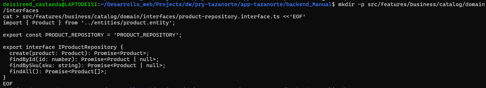

#### 8.4 — /features/business/catalog/domain/interfaces

Modelo Sequelize (`@Table`). Solo infraestructura: mapeo a tabla física.

**Archivo:** `src/features/business/product-types/infrastructure/persistence/models/product-type.model.ts`

``` bash
mkdir -p src/features/business/product-types/infrastructure/persistence/models cat > src/features/business/product-types/infrastructure/persistence/models/product-type.model.ts <<'EOF_BACKEND_IA' import {   AutoIncrement,   Column,   CreatedAt,   DataType,   HasMany,   Model,   PrimaryKey,   Table,   UpdatedAt, } from 'sequelize-typescript'; import { Status } from '../../../../../../common/enums/status.enum';  @Table({ tableName: 'product_types' }) export class ProductTypeModel extends Model {   @PrimaryKey   @AutoIncrement   @Column(DataType.INTEGER)   declare id: number;    @Column({ type: DataType.STRING(100), allowNull: false })   declare name: string;    @Column({ type: DataType.TEXT, allowNull: true })   declare description: string | null;    @Column({     type: DataType.ENUM(...Object.values(Status)),     allowNull: false,     defaultValue: Status.ACTIVE,   })   declare status: Status;    @CreatedAt   declare createdAt: Date;    @UpdatedAt   declare updatedAt: Date;    @HasMany(     () =>       require('../../../../products/infrastructure/persistence/models/product.model')         .ProductModel,   )   declare products: unknown[]; } EOF_BACKEND_IA
```

**Sugerencia de commit (issue):**

``` bash
git add .
git commit -m "feat: add sequelize model product-type.model.ts"
```

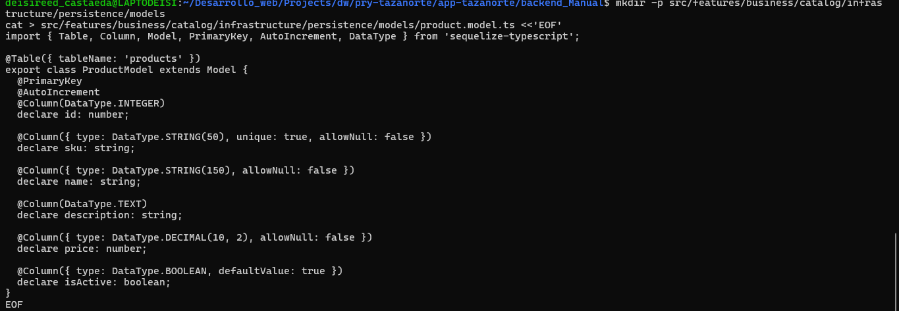

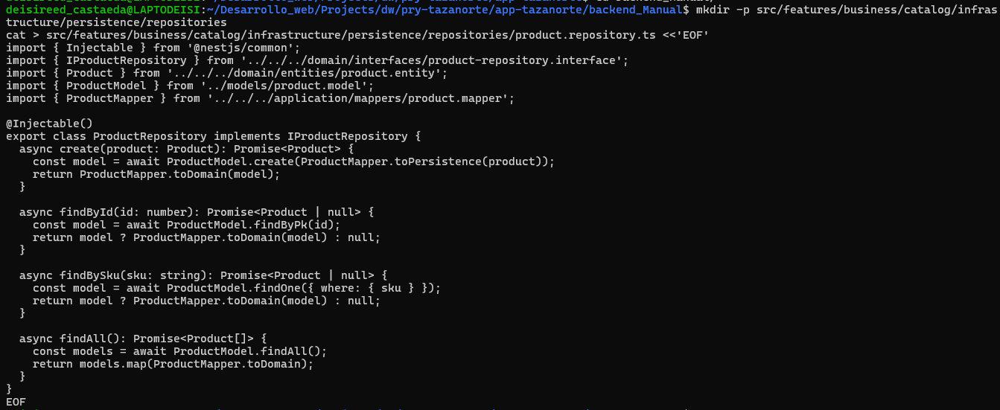

#### 8.5 — /features/business/catalog/domain/interfaces

Adaptador del repositorio: implementa el puerto de dominio con Sequelize.

**Archivo:** `src/features/business/product-types/infrastructure/persistence/repositories/product-type.repository.ts`

``` bash
mkdir -p src/features/business/product-types/infrastructure/persistence/repositories cat > src/features/business/product-types/infrastructure/persistence/repositories/product-type.repository.ts <<'EOF_BACKEND_IA' import { Injectable } from '@nestjs/common'; import { Op } from 'sequelize'; import {   buildPaginatedResult,   normalizePagination, } from '../../../../../../common/utils/pagination.util'; import { ProductType } from '../../../domain/entities/product-type.entity'; import {   IProductTypeRepository,   ProductTypeFindAllParams, } from '../../../domain/interfaces/product-type-repository.interface'; import { ProductTypeMapper } from '../../../application/mappers/product-type.mapper'; import { ProductTypeModel } from '../models/product-type.model';  @Injectable() export class ProductTypeRepository implements IProductTypeRepository {   async create(productType: ProductType): Promise<ProductType> {     const model = await ProductTypeModel.create(       ProductTypeMapper.toPersistence(productType),     );     return ProductTypeMapper.toDomain(model);   }    async update(productType: ProductType): Promise<ProductType> {     await ProductTypeModel.update(       ProductTypeMapper.toPersistence(productType),       { where: { id: productType.id } },     );     const updated = await ProductTypeModel.findByPk(productType.id!);     return ProductTypeMapper.toDomain(updated!);   }    async delete(id: number): Promise<void> {     await ProductTypeModel.destroy({ where: { id } });   }    async findById(id: number): Promise<ProductType | null> {     const model = await ProductTypeModel.findByPk(id);     return model ? ProductTypeMapper.toDomain(model) : null;   }    async findAll(params: ProductTypeFindAllParams) {     const { page, limit, offset } = normalizePagination(       params.page,       params.limit,     );      const where = params.search       ? {           [Op.or]: [             { name: { [Op.like]: `%${params.search}%` } },             { description: { [Op.like]: `%${params.search}%` } },           ],         }       : {};      const { rows, count } = await ProductTypeModel.findAndCountAll({       where,       limit,       offset,       order: [['createdAt', 'DESC']],     });      return buildPaginatedResult(       rows.map((row) => ProductTypeMapper.toDomain(row)),       count,       page,       limit,     );   } } EOF_BACKEND_IA
```

**Sugerencia de commit (issue):**

``` bash
git add . 
git commit -m "feat: add sequelize repository product-type.repository.ts"
```

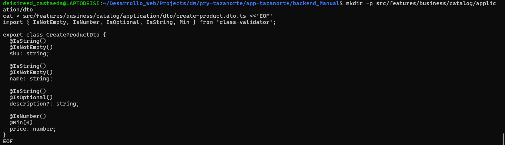

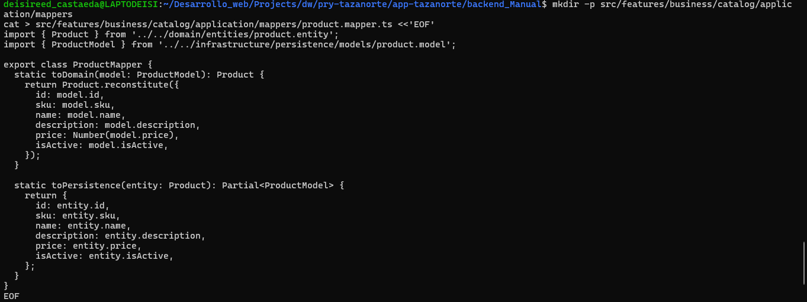

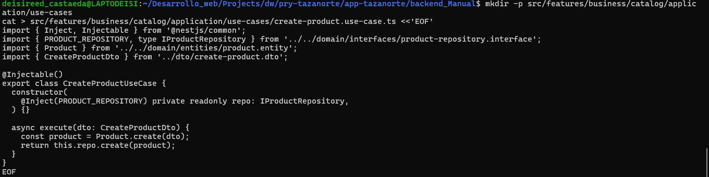

#### 8.6 — /features/business/catalog/domain/interfaces

Migración documental/auxiliar de la tabla. En dev el sync de Sequelize crea el esquema.

**Archivo:** `src/features/business/product-types/infrastructure/persistence/migrations/create-product-types-table.migration.ts`

``` bash
mkdir -p src/features/business/product-types/infrastructure/persistence/migrations cat > src/features/business/product-types/infrastructure/persistence/migrations/create-product-types-table.migration.ts <<'EOF_BACKEND_IA' export const createProductTypesTableMigration = {   name: 'create-product-types-table',   async up(): Promise<void> {     // Sequelize sync handles table creation in development.     // Production: CREATE TABLE product_types (id, name, description, status, createdAt, updatedAt)   },   async down(): Promise<void> {     // Production: DROP TABLE product_types   }, }; EOF_BACKEND_IA
```

**Sugerencia de commit (issue):**

``` bash
git add .
git commit -m "chore: add migration create-product-types-table.migration.ts"
```

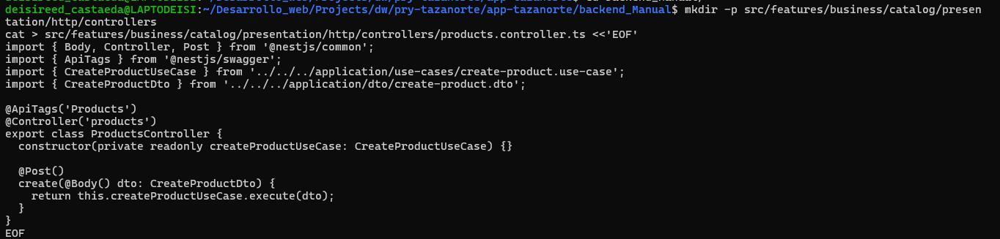

#### 8.7 —  /features/business/catalog/domain/interfaces

Seeder de datos iniciales para desarrollo y verificación física en BD.

**Archivo:** `src/features/business/product-types/infrastructure/persistence/seeders/product-types.seeder.ts`

``` bash
mkdir -p src/features/business/product-types/infrastructure/persistence/seeders cat > src/features/business/product-types/infrastructure/persistence/seeders/product-types.seeder.ts <<'EOF_BACKEND_IA' import { ProductTypeModel } from '../models/product-type.model'; import { Status } from '../../../../../../common/enums/status.enum';  export async function seedProductTypes(): Promise<void> {   const count = await ProductTypeModel.count();   if (count > 0) {     return;   }    await ProductTypeModel.bulkCreate([     {       name: 'Electronics',       description: 'Electronic devices and accessories',       status: Status.ACTIVE,     },     {       name: 'Clothing',       description: 'Apparel and fashion items',       status: Status.ACTIVE,     },   ]); } EOF_BACKEND_IA
```

**Sugerencia de commit (issue):**

``` bash
git add . 
git commit -m "chore: add seeder product-types.seeder.ts"
```

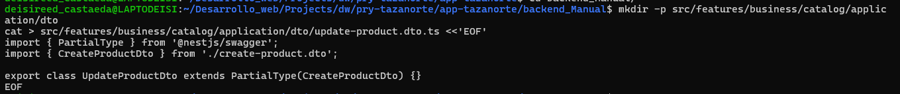

#### 8.8 — features/business/product-types/application/dto/create-product-type.dto.ts

DTO de entrada/salida HTTP con `class-validator` / Swagger.

**Archivo:** `src/features/business/product-types/application/dto/create-product-type.dto.ts`

``` bash
mkdir -p src/features/business/product-types/application/dto cat > src/features/business/product-types/application/dto/create-product-type.dto.ts <<'EOF_BACKEND_IA' import { ApiProperty, ApiPropertyOptional } from '@nestjs/swagger'; import { IsNotEmpty, IsOptional, IsString, MaxLength } from 'class-validator';  export class CreateProductTypeDto {   @ApiProperty({ example: 'Electronics' })   @IsString()   @IsNotEmpty()   @MaxLength(100)   name: string;    @ApiPropertyOptional({ example: 'Electronic devices and accessories' })   @IsOptional()   @IsString()   description?: string; } EOF_BACKEND_IA
```

**Sugerencia de commit (issue):**

``` bash
git add . 
git commit -m "feat: add dto create-product-type.dto.ts"
```

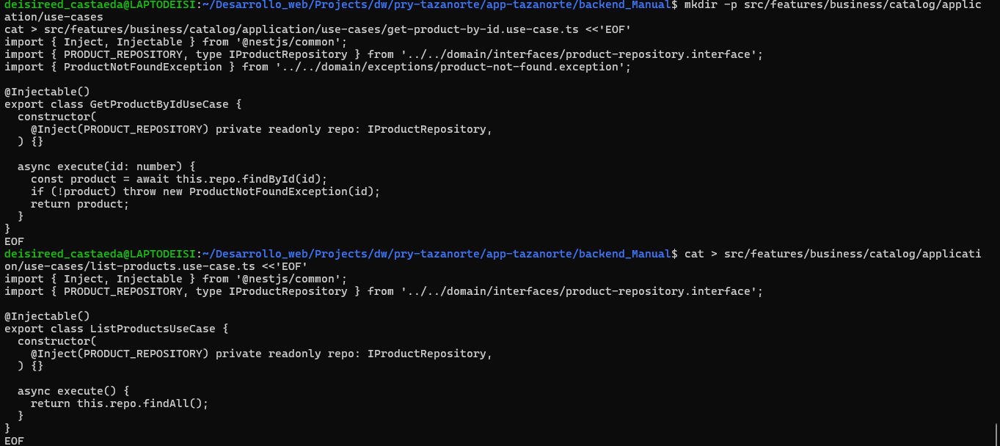

#### 8.9 — features/business/product-types/application/dto/product-type-filter.dto.ts

DTO de entrada/salida HTTP con `class-validator` / Swagger.

**Archivo:** `src/features/business/product-types/application/dto/product-type-filter.dto.ts`

``` bash
mkdir -p src/features/business/product-types/application/dto cat > src/features/business/product-types/application/dto/product-type-filter.dto.ts <<'EOF_BACKEND_IA' import { ApiPropertyOptional } from '@nestjs/swagger'; import { Type } from 'class-transformer'; import { IsInt, IsOptional, IsPositive, IsString, Min } from 'class-validator';  export class ProductTypeFilterDto {   @ApiPropertyOptional({ example: 1, default: 1 })   @IsOptional()   @Type(() => Number)   @IsInt()   @Min(1)   page?: number;    @ApiPropertyOptional({ example: 10, default: 10 })   @IsOptional()   @Type(() => Number)   @IsInt()   @IsPositive()   limit?: number;    @ApiPropertyOptional({ example: 'electronics' })   @IsOptional()   @IsString()   search?: string; } EOF_BACKEND_IA
```

**Sugerencia de commit (issue):**

``` bash
git add . 
git commit -m "feat: add dto product-type-filter.dto.ts"
```

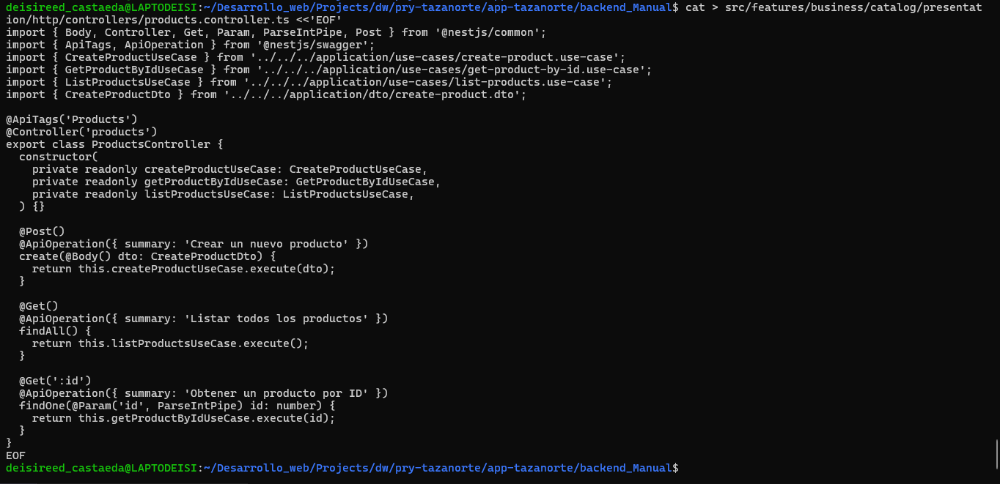

#### 8.10 — features/business/catalog/domain/interfaces

DTO de entrada/salida HTTP con `class-validator` / Swagger.

**Archivo:** `src/features/business/product-types/application/dto/product-type-response.dto.ts`

``` bash
mkdir -p src/features/business/product-types/application/dto cat > src/features/business/product-types/application/dto/product-type-response.dto.ts <<'EOF_BACKEND_IA' import { ApiProperty, ApiPropertyOptional } from '@nestjs/swagger'; import { Status } from '../../../../../common/enums/status.enum';  export class ProductTypeResponseDto {   @ApiProperty({ example: 1 })   id: number;    @ApiProperty({ example: 'Electronics' })   name: string;    @ApiPropertyOptional({ example: 'Electronic devices and accessories' })   description?: string;    @ApiProperty({ enum: Status, example: Status.ACTIVE })   status: Status;    @ApiProperty()   createdAt: Date;    @ApiProperty()   updatedAt: Date; } EOF_BACKEND_IA
```

**Sugerencia de commit (issue):**

``` bash
git add .
git commit -m "feat: add dto product-type-response.dto.ts"
```

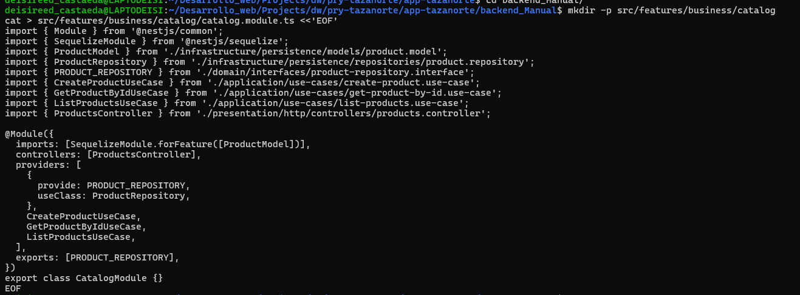

#### 8.11 — /features/business/catalog/domain/interfaces

DTO de entrada/salida HTTP con `class-validator` / Swagger.

**Archivo:** `src/features/business/product-types/application/dto/update-product-type.dto.ts`

``` bash
mkdir -p src/features/business/product-types/application/dto cat > src/features/business/product-types/application/dto/update-product-type.dto.ts <<'EOF_BACKEND_IA' import { PartialType } from '@nestjs/mapped-types'; import { CreateProductTypeDto } from './create-product-type.dto';  export class UpdateProductTypeDto extends PartialType(CreateProductTypeDto) {} EOF_BACKEND_IA
```

**Sugerencia de commit (issue):**

``` bash
git add .
git commit -m "feat: add dto update-product-type.dto.ts"
```

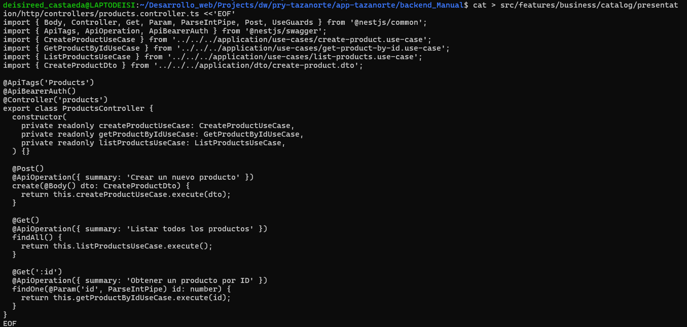

#### 8.12 —  /features/business/catalog/domain/interfaces

Mapper entre entidad de dominio y DTO de respuesta.

**Archivo:** `src/features/business/product-types/application/mappers/product-type.mapper.ts`

``` bash
mkdir -p src/features/business/product-types/application/mappers cat > src/features/business/product-types/application/mappers/product-type.mapper.ts <<'EOF_BACKEND_IA' import { Status } from '../../../../../common/enums/status.enum'; import { ProductType } from '../../domain/entities/product-type.entity'; import { ProductTypeResponseDto } from '../dto/product-type-response.dto'; import { ProductTypeModel } from '../../infrastructure/persistence/models/product-type.model';  export class ProductTypeMapper {   static toDomain(model: ProductTypeModel): ProductType {     return ProductType.reconstitute({       id: model.id,       name: model.name,       description: model.description ?? undefined,       status: model.status,       createdAt: model.createdAt,       updatedAt: model.updatedAt,     });   }    static toResponse(entity: ProductType): ProductTypeResponseDto {     return {       id: entity.id!,       name: entity.name,       description: entity.description,       status: entity.status,       createdAt: entity.createdAt!,       updatedAt: entity.updatedAt!,     };   }    static toPersistence(entity: ProductType): Partial<ProductTypeModel> {     return {       id: entity.id,       name: entity.name,       description: entity.description ?? null,       status: entity.status ?? Status.ACTIVE,     };   } } EOF_BACKEND_IA
```

**Sugerencia de commit (issue):**

``` bash
git add . 
git commit -m "feat: add mapper product-type.mapper.ts"
```

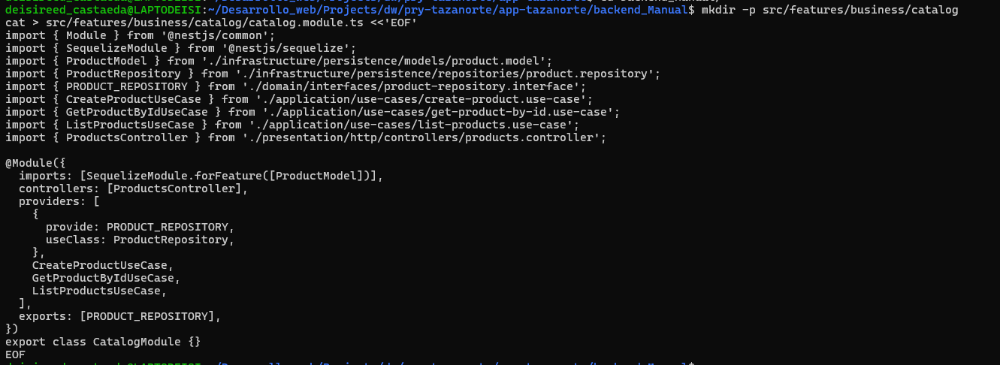

#### 8.13 — /features/business/catalog/domain/interfaces

Caso de uso (aplicación). Orquesta dominio + repositorio. El controller solo lo invoca.

**Archivo:** `src/features/business/product-types/application/use-cases/create-product-type.use-case.ts`

``` bash
mkdir -p src/features/business/product-types/application/use-cases cat > src/features/business/product-types/application/use-cases/create-product-type.use-case.ts <<'EOF_BACKEND_IA' import { Inject, Injectable } from '@nestjs/common'; import { ProductType } from '../../domain/entities/product-type.entity'; import {   type IProductTypeRepository,   PRODUCT_TYPE_REPOSITORY, } from '../../domain/interfaces/product-type-repository.interface'; import { CreateProductTypeDto } from '../dto/create-product-type.dto'; import { ProductTypeMapper } from '../mappers/product-type.mapper';  @Injectable() export class CreateProductTypeUseCase {   constructor(     @Inject(PRODUCT_TYPE_REPOSITORY)     private readonly productTypeRepository: IProductTypeRepository,   ) {}    async execute(dto: CreateProductTypeDto) {     const productType = ProductType.create(dto);     const created = await this.productTypeRepository.create(productType);     return ProductTypeMapper.toResponse(created);   } } EOF_BACKEND_IA
```

**Sugerencia de commit (issue):**

``` bash
git add . 
git commit -m "feat: add use case create-product-type.use-case.ts"
```

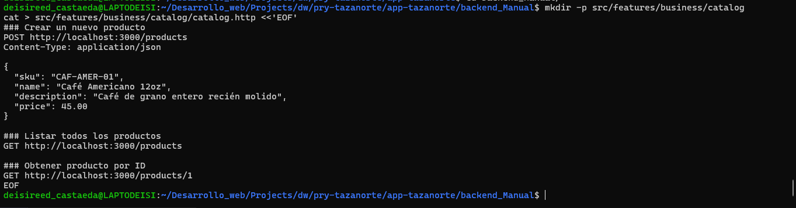

#### 8.14 —/features/business/catalog/domain/interfaces

Caso de uso (aplicación). Orquesta dominio + repositorio. El controller solo lo invoca.

**Archivo:** `src/features/business/product-types/application/use-cases/delete-product-type.use-case.ts`

``` bash
mkdir -p src/features/business/product-types/application/use-cases cat > src/features/business/product-types/application/use-cases/delete-product-type.use-case.ts <<'EOF_BACKEND_IA' import { Inject, Injectable } from '@nestjs/common'; import { ProductTypeNotFoundException } from '../../domain/exceptions/product-type-not-found.exception'; import {   type IProductTypeRepository,   PRODUCT_TYPE_REPOSITORY, } from '../../domain/interfaces/product-type-repository.interface';  @Injectable() export class DeleteProductTypeUseCase {   constructor(     @Inject(PRODUCT_TYPE_REPOSITORY)     private readonly productTypeRepository: IProductTypeRepository,   ) {}    async execute(id: number): Promise<void> {     const productType = await this.productTypeRepository.findById(id);     if (!productType) {       throw new ProductTypeNotFoundException(id);     }      await this.productTypeRepository.delete(id);   } } EOF_BACKEND_IA
```

**Sugerencia de commit (issue):**

``` bash
git add . 
git commit -m "feat: add use case delete-product-type.use-case.ts"
```

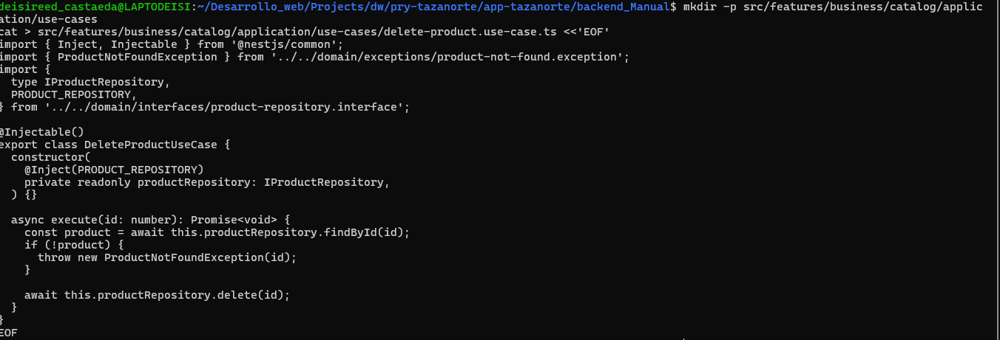

#### 8.15 —/features/business/catalog/domain/interfaces

Caso de uso (aplicación). Orquesta dominio + repositorio. El controller solo lo invoca.

**Archivo:** `src/features/business/product-types/application/use-cases/get-product-type.use-case.ts`

``` bash
mkdir -p src/features/business/product-types/application/use-cases cat > src/features/business/product-types/application/use-cases/get-product-type.use-case.ts <<'EOF_BACKEND_IA' import { Inject, Injectable } from '@nestjs/common'; import { ProductTypeNotFoundException } from '../../domain/exceptions/product-type-not-found.exception'; import {   type IProductTypeRepository,   PRODUCT_TYPE_REPOSITORY, } from '../../domain/interfaces/product-type-repository.interface'; import { ProductTypeMapper } from '../mappers/product-type.mapper';  @Injectable() export class GetProductTypeUseCase {   constructor(     @Inject(PRODUCT_TYPE_REPOSITORY)     private readonly productTypeRepository: IProductTypeRepository,   ) {}    async execute(id: number) {     const productType = await this.productTypeRepository.findById(id);     if (!productType) {       throw new ProductTypeNotFoundException(id);     }      return ProductTypeMapper.toResponse(productType);   } } EOF_BACKEND_IA
```

**Sugerencia de commit (issue):**

``` bash
git add .
git commit -m "feat: add use case get-product-type.use-case.ts"
```

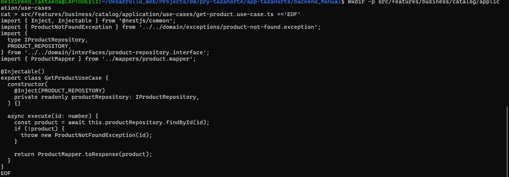

#### 8.16 — /features/business/catalog/domain/interfaces

Caso de uso (aplicación). Orquesta dominio + repositorio. El controller solo lo invoca.

**Archivo:** `src/features/business/product-types/application/use-cases/list-product-types.use-case.ts`

``` bash
mkdir -p src/features/business/product-types/application/use-cases cat > src/features/business/product-types/application/use-cases/list-product-types.use-case.ts <<'EOF_BACKEND_IA' import { Inject, Injectable } from '@nestjs/common'; import {   type IProductTypeRepository,   PRODUCT_TYPE_REPOSITORY, } from '../../domain/interfaces/product-type-repository.interface'; import { ProductTypeFilterDto } from '../dto/product-type-filter.dto'; import { ProductTypeMapper } from '../mappers/product-type.mapper';  @Injectable() export class ListProductTypesUseCase {   constructor(     @Inject(PRODUCT_TYPE_REPOSITORY)     private readonly productTypeRepository: IProductTypeRepository,   ) {}    async execute(filter: ProductTypeFilterDto) {     const result = await this.productTypeRepository.findAll(filter);     return {       items: result.items.map((pt) => ProductTypeMapper.toResponse(pt)),       meta: result.meta,     };   } } EOF_BACKEND_IA
```

**Sugerencia de commit (issue):**

``` bash
git add .
git commit -m "feat: add use case list-product-types.use-case.ts"
```

#### 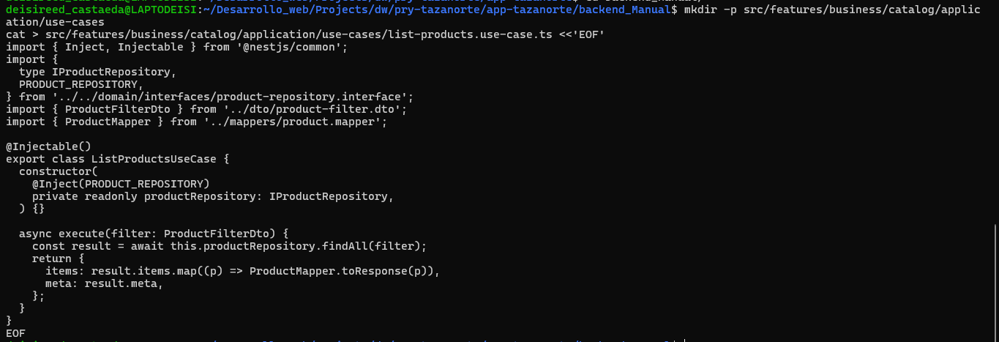

#### 8.17 — features/business/catalog/domain/interfaces

Caso de uso (aplicación). Orquesta dominio + repositorio. El controller solo lo invoca.

**Archivo:** `src/features/business/product-types/application/use-cases/update-product-type.use-case.ts`

``` bash
mkdir -p src/features/business/product-types/application/use-cases cat > src/features/business/product-types/application/use-cases/update-product-type.use-case.ts <<'EOF_BACKEND_IA' import { Inject, Injectable } from '@nestjs/common'; import { ProductTypeNotFoundException } from '../../domain/exceptions/product-type-not-found.exception'; import {   type IProductTypeRepository,   PRODUCT_TYPE_REPOSITORY, } from '../../domain/interfaces/product-type-repository.interface'; import { UpdateProductTypeDto } from '../dto/update-product-type.dto'; import { ProductTypeMapper } from '../mappers/product-type.mapper';  @Injectable() export class UpdateProductTypeUseCase {   constructor(     @Inject(PRODUCT_TYPE_REPOSITORY)     private readonly productTypeRepository: IProductTypeRepository,   ) {}    async execute(id: number, dto: UpdateProductTypeDto) {     const productType = await this.productTypeRepository.findById(id);     if (!productType) {       throw new ProductTypeNotFoundException(id);     }      productType.update(dto);     const updated = await this.productTypeRepository.update(productType);     return ProductTypeMapper.toResponse(updated);   } } EOF_BACKEND_IA
```

**Sugerencia de commit (issue):**

``` bash
git add . 
git commit -m "feat: add use case update-product-type.use-case.ts"
```

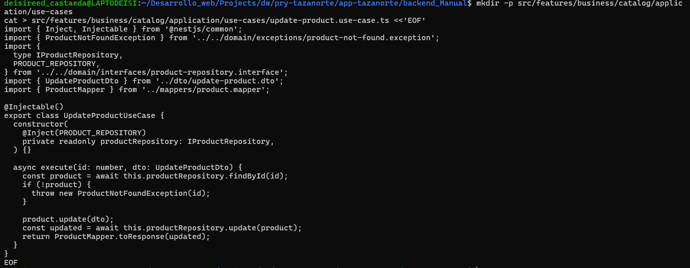

#### 8.18 —  features/business/catalog/domain/interfaces

Serializer de presentación (forma estable de la respuesta HTTP).

**Archivo:** `src/features/business/product-types/presentation/http/serializers/product-type.serializer.ts`

``` bash
mkdir -p src/features/business/product-types/presentation/http/serializers cat > src/features/business/product-types/presentation/http/serializers/product-type.serializer.ts <<'EOF_BACKEND_IA' import { ProductType } from '../../../domain/entities/product-type.entity'; import { ProductTypeResponseDto } from '../../../application/dto/product-type-response.dto'; import { ProductTypeMapper } from '../../../application/mappers/product-type.mapper';  export class ProductTypeSerializer {   static serialize(entity: ProductType): ProductTypeResponseDto {     return ProductTypeMapper.toResponse(entity);   } } EOF_BACKEND_IA
```

**Sugerencia de commit (issue):**

``` bash
git add . 
git commit -m "feat: add serializer product-type.serializer.ts"
```

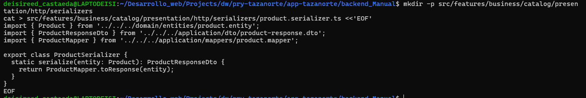

#### 8.19 —features/business/catalog/domain/interfaces

Controller delgado: valida DTO, llama use-case, devuelve respuesta.

**Archivo:** `src/features/business/product-types/presentation/http/controllers/product-types.controller.ts`

``` bash
mkdir -p src/features/business/product-types/presentation/http/controllers cat > src/features/business/product-types/presentation/http/controllers/product-types.controller.ts <<'EOF_BACKEND_IA' import {   Body,   Controller,   Delete,   Get,   HttpCode,   HttpStatus,   Param,   Patch,   Post,   Query, } from '@nestjs/common'; import {   ApiCreatedResponse,   ApiNoContentResponse,   ApiOkResponse,   ApiOperation,   ApiTags, } from '@nestjs/swagger'; import { ParsePositiveIntPipe } from '../../../../../../common/pipes/parse-positive-int.pipe'; import { CreateProductTypeDto } from '../../../application/dto/create-product-type.dto'; import { UpdateProductTypeDto } from '../../../application/dto/update-product-type.dto'; import { ProductTypeFilterDto } from '../../../application/dto/product-type-filter.dto'; import { ProductTypeResponseDto } from '../../../application/dto/product-type-response.dto'; import { CreateProductTypeUseCase } from '../../../application/use-cases/create-product-type.use-case'; import { UpdateProductTypeUseCase } from '../../../application/use-cases/update-product-type.use-case'; import { DeleteProductTypeUseCase } from '../../../application/use-cases/delete-product-type.use-case'; import { GetProductTypeUseCase } from '../../../application/use-cases/get-product-type.use-case'; import { ListProductTypesUseCase } from '../../../application/use-cases/list-product-types.use-case';  @ApiTags('Product Types') @Controller('product-types') export class ProductTypesController {   constructor(     private readonly createProductTypeUseCase: CreateProductTypeUseCase,     private readonly updateProductTypeUseCase: UpdateProductTypeUseCase,     private readonly deleteProductTypeUseCase: DeleteProductTypeUseCase,     private readonly getProductTypeUseCase: GetProductTypeUseCase,     private readonly listProductTypesUseCase: ListProductTypesUseCase,   ) {}    @Post()   @ApiOperation({ summary: 'Crear un tipo de producto' })   @ApiCreatedResponse({ type: ProductTypeResponseDto })   create(@Body() dto: CreateProductTypeDto) {     return this.createProductTypeUseCase.execute(dto);   }    @Get()   @ApiOperation({ summary: 'Listar tipos de producto' })   @ApiOkResponse({ type: [ProductTypeResponseDto] })   findAll(@Query() filter: ProductTypeFilterDto) {     return this.listProductTypesUseCase.execute(filter);   }    @Get(':id')   @ApiOperation({ summary: 'Obtener un tipo de producto por ID' })   @ApiOkResponse({ type: ProductTypeResponseDto })   findOne(@Param('id', ParsePositiveIntPipe) id: number) {     return this.getProductTypeUseCase.execute(id);   }    @Patch(':id')   @ApiOperation({ summary: 'Actualizar un tipo de producto' })   @ApiOkResponse({ type: ProductTypeResponseDto })   update(     @Param('id', ParsePositiveIntPipe) id: number,     @Body() dto: UpdateProductTypeDto,   ) {     return this.updateProductTypeUseCase.execute(id, dto);   }    @Delete(':id')   @HttpCode(HttpStatus.NO_CONTENT)   @ApiOperation({ summary: 'Eliminar un tipo de producto' })   @ApiNoContentResponse()   remove(@Param('id', ParsePositiveIntPipe) id: number) {     return this.deleteProductTypeUseCase.execute(id);   } } EOF_BACKEND_IA
```

**Sugerencia de commit (issue):**

``` bash
git add .
git commit -m "feat: add controller product-types.controller.ts"
```

#### 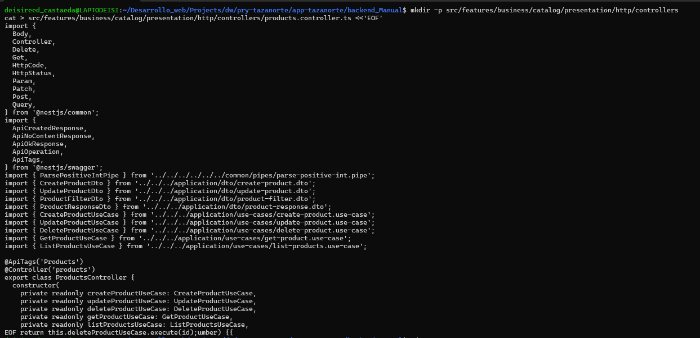

####  8.20 — features/business/product-types/index.ts

Barrel export del feature para imports limpios.

**Archivo:** `src/features/business/product-types/index.ts`

``` bash
mkdir -p src/features/business/product-types cat > src/features/business/product-types/index.ts <<'EOF_BACKEND_IA' export { ProductTypesModule } from './product-types.module'; EOF_BACKEND_IA
```

**Sugerencia de commit (issue):**

``` bash
git add . 
git commit -m "chore: add barrel export product-types"
```

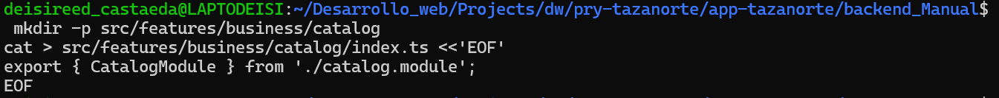

#### 8.21 — features/business/product-types/product-types.module.ts

Módulo Nest del feature: cablea providers, tokens DI y controller.

**Archivo:** `src/features/business/product-types/product-types.module.ts`

``` bash
mkdir -p src/features/business/product-types cat > src/features/business/product-types/product-types.module.ts <<'EOF_BACKEND_IA' import { Module } from '@nestjs/common'; import { PRODUCT_TYPE_REPOSITORY } from './domain/interfaces/product-type-repository.interface'; import { ProductTypeRepository } from './infrastructure/persistence/repositories/product-type.repository'; import { CreateProductTypeUseCase } from './application/use-cases/create-product-type.use-case'; import { UpdateProductTypeUseCase } from './application/use-cases/update-product-type.use-case'; import { DeleteProductTypeUseCase } from './application/use-cases/delete-product-type.use-case'; import { GetProductTypeUseCase } from './application/use-cases/get-product-type.use-case'; import { ListProductTypesUseCase } from './application/use-cases/list-product-types.use-case'; import { ProductTypesController } from './presentation/http/controllers/product-types.controller';  @Module({   controllers: [ProductTypesController],   providers: [     ProductTypeRepository,     { provide: PRODUCT_TYPE_REPOSITORY, useExisting: ProductTypeRepository },     CreateProductTypeUseCase,     UpdateProductTypeUseCase,     DeleteProductTypeUseCase,     GetProductTypeUseCase,     ListProductTypesUseCase,   ],   exports: [PRODUCT_TYPE_REPOSITORY], }) export class ProductTypesModule {} EOF_BACKEND_IA
```

**Sugerencia de commit (issue):**

``` bash
git add . 
git commit -m "feat: wire nest module product-types.module.ts"
```

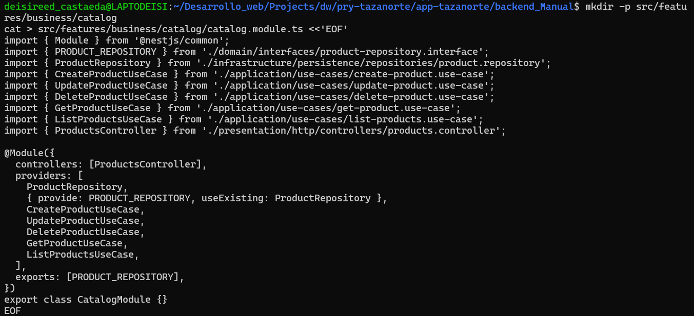

#### 8.22 — Actualizar sequelize.factory.ts (registrar modelos)

Registra en ALL_MODELS solo los modelos ya creados (orden de dependencias).

**Archivo:** `src/infrastructure/database/sequelize/sequelize.factory.ts`

``` bash
mkdir -p src/infrastructure/database/sequelize cat > src/infrastructure/database/sequelize/sequelize.factory.ts <<'EOF_BACKEND_IA' import { Sequelize } from 'sequelize-typescript'; import { DatabaseDialect } from '../../../config/environment/env.interface'; import { getSequelizeOptions } from './sequelize.options';  import { ClientModel } from '../../../features/business/clients/infrastructure/persistence/models/client.model'; import { ProductTypeModel } from '../../../features/business/product-types/infrastructure/persistence/models/product-type.model';  export const ALL_MODELS = [   ClientModel,   ProductTypeModel, ];  export async function createSequelizeInstance(   dialect: DatabaseDialect, ): Promise<Sequelize> {   const options = getSequelizeOptions(dialect);    let dialectModule: any;    switch (dialect) {     case DatabaseDialect.MySQL:       dialectModule = require('mysql2');       break;     case DatabaseDialect.Postgres:       dialectModule = require('pg');       break;     case DatabaseDialect.MSSQL:       dialectModule = require('tedious');       break;     case DatabaseDialect.Oracle:       dialectModule = require('oracledb');       break;     default:       throw new Error(`Dialecto no soportado: ${dialect}`);   }    const sequelize = new Sequelize({     ...options,     dialectModule,     models: ALL_MODELS,   } as any);    try {     await sequelize.authenticate();     console.log(`✅ Conexión exitosa a ${dialect.toUpperCase()}`);   } catch (error: any) {     console.error(       `❌ Error conectando a ${dialect.toUpperCase()}:`,       error.message,     );     throw error;   }    if (process.env.NODE_ENV !== 'production') {     await sequelize.sync({ alter: false });     console.log('✅ Tablas sincronizadas');   }    return sequelize; } EOF_BACKEND_IA
```

**Sugerencia de commit (issue):**

``` bash
git add . 
git commit -m "feat: register ProductTypeModel in sequelize factory"
```

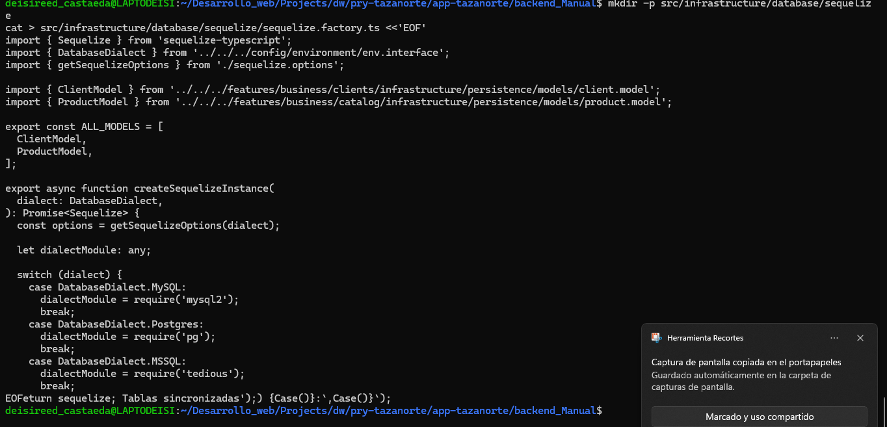

#### 8.23 — Actualizar business.module.ts

Agrega el feature module de negocio recién terminado.

**Archivo:** `src/features/business/business.module.ts`

``` bash
mkdir -p src/features/business cat > src/features/business/business.module.ts <<'EOF_BACKEND_IA' import { Module } from '@nestjs/common'; import { ClientsModule } from './clients/clients.module'; import { ProductTypesModule } from './product-types/product-types.module';  @Module({   imports: [ClientsModule, ProductTypesModule],   exports: [ClientsModule, ProductTypesModule], }) export class BusinessModule {} EOF_BACKEND_IA
```

**Sugerencia de commit (issue):**

``` bash
git add .
git commit -m "feat: add ProductTypesModule to BusinessModule"
```

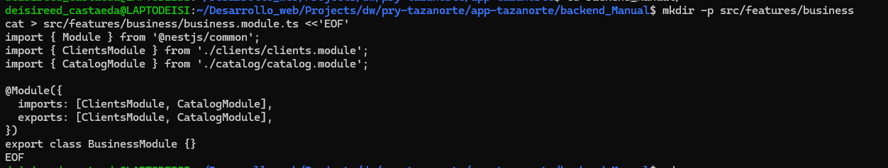

#### 8.24 — Actualizar database-seeder.service.ts

Ejecuta seeders en orden de dependencias al arrancar (dev).

**Archivo:** `src/infrastructure/database/seeders/database-seeder.service.ts`

``` bash
mkdir -p src/infrastructure/database/seeders cat > src/infrastructure/database/seeders/database-seeder.service.ts <<'EOF_BACKEND_IA' import { Injectable, Logger, OnModuleInit } from '@nestjs/common'; import { seedClients } from '../../../features/business/clients/infrastructure/persistence/seeders/clients.seeder'; import { seedProductTypes } from '../../../features/business/product-types/infrastructure/persistence/seeders/product-types.seeder';  /**  * Ejecuta seeders en orden de dependencias.  * Solo en entornos no productivos.  */ @Injectable() export class DatabaseSeederService implements OnModuleInit {   private readonly logger = new Logger(DatabaseSeederService.name);    async onModuleInit(): Promise<void> {     if (process.env.NODE_ENV === 'production') {       return;     }      try {       await seedClients();       await seedProductTypes();       this.logger.log('✅ Seeders ejecutados');     } catch (error: any) {       this.logger.error(`❌ Error en seeders: ${error.message}`, error.stack);       throw error;     }   } } EOF_BACKEND_IA
```

**Sugerencia de commit (issue):**

``` bash
git add . 
git commit -m "chore: run seedProductTypes on bootstrap"
```

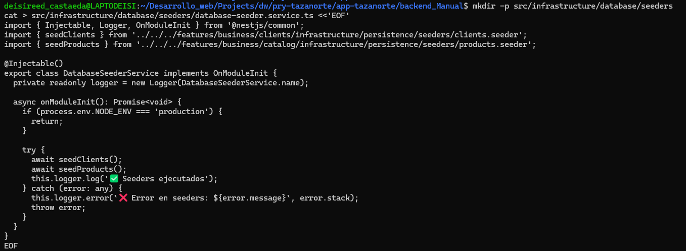

#### 8.25 — Actualizar app.module.ts

Importa BusinessModule y/o AuthModule según el avance. Los guards globales llegan en la fase RBAC.

**Archivo:** `src/app.module.ts`

``` bash
mkdir -p src cat > src/app.module.ts <<'EOF_BACKEND_IA' import { Module } from '@nestjs/common'; import { ConfigModule } from '@nestjs/config'; import { envConfig } from './config/environment/env.config'; import { appConfig } from './config/app/app.config'; import { jwtConfig } from './config/jwt/jwt.config'; import { LoggerModule } from './config/logger/logger.module'; import { SequelizeDatabaseModule } from './infrastructure/database/sequelize/sequelize.module'; import { SecurityModule } from './infrastructure/security/security.module'; import { BusinessModule } from './features/business/business.module'; import { AppController } from './app.controller'; import { AppService } from './app.service';  @Module({   imports: [     ConfigModule.forRoot({       isGlobal: true,       load: [envConfig, appConfig, jwtConfig],       envFilePath: '.env',     }),     SequelizeDatabaseModule,     SecurityModule,     LoggerModule,     BusinessModule,   ],   controllers: [AppController],   providers: [     AppService,   ], }) export class AppModule {} EOF_BACKEND_IA
```

**Sugerencia de commit (issue):**

``` bash
git add . 
git commit -m "chore: keep BusinessModule wired in AppModule"
```

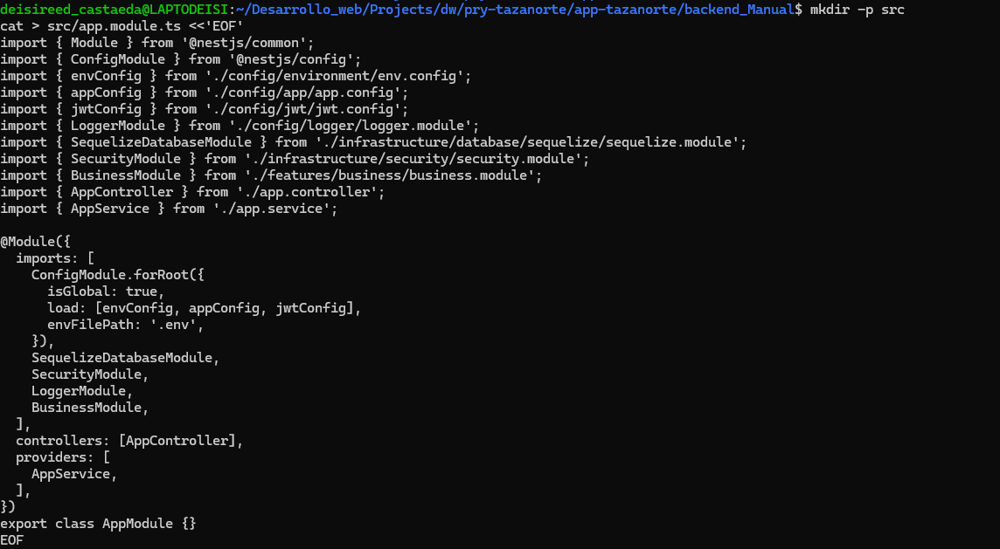

#### 8.26 — Verificar tabla `product_types`

Confirma sync/seeder y endpoints `/api/product-types`.

``` bash
npm run start:dev
```

**Sugerencia de commit (issue):**

``` bash
git add . 
git commit -m "test: verify product_types table and endpoints"
```

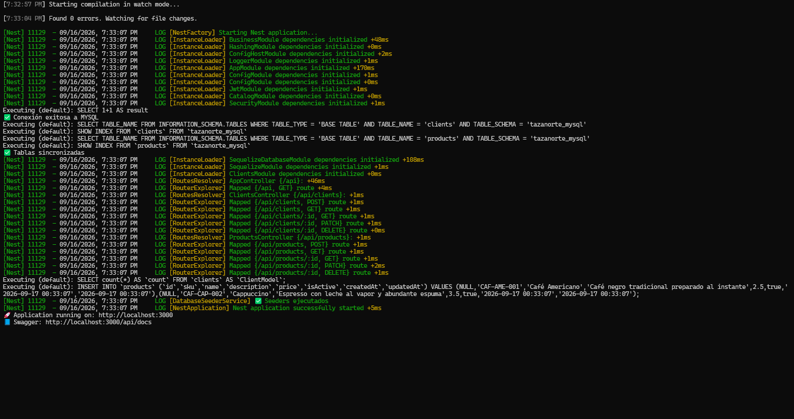

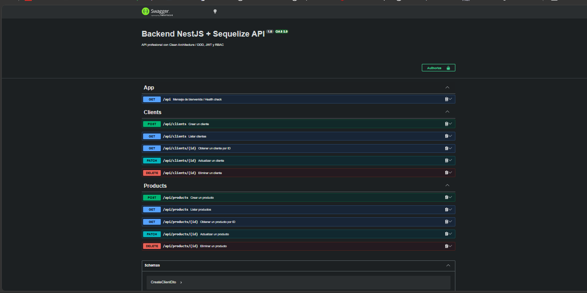

------------------------------------------------------------------------

## 

## FASE 9 — `08_BUSINESS_PRODUCTS`

### Business — Products

> **Objetivo de la fase:** Productos dependen de ProductTypes (FK). El modelo usa `require()` lazy para evitar ciclos.

#### 9.1 — features/business/products/domain/entities/product.entity.ts

Entidad de dominio (TypeScript puro). No extiende Sequelize `Model`. Aquí viven las reglas del negocio.

**Archivo:** `src/features/business/products/domain/entities/product.entity.ts`

``` bash
mkdir -p src/features/business/products/domain/entities cat > src/features/business/products/domain/entities/product.entity.ts <<'EOF_BACKEND_IA' import { Status } from '../../../../../common/enums/status.enum'; import { InvalidProductPriceException } from '../exceptions/invalid-product-price.exception'; import { InvalidProductStockException } from '../exceptions/invalid-product-stock.exception'; import { isValidPrice } from '../validators/product-price.validator'; import { isValidStock } from '../validators/product-stock.validator';  export interface ProductProps {   id?: number;   name: string;   brand: string;   price: number;   minStock: number;   quantity: number;   productTypeId: number;   status?: Status;   createdAt?: Date;   updatedAt?: Date; }  export class Product {   id?: number;   name: string;   brand: string;   price: number;   minStock: number;   quantity: number;   productTypeId: number;   status: Status;   createdAt?: Date;   updatedAt?: Date;    private constructor(props: ProductProps) {     this.id = props.id;     this.name = props.name;     this.brand = props.brand;     this.price = props.price;     this.minStock = props.minStock;     this.quantity = props.quantity;     this.productTypeId = props.productTypeId;     this.status = props.status ?? Status.ACTIVE;     this.createdAt = props.createdAt;     this.updatedAt = props.updatedAt;   }    static create(     props: Omit<ProductProps, 'id' | 'status' | 'createdAt' | 'updatedAt'>,   ): Product {     if (!props.name?.trim()) {       throw new Error('El nombre del producto es requerido');     }      if (!props.brand?.trim()) {       throw new Error('La marca del producto es requerida');     }      if (!isValidPrice(props.price)) {       throw new InvalidProductPriceException(props.price);     }      if (!isValidStock(props.quantity)) {       throw new InvalidProductStockException(props.quantity);     }      if (!isValidStock(props.minStock)) {       throw new InvalidProductStockException(props.minStock);     }      return new Product(props);   }    static reconstitute(props: ProductProps): Product {     return new Product(props);   }    update(     props: Partial<       Omit<ProductProps, 'id' | 'status' | 'createdAt' | 'updatedAt'>     >,   ): void {     if (props.name !== undefined) {       if (!props.name.trim()) {         throw new Error('El nombre del producto es requerido');       }       this.name = props.name;     }      if (props.brand !== undefined) {       if (!props.brand.trim()) {         throw new Error('La marca del producto es requerida');       }       this.brand = props.brand;     }      if (props.price !== undefined) {       if (!isValidPrice(props.price)) {         throw new InvalidProductPriceException(props.price);       }       this.price = props.price;     }      if (props.minStock !== undefined) {       if (!isValidStock(props.minStock)) {         throw new InvalidProductStockException(props.minStock);       }       this.minStock = props.minStock;     }      if (props.quantity !== undefined) {       if (!isValidStock(props.quantity)) {         throw new InvalidProductStockException(props.quantity);       }       this.quantity = props.quantity;     }      if (props.productTypeId !== undefined) {       this.productTypeId = props.productTypeId;     }   }    deactivate(): void {     this.status = Status.INACTIVE;   }    reduceStock(amount: number): void {     const newQuantity = this.quantity - amount;     if (!isValidStock(newQuantity)) {       throw new InvalidProductStockException(newQuantity);     }     this.quantity = newQuantity;   } } EOF_BACKEND_IA
```

**Sugerencia de commit (issue):**

``` bash
git add . 
git commit -m "feat: add domain entity product.entity.ts"
```

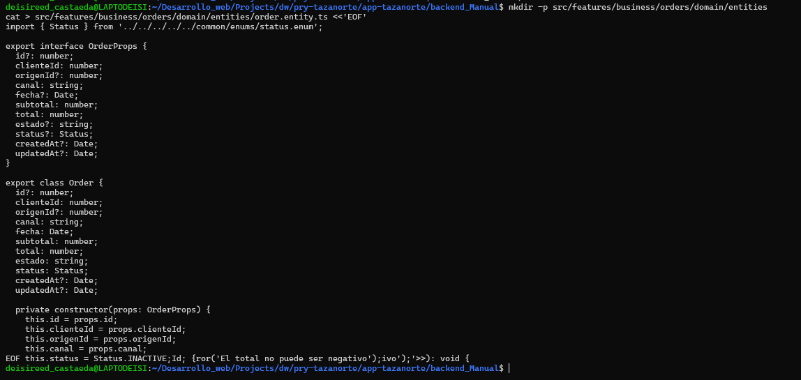

#### 9.2 — features/business/products/domain/exceptions/invalid-product-price.exception.ts

Excepción de dominio. El caso de uso la lanza; el filter HTTP la traduce a status code.

**Archivo:** `src/features/business/products/domain/exceptions/invalid-product-price.exception.ts`

``` bash
mkdir -p src/features/business/products/domain/exceptions cat > src/features/business/products/domain/exceptions/invalid-product-price.exception.ts <<'EOF_BACKEND_IA' import { DomainException } from '../../../../../common/exceptions/domain.exception';  export class InvalidProductPriceException extends DomainException {   constructor(price: number) {     super(`El precio '${price}' debe ser mayor a 0`);   } } EOF_BACKEND_IA
```

**Sugerencia de commit (issue):**

``` bash
git add . 
git commit -m "feat: add domain exception invalid-product-price.exception.ts"
```

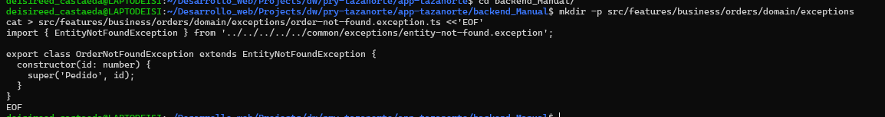

#### 9.3 — features/business/products/domain/exceptions/invalid-product-stock.exception.ts

Excepción de dominio. El caso de uso la lanza; el filter HTTP la traduce a status code.

**Archivo:** `src/features/business/products/domain/exceptions/invalid-product-stock.exception.ts`

``` bash
mkdir -p src/features/business/products/domain/exceptions cat > src/features/business/products/domain/exceptions/invalid-product-stock.exception.ts <<'EOF_BACKEND_IA' import { DomainException } from '../../../../../common/exceptions/domain.exception';  export class InvalidProductStockException extends DomainException {   constructor(stock: number) {     super(`El stock '${stock}' no puede ser negativo`);   } } EOF_BACKEND_IA
```

**Sugerencia de commit (issue):**

``` bash
git add . 
git commit -m "feat: add domain exception invalid-product-stock.exception.ts"
```

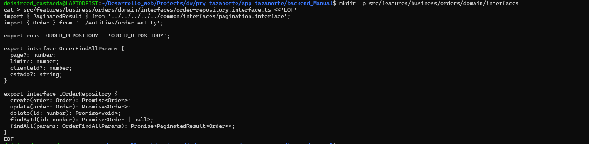

#### 9.4 — features/business/products/domain/exceptions/product-not-found.exception.ts

Excepción de dominio. El caso de uso la lanza; el filter HTTP la traduce a status code.

**Archivo:** `src/features/business/products/domain/exceptions/product-not-found.exception.ts`

``` bash
mkdir -p src/features/business/products/domain/exceptions cat > src/features/business/products/domain/exceptions/product-not-found.exception.ts <<'EOF_BACKEND_IA' import { EntityNotFoundException } from '../../../../../common/exceptions/entity-not-found.exception';  export class ProductNotFoundException extends EntityNotFoundException {   constructor(id: number) {     super('Producto', id);   } } EOF_BACKEND_IA
```

**Sugerencia de commit (issue):**

``` bash
git add .
git commit -m "feat: add domain exception product-not-found.exception.ts"
```

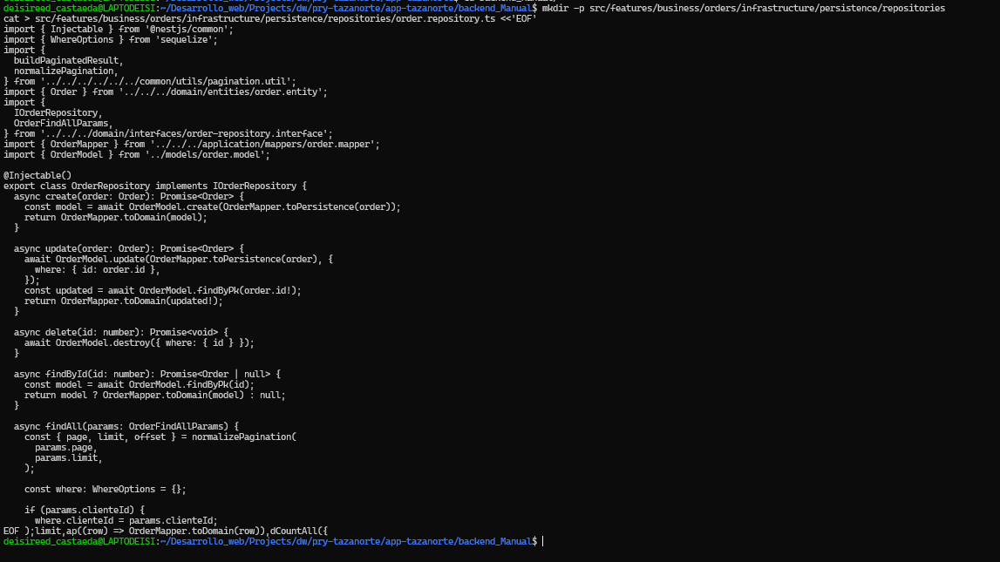

#### 9.5 — features/business/products/domain/interfaces/product-repository.interface.ts

Puerto (contrato) del repositorio. La aplicación depende de esta interface, no de Sequelize.

**Archivo:** `src/features/business/products/domain/interfaces/product-repository.interface.ts`

``` bash
mkdir -p src/features/business/products/domain/interfaces cat > src/features/business/products/domain/interfaces/product-repository.interface.ts <<'EOF_BACKEND_IA' import { PaginatedResult } from '../../../../../common/interfaces/pagination.interface'; import { Product } from '../entities/product.entity';  export const PRODUCT_REPOSITORY = 'PRODUCT_REPOSITORY';  export interface ProductFindAllParams {   page?: number;   limit?: number;   search?: string;   productTypeId?: number; }  export interface IProductRepository {   create(product: Product): Promise<Product>;   update(product: Product): Promise<Product>;   delete(id: number): Promise<void>;   findById(id: number): Promise<Product | null>;   findAll(params: ProductFindAllParams): Promise<PaginatedResult<Product>>; } EOF_BACKEND_IA
```

**Sugerencia de commit (issue):**

``` bash
git add . 
git commit -m "feat: add repository port product-repository.interface.ts"
```

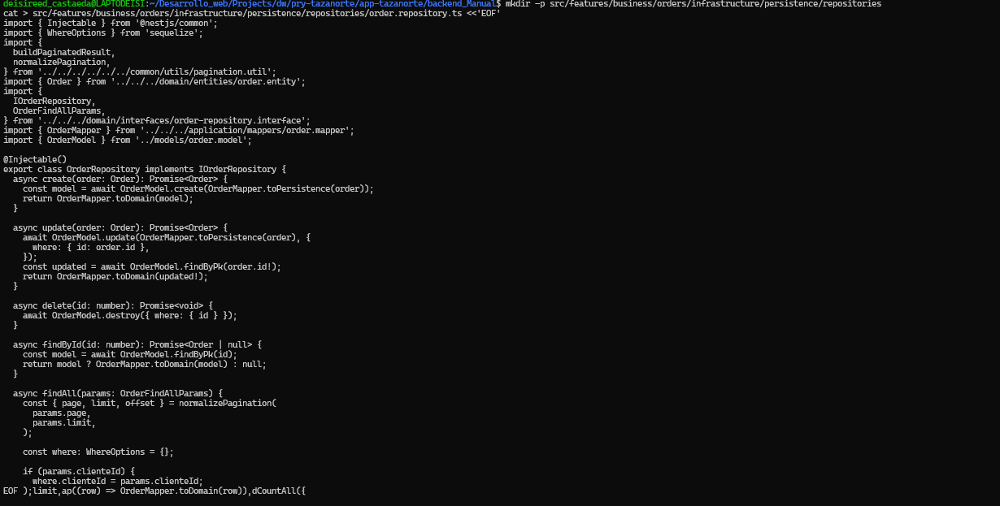

#### 9.6 — features/business/products/domain/validators/product-price.validator.ts

Validador de dominio reutilizable (reglas independientes del framework HTTP).

**Archivo:** `src/features/business/products/domain/validators/product-price.validator.ts`

``` bash
mkdir -p src/features/business/products/domain/validators cat > src/features/business/products/domain/validators/product-price.validator.ts <<'EOF_BACKEND_IA' export function isValidPrice(price: number): boolean {   return price > 0; } EOF_BACKEND_IA
```

**Sugerencia de commit (issue):**

``` bash
git add .
git commit -m "feat: add domain validator product-price.validator.ts"
```

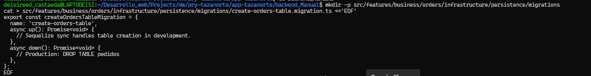

#### 9.7 — features/business/products/domain/validators/product-stock.validator.ts

Validador de dominio reutilizable (reglas independientes del framework HTTP).

**Archivo:** `src/features/business/products/domain/validators/product-stock.validator.ts`

``` bash
mkdir -p src/features/business/products/domain/validators cat > src/features/business/products/domain/validators/product-stock.validator.ts <<'EOF_BACKEND_IA' export function isValidStock(stock: number): boolean {   return stock >= 0; } EOF_BACKEND_IA
```

**Sugerencia de commit (issue):**

``` bash
git add . git commit -m "feat: add domain validator product-stock.validator.ts"
```

#### 9.8 — features/business/products/infrastructure/persistence/models/product.model.ts

Modelo Sequelize (`@Table`). Solo infraestructura: mapeo a tabla física.

**Archivo:** `src/features/business/products/infrastructure/persistence/models/product.model.ts`

``` bash
mkdir -p src/features/business/products/infrastructure/persistence/models cat > src/features/business/products/infrastructure/persistence/models/product.model.ts <<'EOF_BACKEND_IA' import {   AutoIncrement,   BelongsTo,   Column,   CreatedAt,   DataType,   ForeignKey,   Model,   PrimaryKey,   Table,   UpdatedAt, } from 'sequelize-typescript'; import { Status } from '../../../../../../common/enums/status.enum';  @Table({ tableName: 'products' }) export class ProductModel extends Model {   @PrimaryKey   @AutoIncrement   @Column(DataType.INTEGER)   declare id: number;    @Column({ type: DataType.STRING(150), allowNull: false })   declare name: string;    @Column({ type: DataType.STRING(100), allowNull: false })   declare brand: string;    @Column({ type: DataType.BIGINT, allowNull: false })   declare price: number;    @Column({ type: DataType.INTEGER, allowNull: false, defaultValue: 0 })   declare minStock: number;    @Column({ type: DataType.INTEGER, allowNull: false, defaultValue: 0 })   declare quantity: number;    @ForeignKey(     () =>       require('../../../../product-types/infrastructure/persistence/models/product-type.model')         .ProductTypeModel,   )   @Column({ type: DataType.INTEGER, allowNull: false })   declare productTypeId: number;    @BelongsTo(     () =>       require('../../../../product-types/infrastructure/persistence/models/product-type.model')         .ProductTypeModel,   )   declare productType: unknown;    @Column({     type: DataType.ENUM(...Object.values(Status)),     allowNull: false,     defaultValue: Status.ACTIVE,   })   declare status: Status;    @CreatedAt   declare createdAt: Date;    @UpdatedAt   declare updatedAt: Date; } EOF_BACKEND_IA
```

**Sugerencia de commit (issue):**

``` bash
git add . git commit -m "feat: add sequelize model product.model.ts"
```

#### 9.9 — features/business/products/infrastructure/persistence/repositories/product.repository.ts

Adaptador del repositorio: implementa el puerto de dominio con Sequelize.

**Archivo:** `src/features/business/products/infrastructure/persistence/repositories/product.repository.ts`

``` bash
mkdir -p src/features/business/products/infrastructure/persistence/repositories cat > src/features/business/products/infrastructure/persistence/repositories/product.repository.ts <<'EOF_BACKEND_IA' import { Injectable } from '@nestjs/common'; import { Op, WhereOptions } from 'sequelize'; import {   buildPaginatedResult,   normalizePagination, } from '../../../../../../common/utils/pagination.util'; import { Product } from '../../../domain/entities/product.entity'; import {   IProductRepository,   ProductFindAllParams, } from '../../../domain/interfaces/product-repository.interface'; import { ProductMapper } from '../../../application/mappers/product.mapper'; import { ProductModel } from '../models/product.model';  @Injectable() export class ProductRepository implements IProductRepository {   async create(product: Product): Promise<Product> {     const model = await ProductModel.create(ProductMapper.toPersistence(product));     return ProductMapper.toDomain(model);   }    async update(product: Product): Promise<Product> {     await ProductModel.update(ProductMapper.toPersistence(product), {       where: { id: product.id },     });     const updated = await ProductModel.findByPk(product.id!);     return ProductMapper.toDomain(updated!);   }    async delete(id: number): Promise<void> {     await ProductModel.destroy({ where: { id } });   }    async findById(id: number): Promise<Product | null> {     const model = await ProductModel.findByPk(id);     return model ? ProductMapper.toDomain(model) : null;   }    async findAll(params: ProductFindAllParams) {     const { page, limit, offset } = normalizePagination(       params.page,       params.limit,     );      const where: WhereOptions = {};      if (params.search) {       Object.assign(where, {         [Op.or]: [           { name: { [Op.like]: `%${params.search}%` } },           { brand: { [Op.like]: `%${params.search}%` } },         ],       });     }      if (params.productTypeId) {       where.productTypeId = params.productTypeId;     }      const { rows, count } = await ProductModel.findAndCountAll({       where,       limit,       offset,       order: [['createdAt', 'DESC']],     });      return buildPaginatedResult(       rows.map((row) => ProductMapper.toDomain(row)),       count,       page,       limit,     );   } } EOF_BACKEND_IA
```

**Sugerencia de commit (issue):**

``` bash
git add . git commit -m "feat: add sequelize repository product.repository.ts"
```

#### 9.10 — features/business/products/infrastructure/persistence/migrations/create-products-table.migration.ts

Migración documental/auxiliar de la tabla. En dev el sync de Sequelize crea el esquema.

**Archivo:** `src/features/business/products/infrastructure/persistence/migrations/create-products-table.migration.ts`

``` bash
mkdir -p src/features/business/products/infrastructure/persistence/migrations cat > src/features/business/products/infrastructure/persistence/migrations/create-products-table.migration.ts <<'EOF_BACKEND_IA' export const createProductsTableMigration = {   name: 'create-products-table',   async up(): Promise<void> {     // Sequelize sync handles table creation in development.     // Production: CREATE TABLE products (id, name, brand, price, minStock, quantity, productTypeId, status, createdAt, updatedAt)   },   async down(): Promise<void> {     // Production: DROP TABLE products   }, }; EOF_BACKEND_IA
```

**Sugerencia de commit (issue):**

``` bash
git add . git commit -m "chore: add migration create-products-table.migration.ts"
```

#### 9.11 — features/business/products/infrastructure/persistence/seeders/products.seeder.ts

Seeder de datos iniciales para desarrollo y verificación física en BD.

**Archivo:** `src/features/business/products/infrastructure/persistence/seeders/products.seeder.ts`

``` bash
mkdir -p src/features/business/products/infrastructure/persistence/seeders cat > src/features/business/products/infrastructure/persistence/seeders/products.seeder.ts <<'EOF_BACKEND_IA' import { ProductModel } from '../models/product.model'; import { Status } from '../../../../../../common/enums/status.enum';  export async function seedProducts(): Promise<void> {   const count = await ProductModel.count();   if (count > 0) {     return;   }    await ProductModel.bulkCreate([     {       name: 'Smartphone X',       brand: 'TechBrand',       price: 59999,       minStock: 5,       quantity: 50,       productTypeId: 1,       status: Status.ACTIVE,     },     {       name: 'Wireless Headphones',       brand: 'AudioPro',       price: 12999,       minStock: 10,       quantity: 100,       productTypeId: 1,       status: Status.ACTIVE,     },   ]); } EOF_BACKEND_IA
```

**Sugerencia de commit (issue):**

``` bash
git add . git commit -m "chore: add seeder products.seeder.ts"
```

#### 9.12 — features/business/products/application/dto/create-product.dto.ts

DTO de entrada/salida HTTP con `class-validator` / Swagger.

**Archivo:** `src/features/business/products/application/dto/create-product.dto.ts`

``` bash
mkdir -p src/features/business/products/application/dto cat > src/features/business/products/application/dto/create-product.dto.ts <<'EOF_BACKEND_IA' import { ApiProperty, ApiPropertyOptional } from '@nestjs/swagger'; import {   IsInt,   IsNotEmpty,   IsNumber,   IsOptional,   IsPositive,   IsString,   MaxLength,   Min, } from 'class-validator';  export class CreateProductDto {   @ApiProperty({ example: 'Smartphone X' })   @IsString()   @IsNotEmpty()   @MaxLength(150)   name: string;    @ApiProperty({ example: 'TechBrand' })   @IsString()   @IsNotEmpty()   @MaxLength(100)   brand: string;    @ApiProperty({ example: 59999 })   @IsNumber()   @IsPositive()   price: number;    @ApiProperty({ example: 5, default: 0 })   @IsInt()   @Min(0)   minStock: number;    @ApiProperty({ example: 50, default: 0 })   @IsInt()   @Min(0)   quantity: number;    @ApiProperty({ example: 1 })   @IsInt()   @IsPositive()   productTypeId: number; } EOF_BACKEND_IA
```

**Sugerencia de commit (issue):**

``` bash
git add . git commit -m "feat: add dto create-product.dto.ts"
```

#### 9.13 — features/business/products/application/dto/product-filter.dto.ts

DTO de entrada/salida HTTP con `class-validator` / Swagger.

**Archivo:** `src/features/business/products/application/dto/product-filter.dto.ts`

``` bash
mkdir -p src/features/business/products/application/dto cat > src/features/business/products/application/dto/product-filter.dto.ts <<'EOF_BACKEND_IA' import { ApiPropertyOptional } from '@nestjs/swagger'; import { Type } from 'class-transformer'; import { IsInt, IsOptional, IsPositive, IsString, Min } from 'class-validator';  export class ProductFilterDto {   @ApiPropertyOptional({ example: 1, default: 1 })   @IsOptional()   @Type(() => Number)   @IsInt()   @Min(1)   page?: number;    @ApiPropertyOptional({ example: 10, default: 10 })   @IsOptional()   @Type(() => Number)   @IsInt()   @IsPositive()   limit?: number;    @ApiPropertyOptional({ example: 'smartphone' })   @IsOptional()   @IsString()   search?: string;    @ApiPropertyOptional({ example: 1 })   @IsOptional()   @Type(() => Number)   @IsInt()   @IsPositive()   productTypeId?: number; } EOF_BACKEND_IA
```

**Sugerencia de commit (issue):**

``` bash
git add . git commit -m "feat: add dto product-filter.dto.ts"
```

#### 9.14 — features/business/products/application/dto/product-response.dto.ts

DTO de entrada/salida HTTP con `class-validator` / Swagger.

**Archivo:** `src/features/business/products/application/dto/product-response.dto.ts`

``` bash
mkdir -p src/features/business/products/application/dto cat > src/features/business/products/application/dto/product-response.dto.ts <<'EOF_BACKEND_IA' import { ApiProperty } from '@nestjs/swagger'; import { Status } from '../../../../../common/enums/status.enum';  export class ProductResponseDto {   @ApiProperty({ example: 1 })   id: number;    @ApiProperty({ example: 'Smartphone X' })   name: string;    @ApiProperty({ example: 'TechBrand' })   brand: string;    @ApiProperty({ example: 59999 })   price: number;    @ApiProperty({ example: 5 })   minStock: number;    @ApiProperty({ example: 50 })   quantity: number;    @ApiProperty({ example: 1 })   productTypeId: number;    @ApiProperty({ enum: Status, example: Status.ACTIVE })   status: Status;    @ApiProperty()   createdAt: Date;    @ApiProperty()   updatedAt: Date; } EOF_BACKEND_IA
```

**Sugerencia de commit (issue):**

``` bash
git add . git commit -m "feat: add dto product-response.dto.ts"
```

#### 9.15 — features/business/products/application/dto/update-product.dto.ts

DTO de entrada/salida HTTP con `class-validator` / Swagger.

**Archivo:** `src/features/business/products/application/dto/update-product.dto.ts`

``` bash
mkdir -p src/features/business/products/application/dto cat > src/features/business/products/application/dto/update-product.dto.ts <<'EOF_BACKEND_IA' import { PartialType } from '@nestjs/mapped-types'; import { CreateProductDto } from './create-product.dto';  export class UpdateProductDto extends PartialType(CreateProductDto) {} EOF_BACKEND_IA
```

**Sugerencia de commit (issue):**

``` bash
git add . git commit -m "feat: add dto update-product.dto.ts"
```

#### 9.16 — features/business/products/application/mappers/product.mapper.ts

Mapper entre entidad de dominio y DTO de respuesta.

**Archivo:** `src/features/business/products/application/mappers/product.mapper.ts`

``` bash
mkdir -p src/features/business/products/application/mappers cat > src/features/business/products/application/mappers/product.mapper.ts <<'EOF_BACKEND_IA' import { Status } from '../../../../../common/enums/status.enum'; import { Product } from '../../domain/entities/product.entity'; import { ProductResponseDto } from '../dto/product-response.dto'; import { ProductModel } from '../../infrastructure/persistence/models/product.model';  export class ProductMapper {   static toDomain(model: ProductModel): Product {     return Product.reconstitute({       id: model.id,       name: model.name,       brand: model.brand,       price: Number(model.price),       minStock: model.minStock,       quantity: model.quantity,       productTypeId: model.productTypeId,       status: model.status,       createdAt: model.createdAt,       updatedAt: model.updatedAt,     });   }    static toResponse(entity: Product): ProductResponseDto {     return {       id: entity.id!,       name: entity.name,       brand: entity.brand,       price: entity.price,       minStock: entity.minStock,       quantity: entity.quantity,       productTypeId: entity.productTypeId,       status: entity.status,       createdAt: entity.createdAt!,       updatedAt: entity.updatedAt!,     };   }    static toPersistence(entity: Product): Partial<ProductModel> {     return {       id: entity.id,       name: entity.name,       brand: entity.brand,       price: entity.price,       minStock: entity.minStock,       quantity: entity.quantity,       productTypeId: entity.productTypeId,       status: entity.status ?? Status.ACTIVE,     };   } } EOF_BACKEND_IA
```

**Sugerencia de commit (issue):**

``` bash
git add . git commit -m "feat: add mapper product.mapper.ts"
```

#### 9.17 — features/business/products/application/use-cases/create-product.use-case.ts

Caso de uso (aplicación). Orquesta dominio + repositorio. El controller solo lo invoca.

**Archivo:** `src/features/business/products/application/use-cases/create-product.use-case.ts`

``` bash
mkdir -p src/features/business/products/application/use-cases cat > src/features/business/products/application/use-cases/create-product.use-case.ts <<'EOF_BACKEND_IA' import { Inject, Injectable } from '@nestjs/common'; import { ProductTypeNotFoundException } from '../../../product-types/domain/exceptions/product-type-not-found.exception'; import {   type IProductTypeRepository,   PRODUCT_TYPE_REPOSITORY, } from '../../../product-types/domain/interfaces/product-type-repository.interface'; import { Product } from '../../domain/entities/product.entity'; import {   type IProductRepository,   PRODUCT_REPOSITORY, } from '../../domain/interfaces/product-repository.interface'; import { CreateProductDto } from '../dto/create-product.dto'; import { ProductMapper } from '../mappers/product.mapper';  @Injectable() export class CreateProductUseCase {   constructor(     @Inject(PRODUCT_REPOSITORY)     private readonly productRepository: IProductRepository,     @Inject(PRODUCT_TYPE_REPOSITORY)     private readonly productTypeRepository: IProductTypeRepository,   ) {}    async execute(dto: CreateProductDto) {     const productType = await this.productTypeRepository.findById(       dto.productTypeId,     );     if (!productType) {       throw new ProductTypeNotFoundException(dto.productTypeId);     }      const product = Product.create(dto);     const created = await this.productRepository.create(product);     return ProductMapper.toResponse(created);   } } EOF_BACKEND_IA
```

**Sugerencia de commit (issue):**

``` bash
git add . git commit -m "feat: add use case create-product.use-case.ts"
```

#### 9.18 — features/business/products/application/use-cases/delete-product.use-case.ts

Caso de uso (aplicación). Orquesta dominio + repositorio. El controller solo lo invoca.

**Archivo:** `src/features/business/products/application/use-cases/delete-product.use-case.ts`

``` bash
mkdir -p src/features/business/products/application/use-cases cat > src/features/business/products/application/use-cases/delete-product.use-case.ts <<'EOF_BACKEND_IA' import { Inject, Injectable } from '@nestjs/common'; import { ProductNotFoundException } from '../../domain/exceptions/product-not-found.exception'; import {   type IProductRepository,   PRODUCT_REPOSITORY, } from '../../domain/interfaces/product-repository.interface';  @Injectable() export class DeleteProductUseCase {   constructor(     @Inject(PRODUCT_REPOSITORY)     private readonly productRepository: IProductRepository,   ) {}    async execute(id: number): Promise<void> {     const product = await this.productRepository.findById(id);     if (!product) {       throw new ProductNotFoundException(id);     }      await this.productRepository.delete(id);   } } EOF_BACKEND_IA
```

**Sugerencia de commit (issue):**

``` bash
git add . git commit -m "feat: add use case delete-product.use-case.ts"
```

#### 9.19 — features/business/products/application/use-cases/get-product.use-case.ts

Caso de uso (aplicación). Orquesta dominio + repositorio. El controller solo lo invoca.

**Archivo:** `src/features/business/products/application/use-cases/get-product.use-case.ts`

``` bash
mkdir -p src/features/business/products/application/use-cases cat > src/features/business/products/application/use-cases/get-product.use-case.ts <<'EOF_BACKEND_IA' import { Inject, Injectable } from '@nestjs/common'; import { ProductNotFoundException } from '../../domain/exceptions/product-not-found.exception'; import {   type IProductRepository,   PRODUCT_REPOSITORY, } from '../../domain/interfaces/product-repository.interface'; import { ProductMapper } from '../mappers/product.mapper';  @Injectable() export class GetProductUseCase {   constructor(     @Inject(PRODUCT_REPOSITORY)     private readonly productRepository: IProductRepository,   ) {}    async execute(id: number) {     const product = await this.productRepository.findById(id);     if (!product) {       throw new ProductNotFoundException(id);     }      return ProductMapper.toResponse(product);   } } EOF_BACKEND_IA
```

**Sugerencia de commit (issue):**

``` bash
git add . git commit -m "feat: add use case get-product.use-case.ts"
```

#### 9.20 — features/business/products/application/use-cases/list-products.use-case.ts

Caso de uso (aplicación). Orquesta dominio + repositorio. El controller solo lo invoca.

**Archivo:** `src/features/business/products/application/use-cases/list-products.use-case.ts`

``` bash
mkdir -p src/features/business/products/application/use-cases cat > src/features/business/products/application/use-cases/list-products.use-case.ts <<'EOF_BACKEND_IA' import { Inject, Injectable } from '@nestjs/common'; import {   type IProductRepository,   PRODUCT_REPOSITORY, } from '../../domain/interfaces/product-repository.interface'; import { ProductFilterDto } from '../dto/product-filter.dto'; import { ProductMapper } from '../mappers/product.mapper';  @Injectable() export class ListProductsUseCase {   constructor(     @Inject(PRODUCT_REPOSITORY)     private readonly productRepository: IProductRepository,   ) {}    async execute(filter: ProductFilterDto) {     const result = await this.productRepository.findAll(filter);     return {       items: result.items.map((product) => ProductMapper.toResponse(product)),       meta: result.meta,     };   } } EOF_BACKEND_IA
```

**Sugerencia de commit (issue):**

``` bash
git add . git commit -m "feat: add use case list-products.use-case.ts"
```

#### 9.21 — features/business/products/application/use-cases/update-product.use-case.ts

Caso de uso (aplicación). Orquesta dominio + repositorio. El controller solo lo invoca.

**Archivo:** `src/features/business/products/application/use-cases/update-product.use-case.ts`

``` bash
mkdir -p src/features/business/products/application/use-cases cat > src/features/business/products/application/use-cases/update-product.use-case.ts <<'EOF_BACKEND_IA' import { Inject, Injectable } from '@nestjs/common'; import { ProductTypeNotFoundException } from '../../../product-types/domain/exceptions/product-type-not-found.exception'; import {   type IProductTypeRepository,   PRODUCT_TYPE_REPOSITORY, } from '../../../product-types/domain/interfaces/product-type-repository.interface'; import { ProductNotFoundException } from '../../domain/exceptions/product-not-found.exception'; import {   type IProductRepository,   PRODUCT_REPOSITORY, } from '../../domain/interfaces/product-repository.interface'; import { UpdateProductDto } from '../dto/update-product.dto'; import { ProductMapper } from '../mappers/product.mapper';  @Injectable() export class UpdateProductUseCase {   constructor(     @Inject(PRODUCT_REPOSITORY)     private readonly productRepository: IProductRepository,     @Inject(PRODUCT_TYPE_REPOSITORY)     private readonly productTypeRepository: IProductTypeRepository,   ) {}    async execute(id: number, dto: UpdateProductDto) {     const product = await this.productRepository.findById(id);     if (!product) {       throw new ProductNotFoundException(id);     }      if (dto.productTypeId) {       const productType = await this.productTypeRepository.findById(         dto.productTypeId,       );       if (!productType) {         throw new ProductTypeNotFoundException(dto.productTypeId);       }     }      product.update(dto);     const updated = await this.productRepository.update(product);     return ProductMapper.toResponse(updated);   } } EOF_BACKEND_IA
```

**Sugerencia de commit (issue):**

``` bash
git add . git commit -m "feat: add use case update-product.use-case.ts"
```

#### 9.22 — features/business/products/presentation/http/serializers/product.serializer.ts

Serializer de presentación (forma estable de la respuesta HTTP).

**Archivo:** `src/features/business/products/presentation/http/serializers/product.serializer.ts`

``` bash
mkdir -p src/features/business/products/presentation/http/serializers cat > src/features/business/products/presentation/http/serializers/product.serializer.ts <<'EOF_BACKEND_IA' import { Product } from '../../../domain/entities/product.entity'; import { ProductResponseDto } from '../../../application/dto/product-response.dto'; import { ProductMapper } from '../../../application/mappers/product.mapper';  export class ProductSerializer {   static serialize(entity: Product): ProductResponseDto {     return ProductMapper.toResponse(entity);   } } EOF_BACKEND_IA
```

**Sugerencia de commit (issue):**

``` bash
git add . git commit -m "feat: add serializer product.serializer.ts"
```

#### 9.23 — features/business/products/presentation/http/controllers/products.controller.ts

Controller delgado: valida DTO, llama use-case, devuelve respuesta.

**Archivo:** `src/features/business/products/presentation/http/controllers/products.controller.ts`

``` bash
mkdir -p src/features/business/products/presentation/http/controllers cat > src/features/business/products/presentation/http/controllers/products.controller.ts <<'EOF_BACKEND_IA' import {   Body,   Controller,   Delete,   Get,   HttpCode,   HttpStatus,   Param,   Patch,   Post,   Query, } from '@nestjs/common'; import {   ApiCreatedResponse,   ApiNoContentResponse,   ApiOkResponse,   ApiOperation,   ApiTags, } from '@nestjs/swagger'; import { ParsePositiveIntPipe } from '../../../../../../common/pipes/parse-positive-int.pipe'; import { CreateProductDto } from '../../../application/dto/create-product.dto'; import { UpdateProductDto } from '../../../application/dto/update-product.dto'; import { ProductFilterDto } from '../../../application/dto/product-filter.dto'; import { ProductResponseDto } from '../../../application/dto/product-response.dto'; import { CreateProductUseCase } from '../../../application/use-cases/create-product.use-case'; import { UpdateProductUseCase } from '../../../application/use-cases/update-product.use-case'; import { DeleteProductUseCase } from '../../../application/use-cases/delete-product.use-case'; import { GetProductUseCase } from '../../../application/use-cases/get-product.use-case'; import { ListProductsUseCase } from '../../../application/use-cases/list-products.use-case';  @ApiTags('Products') @Controller('products') export class ProductsController {   constructor(     private readonly createProductUseCase: CreateProductUseCase,     private readonly updateProductUseCase: UpdateProductUseCase,     private readonly deleteProductUseCase: DeleteProductUseCase,     private readonly getProductUseCase: GetProductUseCase,     private readonly listProductsUseCase: ListProductsUseCase,   ) {}    @Post()   @ApiOperation({ summary: 'Crear un producto' })   @ApiCreatedResponse({ type: ProductResponseDto })   create(@Body() dto: CreateProductDto) {     return this.createProductUseCase.execute(dto);   }    @Get()   @ApiOperation({ summary: 'Listar productos' })   @ApiOkResponse({ type: [ProductResponseDto] })   findAll(@Query() filter: ProductFilterDto) {     return this.listProductsUseCase.execute(filter);   }    @Get(':id')   @ApiOperation({ summary: 'Obtener un producto por ID' })   @ApiOkResponse({ type: ProductResponseDto })   findOne(@Param('id', ParsePositiveIntPipe) id: number) {     return this.getProductUseCase.execute(id);   }    @Patch(':id')   @ApiOperation({ summary: 'Actualizar un producto' })   @ApiOkResponse({ type: ProductResponseDto })   update(     @Param('id', ParsePositiveIntPipe) id: number,     @Body() dto: UpdateProductDto,   ) {     return this.updateProductUseCase.execute(id, dto);   }    @Delete(':id')   @HttpCode(HttpStatus.NO_CONTENT)   @ApiOperation({ summary: 'Eliminar un producto' })   @ApiNoContentResponse()   remove(@Param('id', ParsePositiveIntPipe) id: number) {     return this.deleteProductUseCase.execute(id);   } } EOF_BACKEND_IA
```

**Sugerencia de commit (issue):**

``` bash
git add . git commit -m "feat: add controller products.controller.ts"
```

#### 9.24 — features/business/products/index.ts

Barrel export del feature para imports limpios.

**Archivo:** `src/features/business/products/index.ts`

``` bash
mkdir -p src/features/business/products cat > src/features/business/products/index.ts <<'EOF_BACKEND_IA' export { ProductsModule } from './products.module'; EOF_BACKEND_IA
```

**Sugerencia de commit (issue):**

``` bash
git add . git commit -m "chore: add barrel export products"
```

#### 9.25 — features/business/products/products.module.ts

Módulo Nest del feature: cablea providers, tokens DI y controller.

**Archivo:** `src/features/business/products/products.module.ts`

``` bash
mkdir -p src/features/business/products cat > src/features/business/products/products.module.ts <<'EOF_BACKEND_IA' import { Module } from '@nestjs/common'; import { ProductTypesModule } from '../product-types/product-types.module'; import { PRODUCT_REPOSITORY } from './domain/interfaces/product-repository.interface'; import { ProductRepository } from './infrastructure/persistence/repositories/product.repository'; import { CreateProductUseCase } from './application/use-cases/create-product.use-case'; import { UpdateProductUseCase } from './application/use-cases/update-product.use-case'; import { DeleteProductUseCase } from './application/use-cases/delete-product.use-case'; import { GetProductUseCase } from './application/use-cases/get-product.use-case'; import { ListProductsUseCase } from './application/use-cases/list-products.use-case'; import { ProductsController } from './presentation/http/controllers/products.controller';  @Module({   imports: [ProductTypesModule],   controllers: [ProductsController],   providers: [     ProductRepository,     { provide: PRODUCT_REPOSITORY, useExisting: ProductRepository },     CreateProductUseCase,     UpdateProductUseCase,     DeleteProductUseCase,     GetProductUseCase,     ListProductsUseCase,   ],   exports: [PRODUCT_REPOSITORY], }) export class ProductsModule {} EOF_BACKEND_IA
```

**Sugerencia de commit (issue):**

``` bash
git add . git commit -m "feat: wire nest module products.module.ts"
```

#### 9.26 — Actualizar sequelize.factory.ts (registrar modelos)

Registra en ALL_MODELS solo los modelos ya creados (orden de dependencias).

**Archivo:** `src/infrastructure/database/sequelize/sequelize.factory.ts`

``` bash
mkdir -p src/infrastructure/database/sequelize cat > src/infrastructure/database/sequelize/sequelize.factory.ts <<'EOF_BACKEND_IA' import { Sequelize } from 'sequelize-typescript'; import { DatabaseDialect } from '../../../config/environment/env.interface'; import { getSequelizeOptions } from './sequelize.options';  import { ClientModel } from '../../../features/business/clients/infrastructure/persistence/models/client.model'; import { ProductTypeModel } from '../../../features/business/product-types/infrastructure/persistence/models/product-type.model'; import { ProductModel } from '../../../features/business/products/infrastructure/persistence/models/product.model';  export const ALL_MODELS = [   ClientModel,   ProductTypeModel,   ProductModel, ];  export async function createSequelizeInstance(   dialect: DatabaseDialect, ): Promise<Sequelize> {   const options = getSequelizeOptions(dialect);    let dialectModule: any;    switch (dialect) {     case DatabaseDialect.MySQL:       dialectModule = require('mysql2');       break;     case DatabaseDialect.Postgres:       dialectModule = require('pg');       break;     case DatabaseDialect.MSSQL:       dialectModule = require('tedious');       break;     case DatabaseDialect.Oracle:       dialectModule = require('oracledb');       break;     default:       throw new Error(`Dialecto no soportado: ${dialect}`);   }    const sequelize = new Sequelize({     ...options,     dialectModule,     models: ALL_MODELS,   } as any);    try {     await sequelize.authenticate();     console.log(`✅ Conexión exitosa a ${dialect.toUpperCase()}`);   } catch (error: any) {     console.error(       `❌ Error conectando a ${dialect.toUpperCase()}:`,       error.message,     );     throw error;   }    if (process.env.NODE_ENV !== 'production') {     await sequelize.sync({ alter: false });     console.log('✅ Tablas sincronizadas');   }    return sequelize; } EOF_BACKEND_IA
```

**Sugerencia de commit (issue):**

``` bash
git add . git commit -m "feat: register ProductModel in sequelize factory"
```

#### 9.27 — Actualizar business.module.ts

Agrega el feature module de negocio recién terminado.

**Archivo:** `src/features/business/business.module.ts`

``` bash
mkdir -p src/features/business cat > src/features/business/business.module.ts <<'EOF_BACKEND_IA' import { Module } from '@nestjs/common'; import { ClientsModule } from './clients/clients.module'; import { ProductTypesModule } from './product-types/product-types.module'; import { ProductsModule } from './products/products.module';  @Module({   imports: [ClientsModule, ProductTypesModule, ProductsModule],   exports: [ClientsModule, ProductTypesModule, ProductsModule], }) export class BusinessModule {} EOF_BACKEND_IA
```

**Sugerencia de commit (issue):**

``` bash
git add . git commit -m "feat: add ProductsModule to BusinessModule"
```

#### 9.28 — Actualizar database-seeder.service.ts

Ejecuta seeders en orden de dependencias al arrancar (dev).

**Archivo:** `src/infrastructure/database/seeders/database-seeder.service.ts`

``` bash
mkdir -p src/infrastructure/database/seeders cat > src/infrastructure/database/seeders/database-seeder.service.ts <<'EOF_BACKEND_IA' import { Injectable, Logger, OnModuleInit } from '@nestjs/common'; import { seedClients } from '../../../features/business/clients/infrastructure/persistence/seeders/clients.seeder'; import { seedProductTypes } from '../../../features/business/product-types/infrastructure/persistence/seeders/product-types.seeder'; import { seedProducts } from '../../../features/business/products/infrastructure/persistence/seeders/products.seeder';  /**  * Ejecuta seeders en orden de dependencias.  * Solo en entornos no productivos.  */ @Injectable() export class DatabaseSeederService implements OnModuleInit {   private readonly logger = new Logger(DatabaseSeederService.name);    async onModuleInit(): Promise<void> {     if (process.env.NODE_ENV === 'production') {       return;     }      try {       await seedClients();       await seedProductTypes();       await seedProducts();       this.logger.log('✅ Seeders ejecutados');     } catch (error: any) {       this.logger.error(`❌ Error en seeders: ${error.message}`, error.stack);       throw error;     }   } } EOF_BACKEND_IA
```

**Sugerencia de commit (issue):**

``` bash
git add . git commit -m "chore: run seedProducts on bootstrap"
```

#### 9.29 — Actualizar app.module.ts

Importa BusinessModule y/o AuthModule según el avance. Los guards globales llegan en la fase RBAC.

**Archivo:** `src/app.module.ts`

``` bash
mkdir -p src cat > src/app.module.ts <<'EOF_BACKEND_IA' import { Module } from '@nestjs/common'; import { ConfigModule } from '@nestjs/config'; import { envConfig } from './config/environment/env.config'; import { appConfig } from './config/app/app.config'; import { jwtConfig } from './config/jwt/jwt.config'; import { LoggerModule } from './config/logger/logger.module'; import { SequelizeDatabaseModule } from './infrastructure/database/sequelize/sequelize.module'; import { SecurityModule } from './infrastructure/security/security.module'; import { BusinessModule } from './features/business/business.module'; import { AppController } from './app.controller'; import { AppService } from './app.service';  @Module({   imports: [     ConfigModule.forRoot({       isGlobal: true,       load: [envConfig, appConfig, jwtConfig],       envFilePath: '.env',     }),     SequelizeDatabaseModule,     SecurityModule,     LoggerModule,     BusinessModule,   ],   controllers: [AppController],   providers: [     AppService,   ], }) export class AppModule {} EOF_BACKEND_IA
```

**Sugerencia de commit (issue):**

``` bash
git add . git commit -m "chore: keep BusinessModule wired in AppModule"
```

#### 9.30 — Verificar tabla `products`

Confirma FK a product_types, seeder y CRUD `/api/products`.

``` bash
npm run start:dev
```

**Sugerencia de commit (issue):**

``` bash
git add . git commit -m "test: verify products table and endpoints"
```

------------------------------------------------------------------------

## 
