# ACTIVIDAD 01 DESARROLLO WEB

Deisireed Castañeda

Jaider Quintero

## **1. Requisitos Previos**

- WSL2 instalado y funcionando

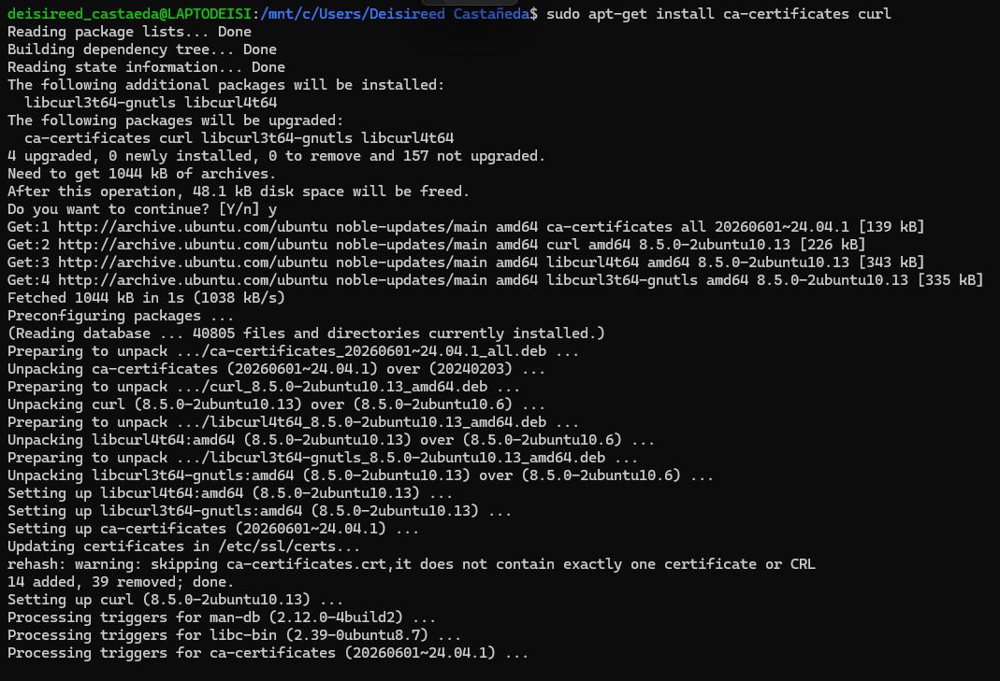](images/clipboard-3224020678.png)

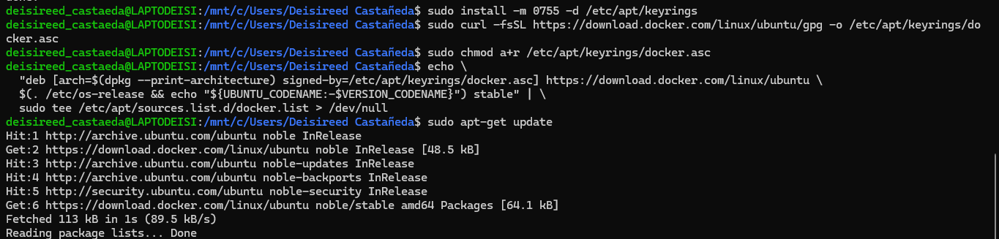

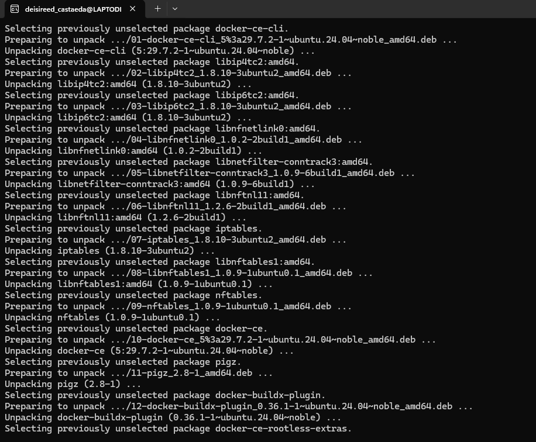](images/clipboard-4060481642.png)

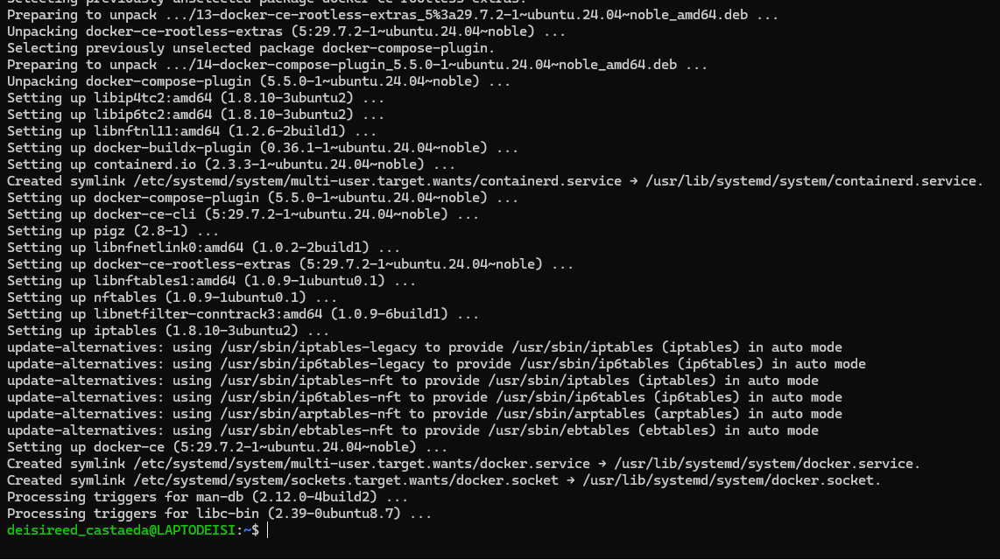

Verificación del Docker:

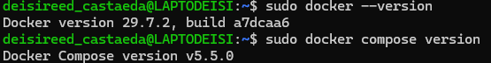

## **CREACIÓN DE CARPETAS**

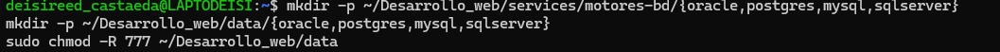

## Archivo docker compose.yml

### Oracle

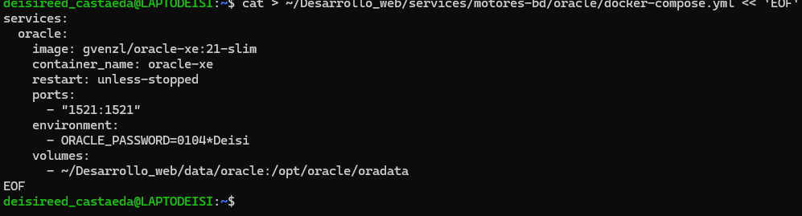

### sql server

### 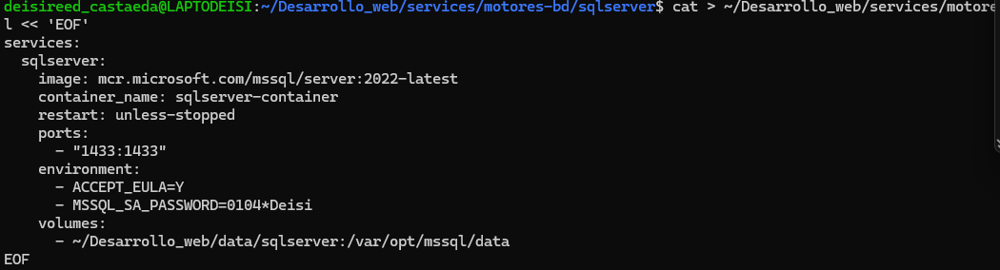

### postgres

## 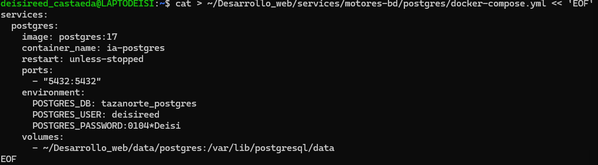

### MySQL

### 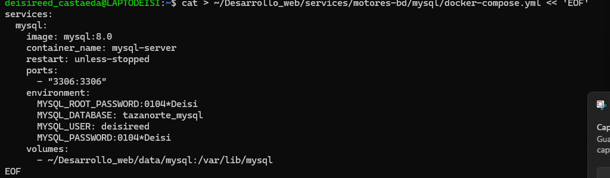

## ARCHIVO .ENV

### Oracle

### 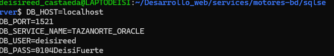sqlserver

### 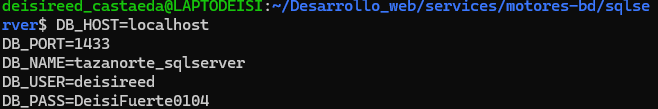Postgres

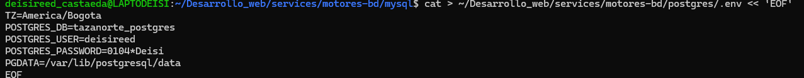

### MySQL

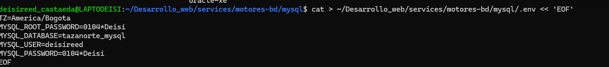

## **Crear README.md**

### MySQL

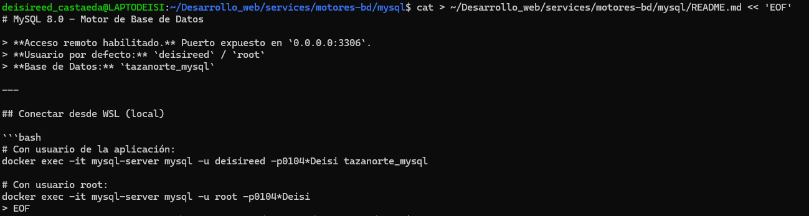

### Postgres

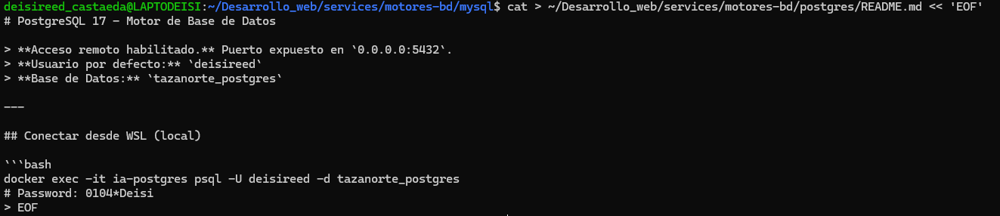

### sqlserver

### 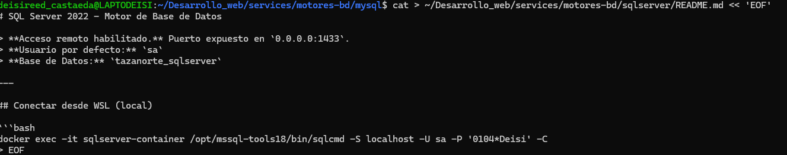

### Oracle

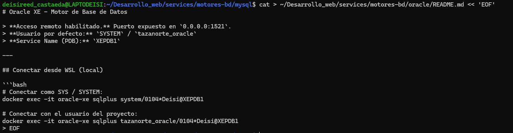

## **Crear un usuario PROPIO con ACCESO REMOTO**

Sqlserver

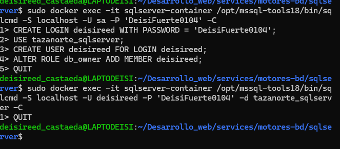

### mysql

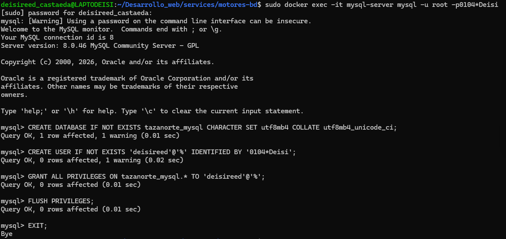

](images/clipboard-779680532.png)

### postgres 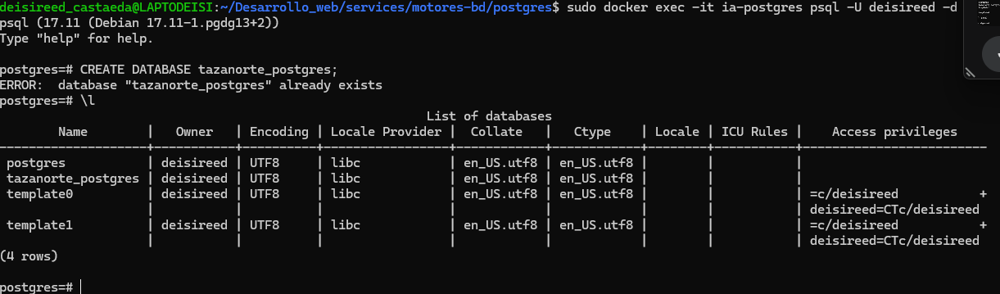

### oracle

### 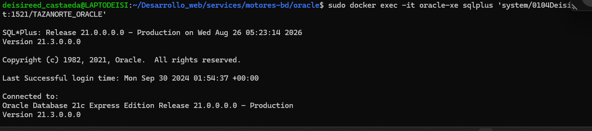

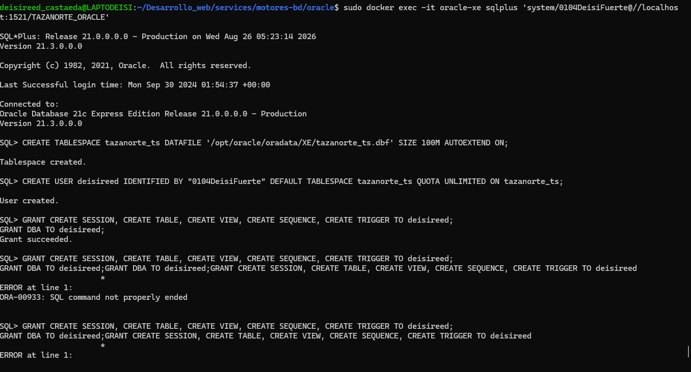

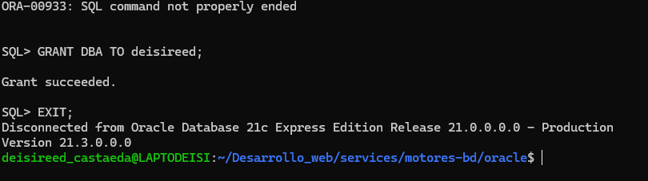

### **CONECTAR REMOTAMENTE DESDE CUALQUIER EQUIPO MySQL**

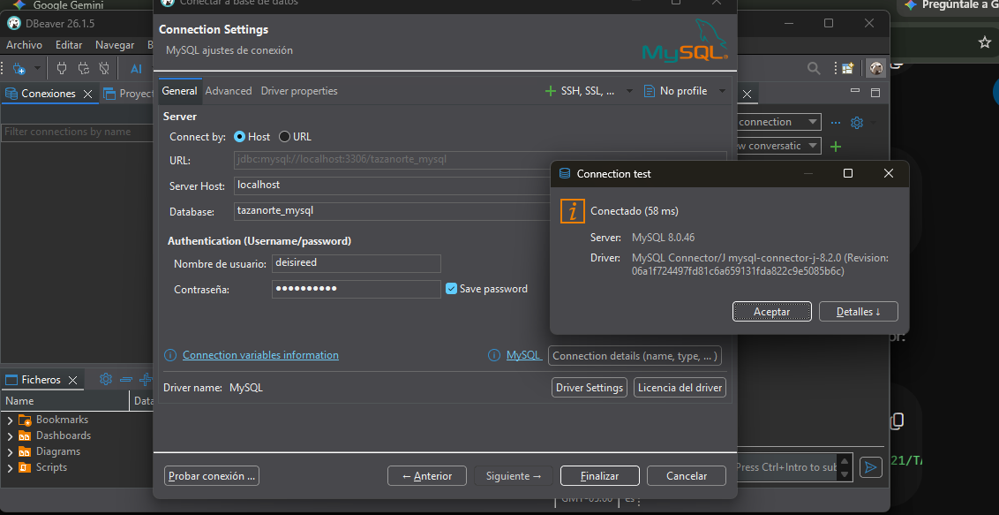

### ORACLE

### 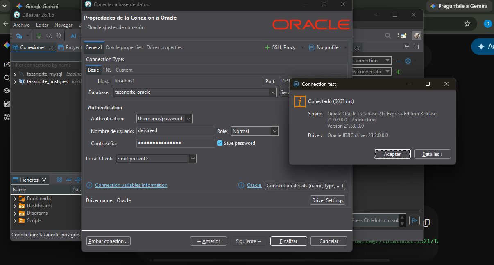

### POSTGRES

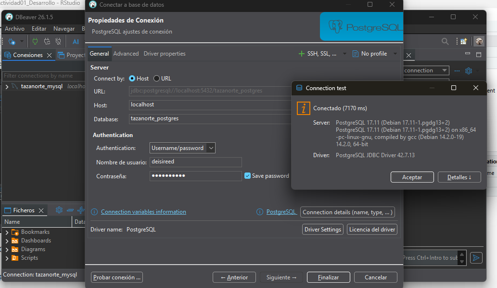

### sqlserver

###  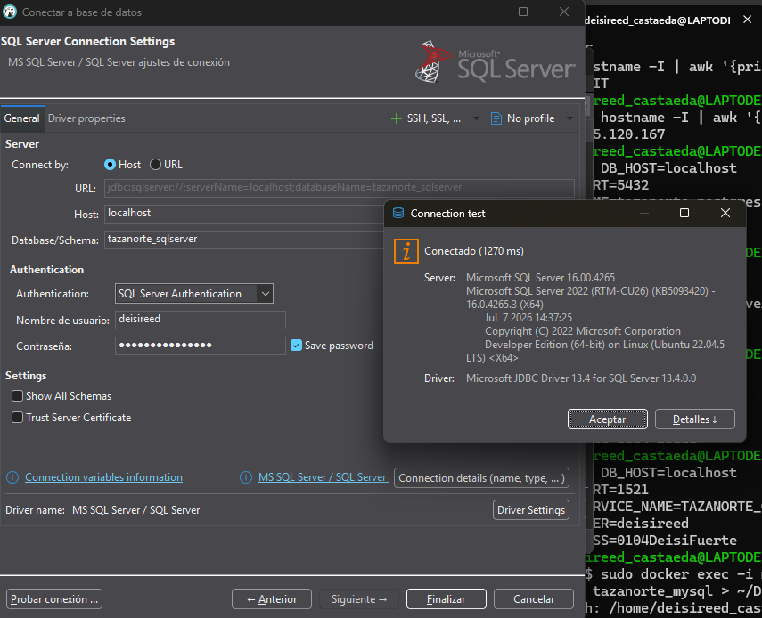

## **BACKUPS DE UNA BASE DE DATOS** 

sqlserver

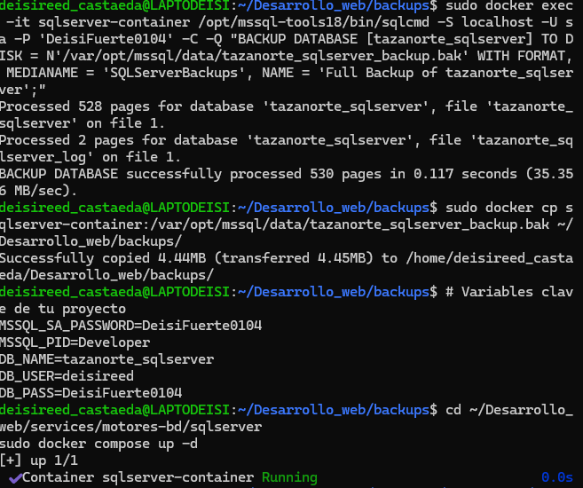

MySQL

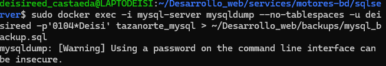

postgres

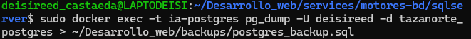

oracle

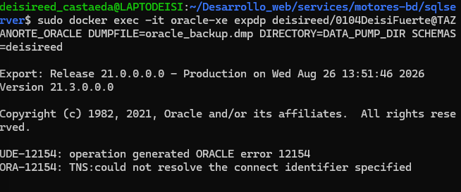

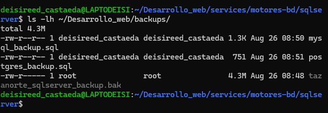
